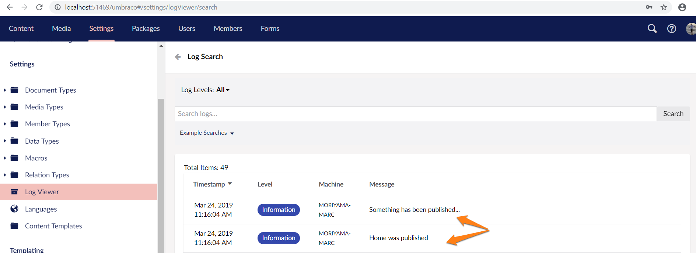

# Subscribing to events

:::note
This article is only relevant if you are using Umbraco 9+. For older versions see the [Subscribing to events article](../Subscribing-To-Events).
:::

Subscribing to events allows you to execute custom code on several events both before and after the event occurs. All you need to follow this guide is an Umbraco installation with some content, e.g. the Umbraco starter kit.

## Subscribing to an event

Let's add a string of text to the log when a document is published. The log is useful for debugging, different parts of the Umbraco codebase 'log' key events, warnings, and errors to the log.

We subscribe to events in Umbraco inside a Component, let's create one, add a new c# class to our project - call it *LogWhenPublishedComponent*. and use `: IComponent` to identify our code as a Component. We'll need to add `using Umbraco.Core.Composing;` to the top of the .cs file and because the events that you can subscribe to in Umbraco are found in the core services namespace we'll also need to add a using statement for that too: `using Umbraco.Core;` and `using Umbraco.Core.Services.Implement;`.

```csharp
using System;
using System.Collections.Generic;
using System.Linq;
using System.Web;
using Umbraco.Core;
using Umbraco.Core.Composing;
using Umbraco.Core.Services.Implement;

namespace MyProjectName.Web.Components
{
    public class LogWhenPublishedComponent : IComponent
    {
        /// Here we'll subscribe to an event
    }
}
```

When you create a Component in Umbraco you need to implement two methods, one to run when the Umbraco application is initialized and one to run when the Umbraco application terminates:

```csharp
using System;
using System.Collections.Generic;
using System.Linq;
using System.Web;
using Umbraco.Core;
using Umbraco.Core.Composing;
using Umbraco.Core.Services.Implement;

namespace MyProjectName.Web.Components
    {
    public class LogWhenPublishedComponent : IComponent
    {
    // initialize: runs once when Umbraco starts
        public void Initialize()
        {
            // do something as Umbraco starts up
            // for example subscribe to an event
        }

        // terminate: runs once when Umbraco stops
        public void Terminate()
        {
            // do something when Umbraco terminates
        }
    }
}
```

It's in this `Initialize()` method where we will subscribe to our Published event `Umbraco.Core.Services.Contentservice.Published`.

```csharp
public void Initialize()
{
    // subscribe to content service published event
    ContentService.Published += ContentService_Published;
}
```

This will tell Umbraco that a method called `ContentService_Published` will subscribe to the publish event - but we haven't created that yet. If you are using Visual Studio there is a shortcut key to add a stub for this method. In the above example after you have typed `ContentService.Published` press `+=` and then immediately press the 'tab key' twice. The stub for handling the event with the correct signature will now be added to your C# class:

```csharp
public void Initialize()
{
    // subscribe to content service published event
    ContentService.Published += ContentService_Published;
}

private void ContentService_Published(Umbraco.Core.Services.IContentService sender, Umbraco.Core.Events.ContentPublishedEventArgs e)
{
    // the custom code to fire every time content is published goes here!
}
public void Terminate()
{
    // unsubscribe on shutdown
    ContentService.Published -= ContentService_Published;
}
```

:::note
When you subscribe to static events you should also unsubscribe from them when Umbraco shuts down, see the Terminate() method in the example using the -= syntax to achieve the unsubscribing.
:::

Let's check if this works by adding a message to the log every time the publish event occurs.

We'll need to inject the Umbraco Core Logging service into our Component, by adding the Umbraco.Core.Logging namespace and creating a 'constructor' for our component that allows Umbraco to inject in the service:

```csharp
using System;
using System.Collections.Generic;
using System.Linq;
using System.Web;
using Umbraco.Core;
using Umbraco.Core.Composing;
using Umbraco.Core.Logging;

public class LogWhenPublishedComponent : IComponent
{
    private readonly ILogger _logger;

    public LogWhenPublishedComponent(ILogger logger)
    {
        _logger = logger;
    }

    // initialize: runs once when Umbraco starts
    public void Initialize()
    {
    // ...
    }
```

Now we can use the logger to send a message to the logs:

```csharp
_logger.Info<LogWhenPublishedComponent>("Something has been published...");
```

We could log the name of each item that is being published too:

```csharp
foreach (var publishedItem in e.PublishedEntities)
    {
        _logger.Info<LogWhenPublishedComponent>(publishedItem.Name + " was published");
    }
```

Finally, we need to add our custom Component to the collection of Components that Umbraco is aware of. We use another C# class to achieve that called a Composer. There is a special base composer class called ComponentComposer that we can make use of:

```csharp
[RuntimeLevel(MinLevel = RuntimeLevel.Run)]
public class LogWhenPublishedComposer : ComponentComposer<LogWhenPublishedComponent>
{
    // nothing needed to be done here!
}
```

You can read more about Composers [in the **Composing** article](../../../Implementation/Composing/index.md). There you can also learn about [the different options for RunTimeLevel](../../../Implementation/Composing/index.md#runtimelevel).

The entire class should look like this:

```csharp
using Umbraco.Core;
using Umbraco.Core.Composing;
using Umbraco.Core.Services.Implement;
using Umbraco.Core.Logging;

namespace MyProjectName.Web.Components
{
    // register our component with Umbraco using a Composer
    [RuntimeLevel(MinLevel = RuntimeLevel.Run)]
    public class LogWhenPublishedComposer : ComponentComposer<LogWhenPublishedComponent>
    {
        // nothing needed to be done here!
    }

    public class LogWhenPublishedComponent : IComponent
    {
        //inject in the core Logger service
        private readonly ILogger _logger;

        public LogWhenPublishedComponent(ILogger logger)
        {
            _logger = logger;
        }

        // initialize: runs once when Umbraco starts
        public void Initialize()
        {
            // subscribe to content service published event
            ContentService.Published += ContentService_Published;
        }

        private void ContentService_Published(Umbraco.Core.Services.IContentService sender, Umbraco.Core.Events.ContentPublishedEventArgs e)
        {
            // the custom code to fire everytime content is published goes here!
            _logger.Info<LogWhenPublishedComponent>("Something has been published...");
            foreach (var publishedItem in e.PublishedEntities)
            {
                _logger.Info<LogWhenPublishedComponent>(publishedItem.Name + " was published");
            }
        }

        // terminate: runs once when Umbraco stops
        public void Terminate()
        {
            // unsubscribe on shutdown
            ContentService.Published -= ContentService_Published;
        }
    }
}
```

Now go to the Umbraco backoffice and publish a piece of content. Switch to the Settings section and find the Log Viewer in the Settings tree:


Search 'All Logs', and if all is wired up correctly you should discover your custom publish log message entries:



### Before and after

As you can see our custom code has been executed when we published a piece of content. It was executed after the item was published because we used the `Published` event. If you want to run code before publishing, use `Publishing`. The same goes for most other events so `Saving` : `Saved`, `Copying` : `Copied`, and so forth.

### More information

- [Events Reference](../../../Reference/Events/)
- [Components & Composing](../../../Implementation/Composing/)
