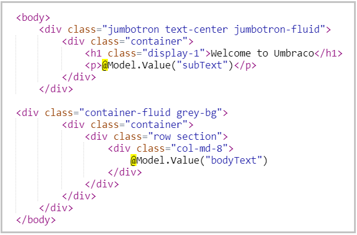
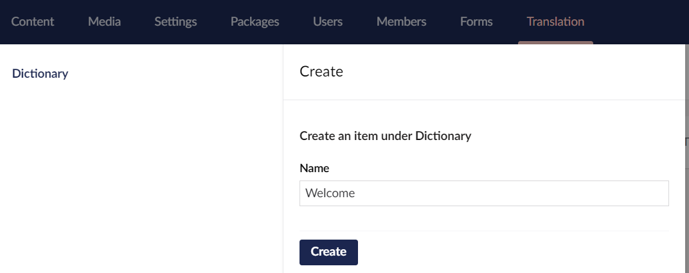
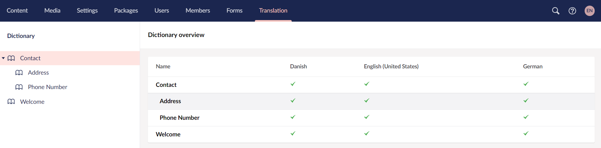
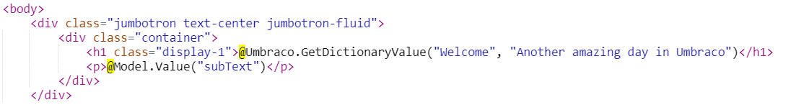

# Dictionary Items

Depending on how your site is set up, not all content is edited through the **Content** section. There might be some text in your templates or macros that needs translation. Using Dictionary Items, you can store a value for each language. Dictionary Items have a unique key which is used to fetch the value of the Dictionary Item.

Dictionary Items can be managed from the **Translation** section. Let's take a look at an example. In this example, we will translate "Welcome to Umbraco" from within the template and add it to the dictionary:


## Adding a Dictionary Item

To add a Dictionary Item:

1. Go to the **Translation** section.
2. Click on **Dictionary** in the **Translation** tree and select **Create**.
3. Enter the **Name** for the dictionary item. Let's say *Welcome*.
    
4. Click **Create**.
5. Enter the values for the different language versions.
    
6. Click **Save**.

### Grouping Dictionary Items

To group dictionary items:

1. Go to the **Translation** section.
2. Click on **Dictionary** in the **Translation** tree and select **Create**.
3. Enter the **Name** for the dictionary item. Let's say *Contact*.
4. Click **Create**.
5. Click on **Contact** and select **Create**.
6. Enter the **Name** of the item to be created under the **Contact** group.
7. Click **Create**.
8. Enter the values for the different language versions.
    
9. Click **Save**.

## Fetching Dictionary Values

To fetch dictionary values in the template, replace the text with the following snippet:

```csharp
@Umbraco.GetDictionaryValue("Welcome")
```


Alternatively, you can specify an `altText` which will be returned if the dictionary value is empty.

```csharp
@Umbraco.GetDictionaryValue("Welcome", "Another amazing day in Umbraco")
```



## Using Dictionary Item in a Multilingual website

To use Dictionary Items in a multilingual website, see the [Creating a Multilingual Site](../../../Tutorials/Multilanguage-Setup/index.md) article.

## Related Links

- [API reference for the DictionaryItem](../../../Reference/Management/Models/DictionaryItem.md)
- [Localization Service](../../../Reference/Management/Services/LocalizationService/index.md)
- [Creating a Multilingual Site](../../../Tutorials/Multilanguage-Setup/index.md)