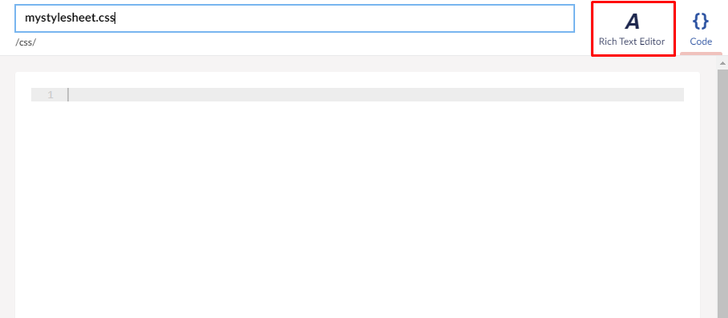

# Working with stylesheets and JavaScript

## Stylesheets in the Backoffice

You can create and edit stylesheets in the Stylesheets folder in the Settings section of the Backoffice.


In the Create menu, there are several options available:

* Stylesheet file (for use in templates/views)
* Rich Text Editor stylesheet file (for use in [Rich Text Editor](../../Backoffice/Property-Editors/Built-in-Property-Editors/Rich-Text-Editor/))
* Folder (for keeping stylesheets organized)

:::note
It is currently not possible to use any CSS preprocessor (such as SASS) in the backoffice.
:::

After creating a new stylesheet, you would work with it as you would with templates or javascript files - using the built-in backoffice text editor.
When you're working with stylesheets, you also have access to the Rich Text Editor, which allows you to create CSS styles and get a real-time preview.



The rules you create in the Rich Text Editor section will carry over to the Code tab.


To reference your newly included stylesheet in a template file, navigate to Templates, pick the template you like (css files are usually referenced in the layout or home templates) and link to it with the `link` tag.


By default, the stylesheets will be saved in the `css` folder in the solution.
To reference them you can use either of the methods used in the above screenshot.

```html
<link rel="stylesheet" href='@Url.Content("~/css/mystylesheet.css")'>
```
or
```html
<link rel="stylesheet" href="/css/mystylesheet.css">
```

With the stylesheet referenced, you will be able to style the template file with the rules and classes defined in the stylesheet.

Your stylesheets can be used in Rich Text Editors (datatype) as well - please see the [Rich Text Editor](../../Backoffice/Property-Editors/Built-in-Property-Editors/Rich-Text-Editor/RTE-Styles/) documentation for more information.

:::note
If your RTE is styled differently on the frontend of the site, the backoffice styling might be getting overwritten by other stylesheets you have included.
:::

## JavaScript files in the Backoffice

To create and edit JavaScript files in the Backoffice, head on over to the Scripts folder in the Settings section of the Backoffice.


From here you can add a new JavaScript file, or a new folder.

Add a new JavaScript file and write your code:


Then, navigate to the template where you would like to include your JS file.
```html
<script src="/scripts/myScript.js"></script>
```


By default all JavaScript files will be stored in the `scripts` folder in the solution.

:::tip
If you are working locally, you can create CSS and JS files outside of the Backoffice - long as they are placed in appropiate folders (`css` and `scripts`), they will show up in the Backoffice.
:::

## Bundling & Minification for JavaScript and CSS

You can use whichever tool you are comfortable with for bundling & minification, though it is worth noting that Umbraco ships with the ClientDependency Framework which offers runtime bundling & minification.

You can bundle and minify as follows in a view template file.

```csharp
@using ClientDependency.Core.Mvc
@using ClientDependency.Core
@{
    Html.RequiresJs("~/scripts/Script1.js", 1);
    Html.RequiresJs("~/scripts/Script2.js", 2);

    Html.RequiresCss("~/css/style.css");
}
<html>
<head>
    @Html.RenderCssHere()
    @Html.RenderJsHere()
</head>
```

:::note
If you are running your site locally and the compilation setting for debugging in your `web.config` is set to true, the Client Dependency Framework will not minify or combine your js/CSS. This is by design to help when debugging issues in a local environment. However, it also means if there is a problem minifying a file you will only encounter the issue when you deploy. To test minification and bundling locally, set the debug setting to false for compilation.
:::

:::note
When adding stylesheet references to `Html.RequiresCss` there is no need to add `?v=1` to specify a specific version of the asset for cache-busting. Doing so will break the minification and combination of your files. The Client Dependency Framework uses the version number from `/config/clientdependency.config` on the querystring of the combined and minified resource. 

To force your updated, minified and combined assets to be refreshed, increment this version number by 1 in the config file to bust any browser caching on the old version of your assets. See the [Healthcheck for Client Dependency Framework](https://our.umbraco.com/packages/developer-tools/health-check-for-client-dependency-framework/) package to do this from the backoffice, or you can automatically increment the version in your build and deploy process. 
:::


Full details of the ClientDependency Framework can be found here: [https://github.com/Shandem/ClientDependency](https://github.com/Shandem/ClientDependency)
