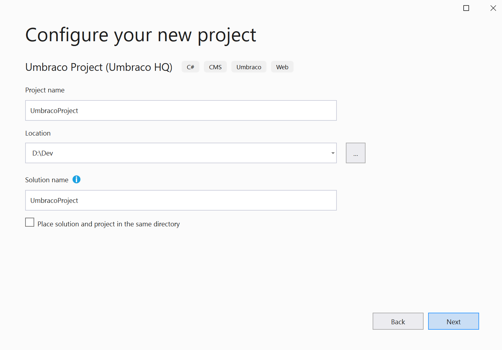

# Install Umbraco with Visual Studio

*Follow these steps to do a full install of Umbraco using Visual Studio.*

:::note
This article is valid only for Umbraco 9 and later versions.
:::

## Abbreviated version

- To install Umbraco, you first need to install [Umbraco's dotnet new templates](install-umbraco-with-templates.md).
- You will get the best results if you use Umbraco's dotnet new templates.
  - *In Visual Studio 2022, the .NET CLI templates are enabled to appear, by default. For information on how to enable .NET CLI templates in Visual Studio 2019, see the [.NET CLI Templates in Visual Studio](https://devblogs.microsoft.com/dotnet/net-cli-templates-in-visual-studio/) article*

- You will need Visual Studio 2019 updated to version **16.8 at least** or use you can use Visual Studio 2022.
- Go to `File` > `New` > `Project`, search for **Umbraco**.
- Choose **Umbraco Project (Umbraco HQ)** then click **Next**.
- In the next screen you can choose or specify different parameters but you can leave them all empty/default.
- The final step to complete this dialog is to click **Create**.
- Use CTRL+F5 to run the project and start the Umbraco installer.

## New project

To install Umbraco we first need to install Umbraco's dotnet new templates.

For more information check the first 2 steps of [Install Umbraco with .NET CLI](install-umbraco-with-templates.md#Install-the-template).

:::note  
Check that your Visual Studio version is at least 16.8 (`Help` > `About Microsoft Visual Studio`), lower versions do not install the correct NuGet dependencies.  
:::

### Create project

Go to **File > New > Project** and search for `Umbraco` in the *Search for templates* field.

Once you select **Umbraco Project (Umbraco HQ)** navigate to the next step by clicking *Next*.

### Configure project

In this step, you will be able to give your project and solution a name.

:::note  
Refrain from naming your solution `Umbraco`, as this will cause a namespace conflict with the CMS itself.  
:::

### Additional information

On the next step, you are able to specify some additional parameters like *Target framework*. The rest are optional.

You can then click the *Create* button and your Umbraco Project will be ready for you.

### Running the site

You can now run the site like you would normally in Visual Studio (using **F5** or the **Debug** button).

Follow the installation wizard and after a few steps and choices you should get a message saying the installation was a success.
