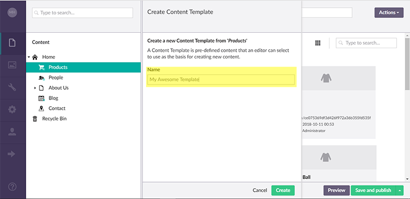
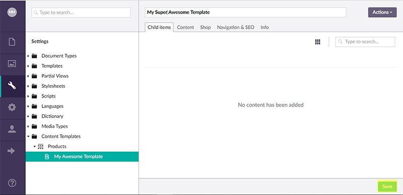

# Content Templates

Content Templates allows a content editor to create a blueprint for new content nodes based on an existing node.

## Create - Method 1

Select the 'Content' menu:

Then click the 'Actions' dropdown menu button and select the 'Create Content Template' menu item:

Give your content template a name:

Click the 'Create' button and if the creation was successful, you will see a success notification:

The new content template will be created in 'Content Templates' node of the settings tree:

## Create - Method 2

Click on the 'Settings' menu:

Right click on the 'Content Templates' tree and select the 'Create' menu item:

Select the document type you want to create a content template for:

Give your content template a name and click the 'Save' button:

The new content template will be created in 'Content Templates' node of the settings tree:

## Edit

To edit an existing content template, select a content template from the 'Content Templates' node of the settings tree and click the 'Save' button when you have finished editing:

## Use

Once you have created a content template, you can use the template to create new content nodes. To use a content template, right click the content tree and select 'Create':

When you click a document type that has content templates, Umbraco lets you choose to create a new node based on a content template or a blank one:

## More Information

* [Content template demo](https://www.youtube.com/watch?v=AEutrBnXZ-Q)
