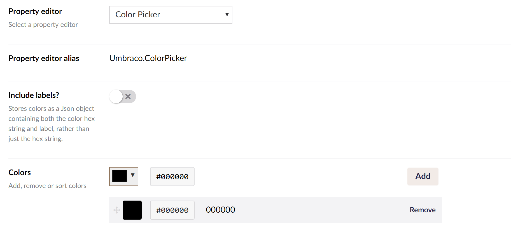

# Color Picker

`Alias: Umbraco.ColorPicker`

`Returns: String (Hexadecimal)` <br/>
`Returns: Umbraco.Core.PropertyEditors.ValueConverters.ColorPickerValueConverter.PickedColor (When using labels)`

The Color picker allows you to set some predetermined colors that the editor can choose between.

## Data Type Definition Example



## Content Example


## Example with Modelsbuilder

```csharp
@{
    var hexColor = Model.Color;
    String colorLabel = Model.Color.Label;

    if (hexColor != null)
    {
        <div style="background-color: #@hexColor">@colorLabel</div>
    }
}
```

## Example without Modelsbuilder

```csharp
@using Umbraco.Core.PropertyEditors.ValueConverters
@{
    var hexColor = Model.Value("Color");
    var colorLabel = Model.Value<ColorPickerValueConverter.PickedColor>("Color").Label;

    if (hexColor != null)
    {
        <div style="background-color: #@hexColor">@colorLabel</div>
    }
}
```