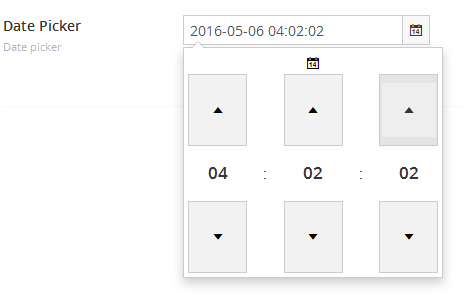

#DateTime

`Returns: DateTime`

Displays a calendar UI for selecting dates and time, the value saved is a standard dateTime valu

##Data Type Definition Example

##Content Example 

##MVC View Example - displays a datetime with time 

###Typed:

	@(Model.Content.GetPropertyValue<DateTime>("datePicker").ToString("dd MM yyyy HH:mm:ss"))

###Dynamic: 

	@{
		@CurrentPage.datePicker.ToString("dd-MM-yyyy HH:mm:ss")
	}