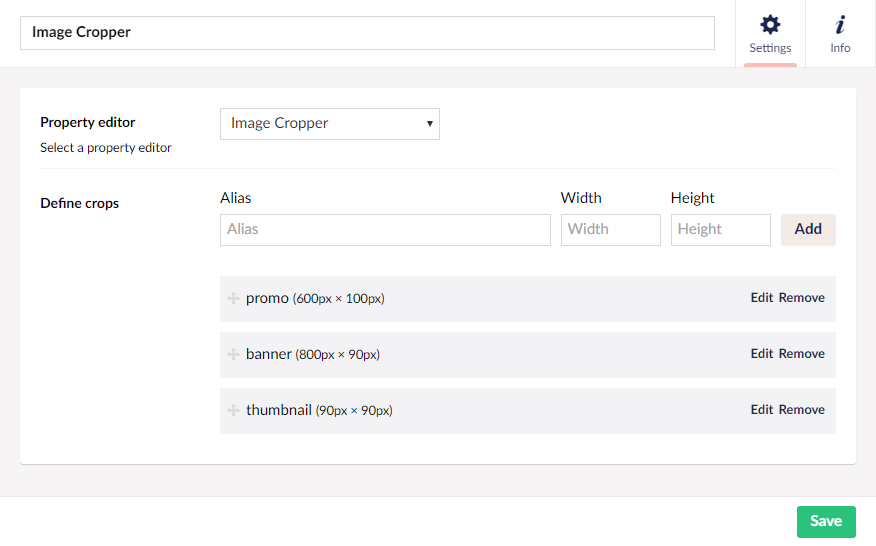
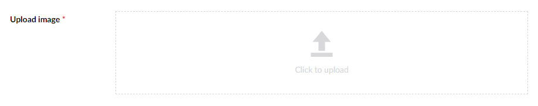

# Image Cropper

`Returns: JSON`

Returns a path to an image, along with information about focal point and available crops

## Settings

### Prevalues
You can add, edit & delete crop presets the cropper UI can use.

## Data Type Definition Example



## Content Example

Provides a UI to upload an image, set a focal point on the image, and optionally crop and scale the image to predefined crops.
By default, images in the cropper will be shown based on a set focal point, and only use specific crops if they are available.

The cropper comes in 3 modes:

- Uploading an image
- Setting a focal point
- Cropping the image to predefined crops

### Uploading images
The editor exposes a drop area for files. Click it to upload an image.


### Set focal point
By default, the cropper allows the editor to set a focal point on the uploaded image.
Next to the image, all the preset crops are shown to give the editor a preview of what
the image will look like to the end user.


### Crop and resize
If needed, the editor can crop the image to specific crop presets, to ensure the right part and size of the image
is shown for a specific crop.


## Sample code

Image Cropper comes with an API to generate crop URLs, or you can access its raw data directly as a
dynamic object.

The Url Helper method can be used to replace the IPublishedContent extension methods. It has  a set of extensions for working with URLs. 

For rendering a cropped media item, the `.GetCropUrl` is used:

```csharp
@Url.​GetCropUrl​(mediaItem: Model.Image, cropAlias: ​"Grid"​, htmlEncode: true); 
```

`HtmlEncode` is by default set to true, which means you only need to define the parameter if you wan't to disable HTML encoding.

### MVC View Example to output a "banner" crop from a cropper property with the alias "image"

```html

```

Or, alternatively:

```html

```

### MVC View Example to output create custom crops - in this case forcing a 300 x 400 px image

```csharp
@if (Model.HasValue("image"))
{
    
}
```

### CSS background example to output a "banner" crop from a cropper property with alias "image"

Set the `htmlEncode` to false so that the URL is not HTML encoded

```csharp
@{
    
    if (Model.Image != null)
    {
        var cropUrl = Url.GetCropUrl(Model.Image, "banner", false);
        <style>
            .myCssClass {
                background-image: url("@cropUrl");
            }
        </style>
    }
}
```

## Upload property replacement

You can replace an upload property with a cropper, existing images will keep returning their current path and work unmodified with the cropper
applied. The old image will even be available in the cropper, so you can modify it if you ever need to.

However, be aware that a cropper returns a dynamic object when saved, so if you perform any sort of string modifications on your upload property value,
you will most likely see some errors in your templates / macros.
