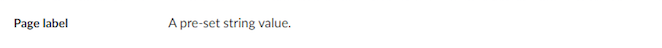

# Label

`Alias: Umbraco.Label`

`Returns: String`

Label is a non-editable control and can only be used to display a pre-set value.

## Data Type Definition Example


### Value type

If you want to set a value other than a String, you can define the data using one of the other available Data Types: Decimal, Date/time, Time, Integer and Big integer.

There is also a Value Type: Long string if you need to set a very long string value for your Label.

## Content Example



## MVC View Example

```csharp
@{
    if (Model.HasValue("pageLabel")){
        <p>@(Model.Value("pageLabel"))</p>
    }
}
```
