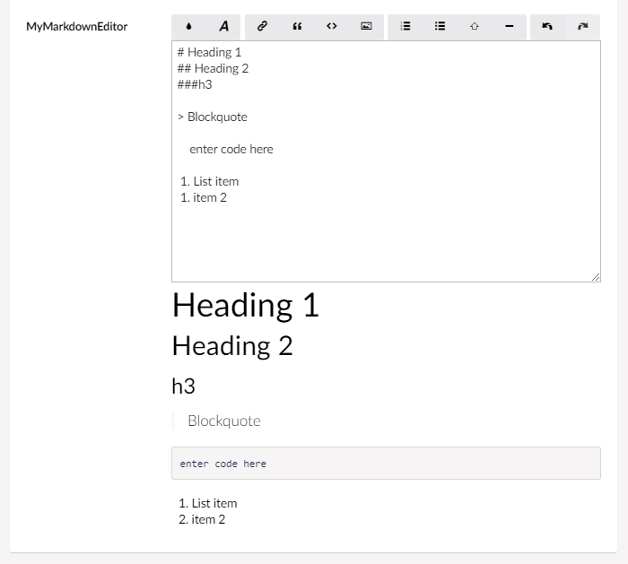

# Markdown editor

`Alias: Umbraco.MarkdownEditor`

`Returns: System.Web.HtmlString`

This built-in editor allow the user to use the markdown formatting options, from within a tinyMCE-like interface.


## Data Type Definition Example


There are two settings available for manipulating the **Markdown editor** property.

* **Preview** toggles if a preview of the markdown should be displayed beneath the editor in the content view. 
* **Default value** is inserted if no content has been saved to the document type using this property editor.

## Content Example



### Explanation of buttons from left to right
Function | Shortcut | Further explanation
---------|----------|---------------------
toggle **bold** text  | Ctrl + B |
toggle *italic* text  | Ctrl + I |
insert link           | Ctrl + L | This opens the Select Link interface. 
toggle quote          | Ctrl + Q |
toggle code block     | Ctrl + K |
insert image          | Ctrl + G | This opens the Select Media interface.
toggle ordered list   | Ctrl + O |
toggle unordered list | Ctrl + U | 
toggle heading        | Ctrl + H | This toggles between h1, h2 and off.
toggle a hr           |          |
undo                  | Ctrl + Z |
redo                  | Ctrl + Y |
### Other functionality
Function   | Shortcut 
-----------|---------
select all | Ctrl + A 
copy       | Ctrl + C 
paste      | Ctrl + V


## MVC View Example

### With Modelsbuilder

```csharp
@Model.MyMarkdownEditor
```

### Without Modelsbuilder

```csharp
@Model.Value("MyMarkdownEditor")
```
