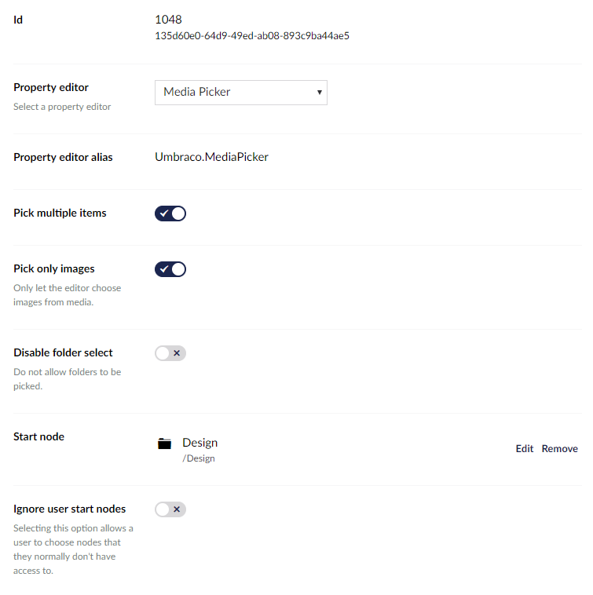

# Media Picker #

`Alias: Umbraco.MediaPicker`

`Returns: IEnumerable<IPublishedContent>` or `IPublishedContent`

This property editors returns a single item if the "Pick multiple items" data type setting is disabled or a collection if it is enabled.

## Data Type Definition Example



### Ignorer user start nodes
Choose this to overrule user permissions, to enable any user of this property to pick any Media Item of the choosen Start node. If no Start node has been defined for this property any content can be viewed and selected of this property.

## Content Example


## MVC View Example

### Multiple enabled without Modelsbuilder

```csharp
@{
    var typedMultiMediaPicker = Model.Value<IEnumerable<IPublishedContent>>("sliders");
    foreach (var item in typedMultiMediaPicker)
    {
        
    }
}
```

### Multiple enabled with Modelsbuilder

```csharp
@{
    var typedMultiMediaPicker = Model.Sliders;
    foreach (var item in typedMultiMediaPicker)
    {
        
    }
}
```

## Multiple disabled without Modelsbuilder

```csharp
@{
    var typedMediaPickerSingle = Model.Value<IPublishedContent>("featuredBanner");
    if (typedMediaPickerSingle != null)
    {
        <p>@typedMediaPickerSingle.Url</p>
        
    }
}
```

## Multiple disabled with Modelsbuilder

```csharp
@{
    var typedMediaPickerSingle = Model.FeaturedBanner;
    if (typedMediaPickerSingle is Image image)
    {
        <p>@image.Url</p>
        
    }
}
```
