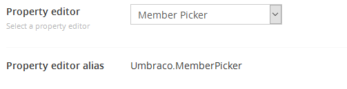
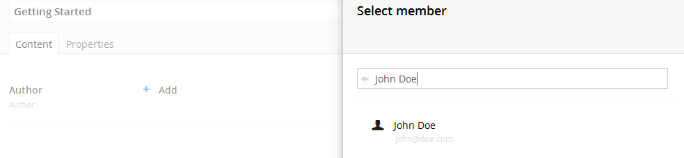

#Member Picker

`Returns: Member ID`

The member picker opens a panel to pick a specific member from the member section. The value saved is the selected member ID.

##Data Type Definition Example

##Content Example 

##MVC View Example

###Typed:

	@{
		if(Model.Content.HasValue("author")){
			var member = Umbraco.TypedMember(Model.Content.GetPropertyValue<int>("author"));
				@member.Name
		}
	}

###Dynamic:                              

	@{
		if(CurrentPage.HasValue("author")){
			var member = Umbraco.TypedMember(CurrentPage.author);
				@member.Name
		}
	}
	
