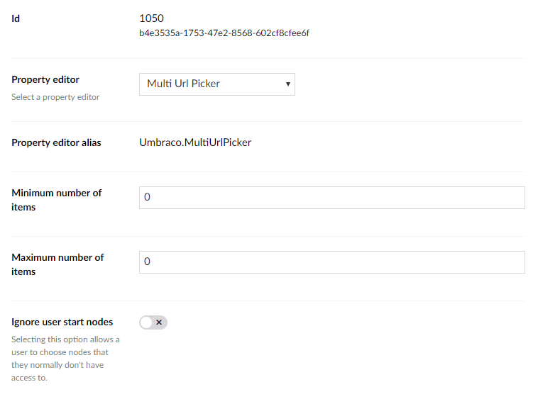

# Multi Url Picker

`Alias: Umbraco.MultiUrlPicker`

`Returns: IEnumerable<Link> or Link`

Multi Url Picker allows an editor to pick and sort multiple urls. This property editor returns a single item if the "Maximum number of items" data type setting is set to 1 or a collection if it is 0. These can either be internal, external or media.


## Data Type Definition Example



## Content Example


## MVC View Example - [value converters enabled](../../../../Setup/Upgrading/760-breaking-changes.md#property-value-converters-u4-7318)

## Typed

```csharp
@using Umbraco.Web.Models
@{
    var links = Model.Value<IEnumerable<Link>>("footerLinks");
    if (links.Any())
    {
        <ul>
            @foreach (var link in links)
            {
                <li><a href="@link.Url" target="@link.Target">@link.Name</a></li>
            }
        </ul>
    }
}
```

If `Max number of items` is configured to `1`
```csharp
@using Umbraco.Web.Models
@{
    var link = Model.Value<Link>("link");
    if (link != null)
    {
    <li><a href="@link.Url" target="@link.Target">@link.Name</a></li>
    }
}
```
