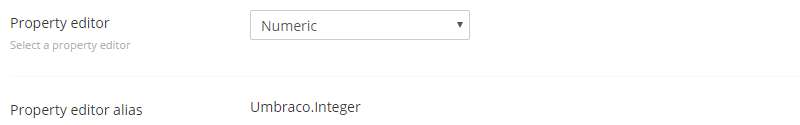
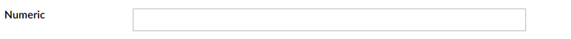

# Numeric

`Alias: Umbraco.Integer`

`Returns: Integer`

Numeric is an HTML input control for entering numbers. Since it's a standard HTML element the options and behaviour is all controlled by the browser and therefore is beyond the control of Umbraco.

## Data Type Definition Example



## Settings

## Content Example




## MVC View Example

```csharp
@{
    if(Model.Content.HasValue("amount")){
        <p>@(Model.Content.GetPropertyValue<string>("amount"))</p>
    }
}
```
