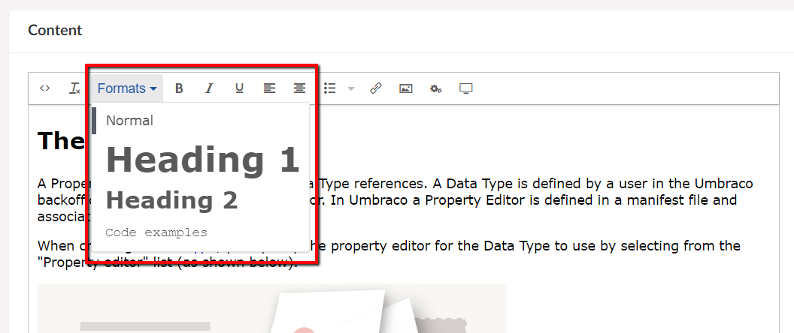

# Rich Text Editor Styles

It is possible to define specific styles and fonts for the Rich Text Editor. Once you've defined the styles, and enabled them on the RTE Data Type, the styles can be accessed directly in the content section.

## Creating RTE Styles

The RTE styles are created and managed in the Umbraco backoffice.

Find the **Stylesheets** folder in the Settings section. Right-click the folder, select **Create...** and choose *New Rich Text Editor style sheet file*. Give the new stylesheet a name and **Save** it - this will generate an empty `.css` file.

At this point, you can start adding specific styles, that your editors can then use in the content section when creating and writing new content.

The image above is an example of how an RTE style can be configured. When working with these styles, the **Preview** feature will show you how the style will look when applied.

## Using RTE Styles
