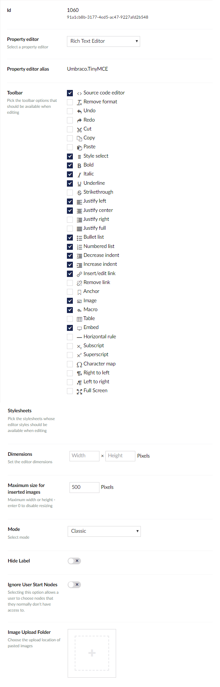

# Rich Text Editor

`Alias: Umbraco.TinyMCE`

`Returns: HTML`

The Rich Text Editor (RTE) is based on [tinymce](https://www.tinymce.com/) and is highly configurable. Depdending on the configuration, it will give your content editors more flexibility when working with content that should be more than only plain text.

## [Configuration options](Configuration)

Customize everything from toolbar options to editor size to where pasted images are saved.

## [RTE Styles](RTE-Styles)

Use CSS to define specific editor styles and add them to the RTE.

## Data Type Definition Example



## Content Example


## MVC View Example

```csharp
@{
    if (Model.HasValue("richText")){
        <p>@(Model.Value("richText"))</p>
    }
}
```