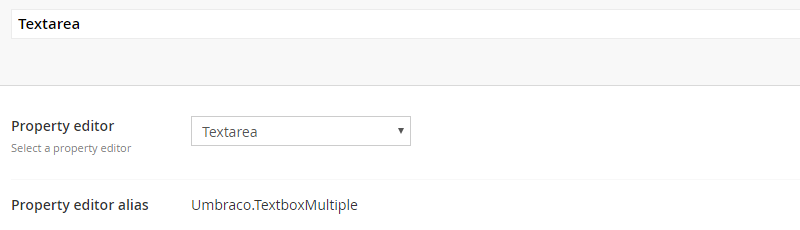
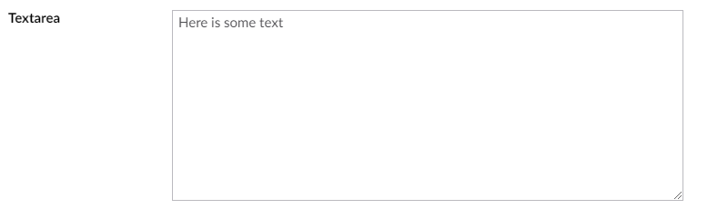

# Textarea

`Alias: Umbraco.TextboxMultiple`

`Returns: String`

Textarea is a simple HTML textarea control for multiple lines of text.

## Data Type Definition Example

## Settings

## Content Example:

## MVC View Example:

	@{
	   if (Model.Content.HasValue("description")){
	       
@(Model.Content.GetPropertyValue<string>("description"))

	   }
	}
