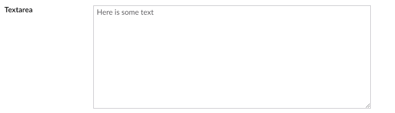

# Textarea

`Alias: Umbraco.TextboxMultiple`

`Returns: String`

Textarea is an HTML textarea control for multiple lines of text.

## Data Type Definition Example


## Settings

## Content Example




## MVC View Example

```csharp
@{
    if (Model.Content.HasValue("description")){
        <p>@(Model.Content.GetPropertyValue<string>("description"))</p>
    }
}
```
