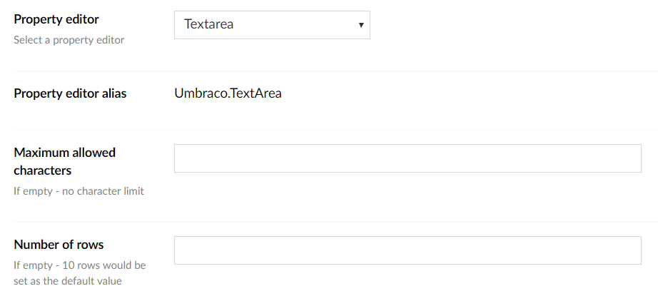

# Textarea

`Alias: Umbraco.TextArea`

`Returns: String`

Textarea is an HTML textarea control for multiple lines of text. It can be configured to have a fixed character limit, as well as define how big the space for writing can be. By default, there is no character limit unless it's specifically set to a specific value like 200 for instance. If you don't specify the number of rows, 10 will be the amount of rows the textarea will be occupying, unless changed to a custom value.

## Data Type Definition Example

### Without a character limit



### With a character limit


## Settings

## Content Example

### Without a character and rows limit


### With a character limit and rows limit


## MVC View Example

```csharp
@{
    if (Model.HasValue("description")){
        <p>@(Model.Value<string>("description"))</p>
    }
}
```
