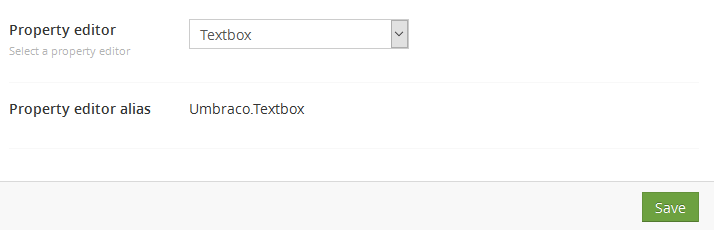

# Textbox

`Alias: Umbraco.Textbox`

`Returns: String`

Textbox is a simple HTML input control for text.

## Data Type Definition Example

## Settings

## Content Example:

## MVC View Example:

	@{
	   if (Model.Content.HasValue("pageTitle")){
	       
@(Model.Content.GetPropertyValue<string>("pageTitle"))

	   }
	}

### Dynamic (Obsolete):

See [Common pitfalls](../../../../../reference/Common-Pitfalls/#dynamics) for more information about why the dynamic approach is obsolete.

	@{
	   if (CurrentPage.HasValue("pageTitle")){
	       
@CurrentPage.pageTitle

	   }
	}
