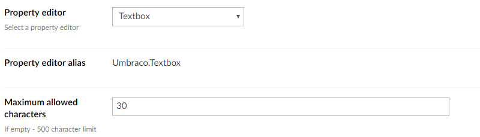
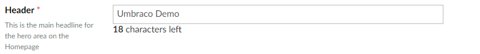

# Textbox

`Returns: String`

Textbox is a simple HTML input control for text. It can be configured to have a fixed character limit. The default maximum amount of characters is 500 unless it's specifically changed to a lower amount.

## Data Type Definition Example

### Without a character limit

### With a character limit

## Settings

## Content Example:

### Without a character limit

### With a character limit

## MVC View Example:

	@{
	   if (Model.Content.HasValue("pageTitle")){
	       
@(Model.Content.GetPropertyValue<string>("pageTitle"))

	   }
	}

### Dynamic (Obsolete):

See [Common pitfalls](https://our.umbraco.org/documentation/reference/Common-Pitfalls/#dynamics) for more information about why the dynamic approach is obsolete.

	@{
	   if (CurrentPage.HasValue("pageTitle")){
	       
@CurrentPage.pageTitle

	   }
	}
