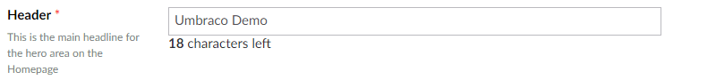

# Textbox

`Alias: Umbraco.Textbox`

`Returns: String`

Textbox is an HTML input control for text. It can be configured to have a fixed character limit. The default maximum amount of characters is 500 unless it's specifically changed to a lower amount.

## Data Type Definition Example

### Without a character limit


### With a character limit


## Settings

## Content Example

### Without a character limit


### With a character limit



## MVC View Example

```csharp
@{
    if (Model.Content.HasValue("pageTitle")){
        <p>@(Model.Content.GetPropertyValue<string>("pageTitle"))</p>
    }
}
```


### Dynamic (Obsolete)

See [Common pitfalls](https://our.umbraco.com/documentation/reference/Common-Pitfalls/#dynamics) for more information about why the dynamic approach is obsolete.

```csharp
@{
    if (CurrentPage.HasValue("pageTitle")){
        <p>@CurrentPage.pageTitle</p>
    }
}
```
