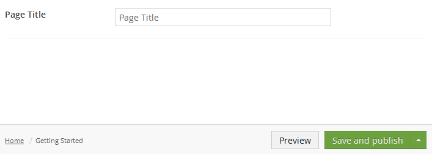

# Textbox

`Alias: Umbraco.Textbox`

`Returns: String`

Textbox is an HTML input control for text.

## Data Type Definition Example


## Settings

## Content Example



## MVC View Example

```csharp
@{
    if (Model.Content.HasValue("pageTitle")){
        <p>@(Model.Content.GetPropertyValue<string>("pageTitle"))</p>
    }
}
```


### Dynamic (Obsolete)

See [Common pitfalls](../../../../../Reference/Common-Pitfalls/index.md#dynamics) for more information about why the dynamic approach is obsolete.

```csharp
@{
    if (CurrentPage.HasValue("pageTitle")){
        <p>@CurrentPage.pageTitle</p>
    }
}
```
