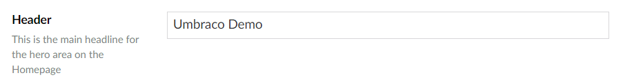

# Textbox

`Alias: Umbraco.Textbox`

`Returns: String`

Textbox is an HTML input control for text. It can be configured to have a fixed character limit. The default maximum amount of characters is 500 unless it's specifically changed to a lower amount.

## Data Type Definition Example

### Without a character limit


## Settings

## Content Example

### Without a character limit



### With a character limit


## MVC View Example

```csharp
@{
    // Perform an null-check on the field with alias 'pageTitle'
    if (Model.HasValue("pageTitle")){
        // Print the value of the field with alias 'pageTitle'
        <p>@(Model.Value("pageTitle"))</p>
    }
}
```
