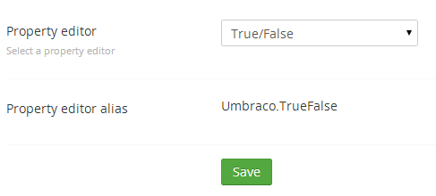

#True/False

`Returns: Boolean`

True/False is a simple checkbox which saves either 0 or 1, depending on the checkbox being checked or not.

##Data Type Definition Example

##Content Example 

##MVC View Example - displays a list of links to child pages that are not hidden

###Typed:

	@{
		foreach (IPublishedContent page in Model.Content.Children){
            if (!page.GetPropertyValue<bool>("umbracoNaviHide"))
            {
				
@page.Name

			}
		}	
	}

###Dynamic: 

	@{
		foreach (var page in CurrentPage.Children){
			if (!page.umbracoNaviHide){
				
@page.Name

			}
		}	
	}