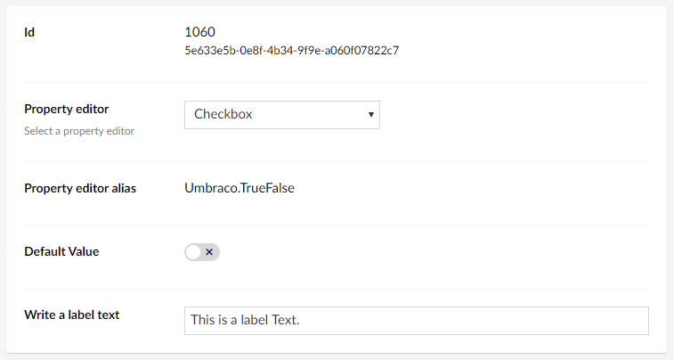

# Toggle

`Returns: Boolean`

Toggle is a standard checkbox which saves either 0 or 1, depending on the checkbox being checked or not.

## Data Type Definition Example



The Toggle property has a setting which allows you to set the default value of the checkbox, either checked (true) or unchecked (false).

It is also possible to define a label, that will be displayed next to the checkbox on the content.

## Content Example


## MVC View Example

### Without Modelsbuilder

```csharp
@{
    if (!Model.Value<bool>("myCheckBox"))
    {
        <p>The Checkbox is not checked!</p>
    }
}
```

### With Modelsbuilder

```csharp
@{
    if (!Model.MyCheckbox)
    {
        <p>The Checkbox is not checked!</p>
    }
}
```

## Add values programmatically

See the example below to see how a value can be added or changed programmatically. To update a value of a property editor you need the [Content Service](../../../../../Reference/Management/Services/ContentService/index.md).

```csharp
@{
    // Get access to ContentService
    var contentService = Services.ContentService;

    // Create a variable for the GUID of the page you want to update
    var guid = new Guid("796a8d5c-b7bb-46d9-bc57-ab834d0d1248");
    
    // Get the page using the GUID you've defined
    var content = contentService.GetById(guid); // ID of your page

    // Set the value of the property with alias 'myCheckBox'
    content.SetValue("myCheckBox", true);
            
    // Save the change
    contentService.Save(content);
}
```

Although the use of a GUID is preferable, you can also use the numeric ID to get the page:

```csharp
@{
    // Get the page using it's id
    var content = contentService.GetById(1234); 
}
```

If Modelsbuilder is enabled you can get the alias of the desired property without using a magic string:

```csharp
@{
    // Set the value of the property with alias 'myCheckBox'
    content.SetValue(Home.GetModelPropertyType(x => x.MyCheckBox).Alias, true);
}
```
