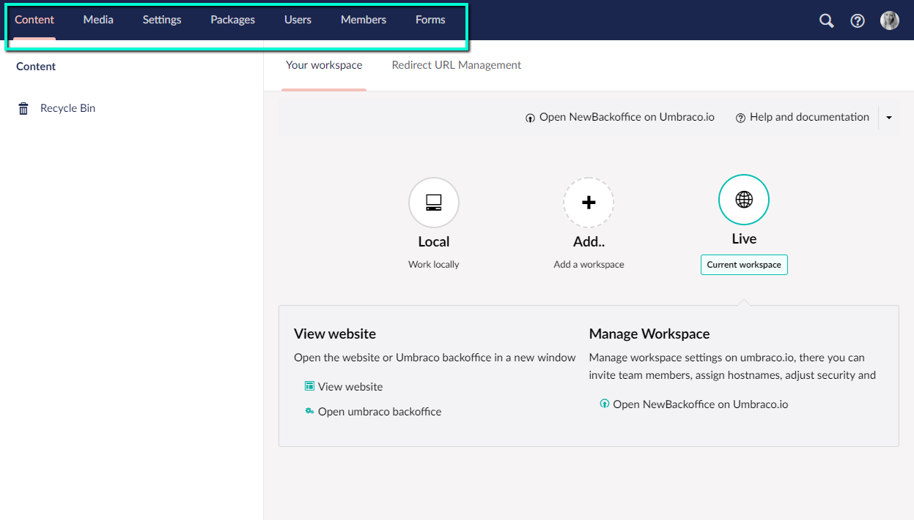

# Sections
A section in Umbraco is where you do specific tasks related to that section. For example Content, Settings and Users are all sections. You can navigate between the different sections by clicking the corresponding icon in the section menu which is in the top of the backoffice.

*The __Section menu__ is the horizontal menu located in the top of the backoffice.*

There are seven default sections that come with Umbraco:

## Content
The Content section contains the content of the website. Content is displayed as nodes in the content tree. Nodes can also show content state:

* Grayed out nodes have not been published
*  nodes have unpublished versions (but are currently published)
*  nodes are protected from the public (require logging in)
*  nodes are currently locked/non-deletable
*  nodes are containers (such as List Views)

In order to create content you must define it using Document Types.

## Media
The Media section contains the media for the website. By default you can create folders and upload media files (images and PDFs). You can customize the existing media types or define your own in the Settings section.

## Settings
The Settings section is where you can work with the website layout, language/localization and define media and content. The Settings tree consists of:  

- Document Types
- Templates (.cshtml files)
- Partial views (.cshtml files)
- Stylesheets (.css files)
- Scripts (.js files)
- Languages
- Dictionary
- Media Types

## Developer
In the developer section you work with packages, data types, macros, relations, XSLT and Razor files. The developer tree consists of:

- Packages
- Data Types
- Macros
- Relation Types
- XSLT files
- Partial View Macro Files

## Members
Manage, create and customize members, member types and member groups.

## Users
Manage, create and customize backoffice users and user groups.

## Forms
You can install Umbraco Forms directly from the backoffice by clicking the install button. Once installed this section is where you create and manage your forms.

## Help
When the help section is opened you get a link to video tutorials about the section you're in.

## More information
As well as the default sections that come with Umbraco, you can create your own [Custom Sections](../../../Extending/Section-Trees/index.md)
