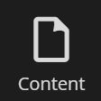
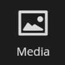
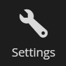
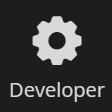
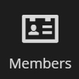
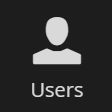
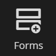
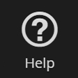

#Sections
There are eight default sections that come with Umbraco:

### Content
The content section contains the content of the website. Content is displayed as nodes in the content tree. In order to create content you must define it using document types.

### Media
The Media section contains the media for the website. By default you can create folders and upload media files (images and pdf's). You can customize the existing media types or define your own in the Settings section.

### Settings
The Settings section is where you can work with the website layout, language/localization and define media and content. The Settings tree consists of:  

- Templates (cshtml files)
- Stylesheets (CSS files)
- Partial views (cshtml files)
- Scripts (javascript files)
- Dictionary
- Languages
- Media Types
- Document Types

### Developer
In the developer section you work with data types, macros, packages, relations and xslt files. The developer tree consists of:

- Data Types
- Macros
- Packages
- Relation Types
- XSLT files
- Partial View Macro Files

### Members
Manage create and customize members, member types and member groups.

### Users
Manage, create and customize backoffice users and user groups.

### Forms
You can install Umbraco Forms directly from the backoffice by clicking the install button. Once installed this section is where you create and manage your forms.

### Help
When the help section is opened you get a links to video tutorials about the section you're in.

##More information
- [Custom Sections](../../../Extending/Section-Trees/index.md)
