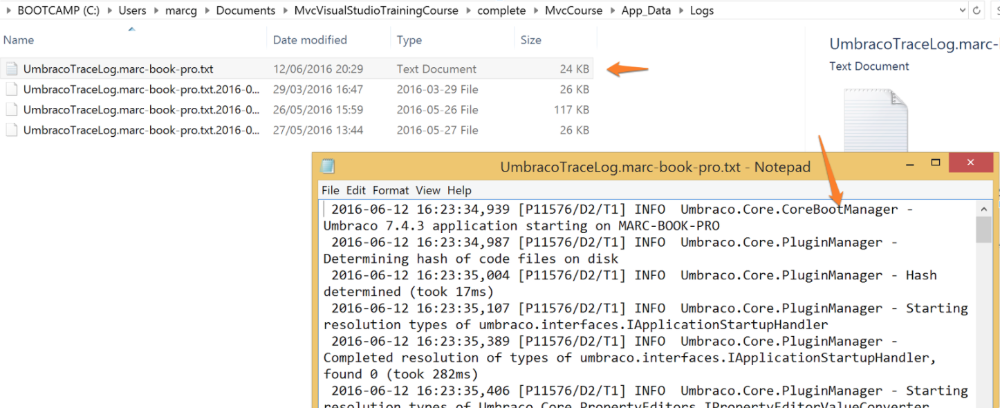

### Logging

Umbraco uses the Apache Log4Net library to output log statements to a set of Trace logs, to help you investigate problems with your Umbraco Installation. You can write to these log files from your custom code.

The configuration for log4net is found in your Umbraco site here: /config/log4net.config you can set the priority of the level of the logs information to be stored here:

    <priority value="Info"/>

Full details of Log4Net configuration options can be found here: https://logging.apache.org/log4net/release/manual/configuration.html

The default location for trace logs in your application will be /app_data/logs/ with a file created for each day of logging information.
There is a useful Umbraco Package called Diplo Trace Log Viewer that will enable you to see this log file information from the developer section of the Umbraco Backoffice: https://our.umbraco.com/projects/developer-tools/diplo-trace-log-viewer/

##### Writing to the logs

Umbraco provides a helper to enable you to log information from within your custom code.

You will need to add a reference to Umbraco.Core.Logging in your class / view:

    using Umbraco.Core.Logging;

and then from within your code you can use the helper to log information

    LogHelper.Info(typeof(NameOfClassYouAreLoggingFrom), "Your logging message");

or more generically if you are not sure of the class...

    LogHelper.Info(this.GetType(),"Your logging message");

There are methods to add logging at different priority levels:

* Debug - Used in development and testing, contains the most information, and likely information to help you diagnose a problem - avoid running a production site 'in debug'.
* Information - Useful status information regarding the running and management of your site, eg xx started correctly.
* Warn - For exceptions that are expected and handled in your code but useful to flog - eg missing configuration.
* Error - For exceptions that are not handled in code.

