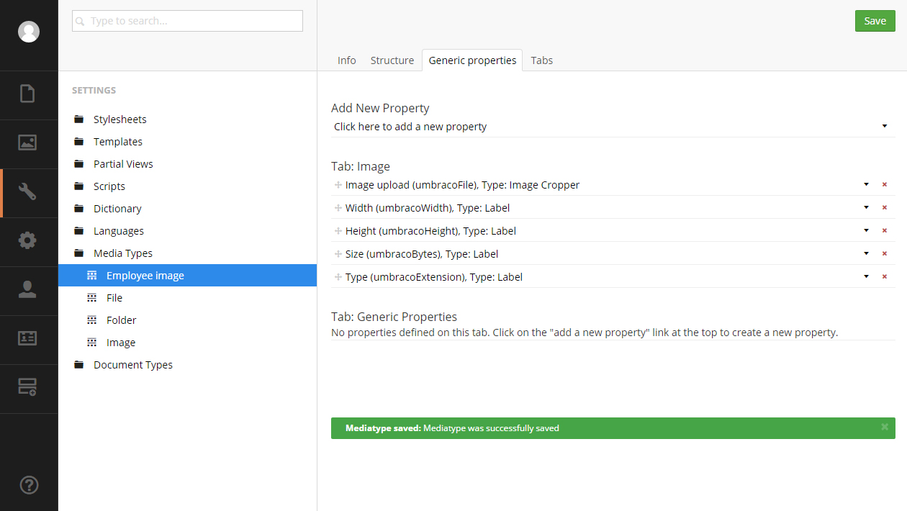
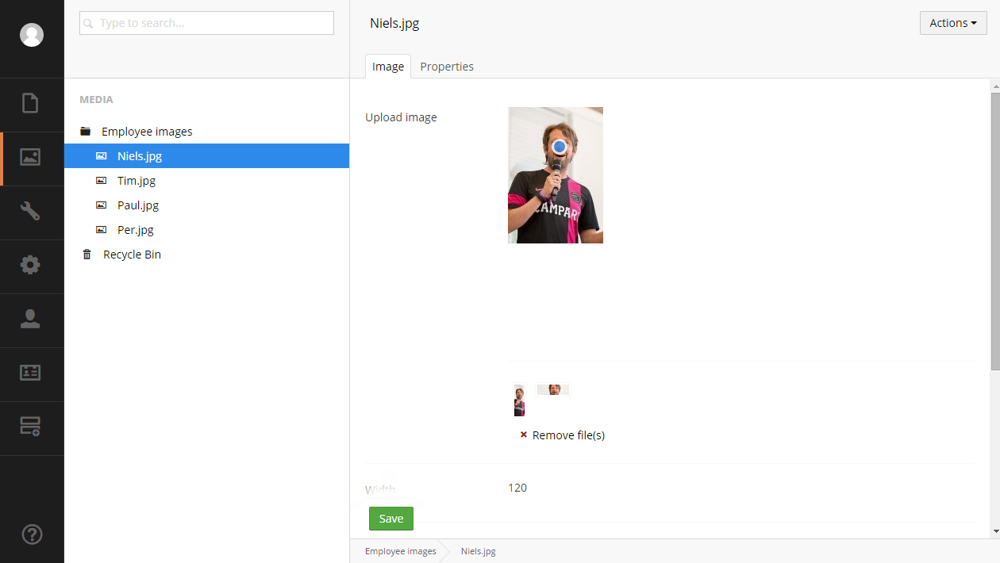

#Creating media
Media in Umbraco is handled in much the same way as content. Instead of defining Document Types you define Media Types that act as the base for media item. Unlike with normal content there are a three default Media Types:

- Folder
- Image
- File

The __Folder__ Media Type is a container for organizing media items in the media tree. The __Image__ Media Type is used for uploading and storing images and the __File__ Media Type is used to upload other and store files in the Media section. This means you don't have to define your own Media Types to start using the section. You've already got the tools for organizing and uploading media.

###Creating a folder
It is always a good idea to start by creating a folder for Media items. Make sure to name your folders in a way that makes it easy for editors to upload files and images in the right place.

To create a media folder go to the Media section and click the menu icon to the right of __Media__, alternatively you can right click the __Media__ node and choose create. This will bring up the create dialogue. Pick the __Folder__, enter a name and press __save__.

###Uploading images and files
There are a couple different ways to do this. You can use the context menu as when creating a folder. Click the menu icon next to the folder and choose __Image__ or __File__, enter a name for your media item and click the __Choose File__ button.

An easier way to do it is to click the folder node then click the upload area in the __Content__ tab and choose the file you want. Or simply drag and drop the file to the upload area. Umbraco will automatically detect if it is an image or a file and create a media item in the folder.

The __Image__ Media Type has 4 properties that will be populated once the the image is uploaded. These are __Width__, __Height__, __Size__ and __Type__ and can be viewed in the __Media__ section and accessed in your templates.

###Editing media items
To edit a file or an image simply click the item in the __Contents__ tab.

###Using media items in content
By adding a __Media Picker__ property to a Document Type the editor will have the ability to select media items in the __Content__ section.

##Creating a Media Type
You can create your own Media Types and add properties, tabs and control the structure of the Media tree just as with Document Types. This means you can store information that is specific to the media on the media item itself.

A Media Type is created in the __Settings__ section using the Media Type editor.

Go to the __Settings__ section in the backoffice. On the __Media Types__ node click the menu icon (or rightclick the node) to bring up the context menu. Here choose __Create new Media Type__, enter a name and press __Create__.

Click __Choose__ next to __Icon__, search for "user" and select an apropriate icon.

##The Media Type editor
You are now taken to the Media Type editor that is used to define and edit the Media Type. It consists of four tabs: __Info__, __Structure__, __Generic Properties__ and __Tabs__.

The Media Type Editor works in much the same way as the Document Type editor.

####Adding tabs
Before we start adding properties to the Media Type it is a good idea to create a tab to put these on otherwise all the properties will be shown in the default __Properties__ tab along with all the default properties (id, last edited and so forth).

Go to the __Tabs__ tab and create a tab called "Image".

####Adding properties
We need to add the same properties as on the default __Image__ Media Type. These are:

- umbracoFile
- umbracoWidth
- umbracoHeight
- umbracoBytes
- umbracoExtension

Go to the __Generic properties__ tab click __Add new property__. Name it "Image upload" and give it the alias "umbracoFile". Choose __Image cropper__ as the type and put it on the __Image__ tab.

Name the remaining four properties "Width", "Height", "Size" and "Type" and give the aliases seen above. They should all be of the type __Label__. As mentioned before these properties will automatically be populated once an image has been uploaded.

Before moving forward we need to add Cropping information to the image cropper Data Type. So go to the __Developer__ section and expand the __Data Types__ node. Select the __Image Cropper__ node and add a couple of crops. Click the __Add new crop__ button and enter  For this example the name and size of the crops don't matter but to make it easier to see the difference, make the aspect ratio of the crops different (eg. "Portrait" 300x100 and "Landscape" 100x300).

###Defining a Media Type folder
Next up we'll create a folder to hold the employee images. We could use the existing __Folder__ Media Type but that would mean editors can upload employee images to any folder of that type. If we create a folder specifically for employee images there is only one place to put them thus making it easier to have an organized Media section.

####Structure and inheritance
Go back to the __Settings__ and create a new Media Type and name it "Employee Images". Go to the __Structure__ tab. Select __Employee image__ under __Allowed child node types__. We want the same basic functionality (same properties and tabs) as the __Folder__ Media type and that can be achived by selecting __Folder__ under __Document Type Compositions__. Now Employee images will inherit tabs and properties from the Folder Media Type.

All that is left to do is to define where the folder can be created. We want to create the folder in the root of the Media section so select the __Allow at root__ option at the top of the __Structure__ tab.

####Creating the folder and media items
Go to the __Media__ section and click the menu icon next to Media and select the __Employee images__ folder. Name it "Employee images" and click create.

To start uploading images to the folder simply drag and drop the files you want into the __Contents__ tab or click the menu icon on the __Employee images__ node and select __Employee image__.

*Remember you can uncheck the __Allow at root__ option on the __Employee images__ Media Type to prevent editors from creating multiple folders of this type. This will not affect created folders, just disable the creation of new ones*

####Cropping the images

If you select an image that has been uploaded to this folder you'll see the full image and the two crops we have defined below. Moving the blue focal point on the on the image will update the crops to focus accordingly. You can also edit the individual crops by selecting them and moving the image or adjust the slider to zoom.

##More information
- [Rendering Media](../../Design/Rendering-Media/)
- [Customizing Data Types](../Data-Types/index.md)

##Related Services
- [MediaService](../../../Reference/Management/Services/MediaService.md)
