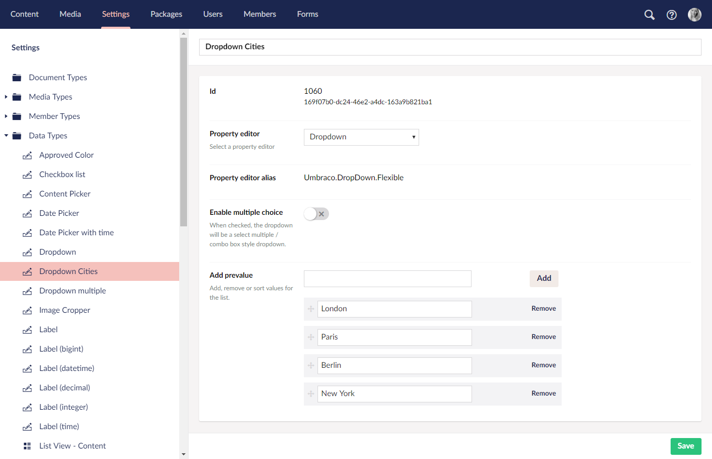

# Data Types
*A Data Type defines the type of input for a property. So when adding a property (on Document Types, Media Types and Members) and selecting the Type you are selecting a Data Type. There are a number of preconfigured Data Types available in Umbraco and more can be added in the Settings section.*

## What is a Data Type?
A Data Type can be something very basic (textstring, number, true/false,...) or it can be more complex (multi node tree picker, image cropper, Grid Layout).

The Data Type references a Property Editor and if the Property Editor has settings these are configured on the Data Type. This means you can have multiple Data Types referencing the same Property Editor.

An example of this could be to have two dropdown Data Types both referencing the same dropdown Property Editor. One configured to show a list of cities, the other a list of countries.

## Creating a new Data Type
To create a new Data Type, go to the Settings section within the backoffice and click the menu icon to the right of the __Data Types__ folder and select __New data type__. Name the Data Type - we'll call it "Dropdown Cities".

* __Property Editor:__ This is where you pick the Property Editor that our *Dropdown Cities* Data Type will be referencing. Pick the __Dropdown__ and now you will see the configuration options that are available for a Data Type referencing the Dropdown Property Editor.

* __Property Editor Alias__
The alias of the Property Editor being used - in this case `Umbraco.DropDown.Flexible`

* __Enable multiple choice:__ By enabling this it will be possible to select multiple options from the dropdown.

* __Add prevalue:__ Here you can add prevalues to the Data Type by entering the value you want into the input field and pressing the __add__ button or hitting __Enter__ on your keyboard.

When you're happy with the list press Save and it is now possible to select this Data Type for a property on Document Types, Media Types and Members. Doing this will then create a dropdown list for the editor to choose from and save the choice as a string.

## Customizing Data Types
To customize an existing Data Type go to the __Settings__ section, expand the __Data Types__ folder and select the Data Type you want to edit.

Aside from the Data Types that are available out of the box there are some additional Property Editors to choose from such as the __Slider__ and __Nested Content__.

### More information
* [List of available Data Types](default-data-types.md)
* [Property Editors](../../Backoffice/Property-Editors/index.md)

### Related Services
* [DataTypeService](../../../Reference/Management/Services/DataTypeService.md)

### Umbraco.tv
* [Episode: Data Types](https://umbraco.tv/videos/umbraco-v8/implementor/fundamentals/document-types/data-types-and-property-editors)
