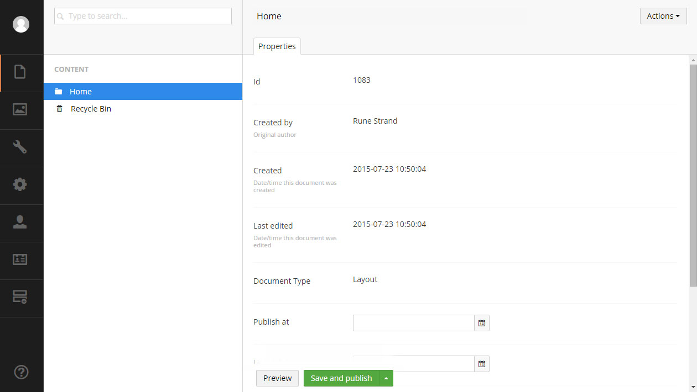
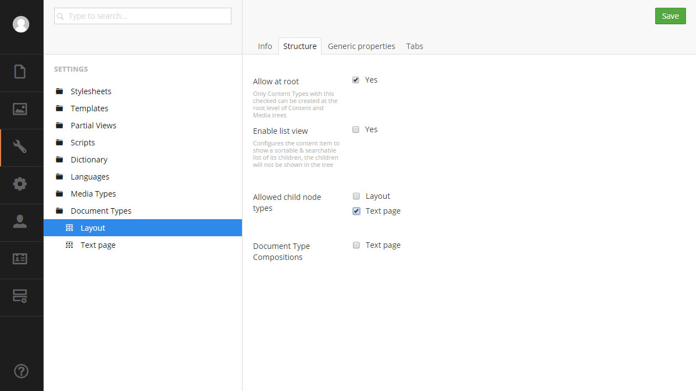

#Defining content
*A fundamental principle in Umbraco is that you cannot create content without defining it first. Here you'll find an explanation of how content is defined and quick guide for your first go (based on an empty installation).*

Before a piece of content can be created it needs to be defined. That is why, when opening a blank installation of Umbraco, it is not possible to create content in the __Content__ section. All content needs a blueprint that holds information about what kind of data can be stored on the content node, which editors are used, how it is organized, where in the structure it is allowed and so forth. This blueprint or definition is called a Document Type.

##What is a Document Type?
In it's most basic form a document type is a form containing fieldsets (or tabs) where you can apply rules about where the content can be created, which template(s) are allowed, backoffice icon and so forth.

Document Types can define entire pages or more limited content that can be reused on other nodes ie. a SEO tab. This means that you are in complete control of what type of content can be created where.

####Properties
Each field on a Document Type is called a property. A property is given a name, an alias (used to output the properties content in a template) and a type. The type determines what type of data the property will store and the input method. There are a wide range of Data Types available out of the box (textstring, richtext, media picker and so forth) and you can customize and add additional Data Types in the __Developer__ section und __Data Types__.

[Additional information on Data Types can be found in here](../Data-Types/index.md)

##Creating a Document Type
A Document Type is created in the settings section using the Document Type editor.

Go to the __Settings__ section in the backoffice. On the __Document Types__ node click the menu icon (or rightclick the node) to bring up the context menu. Here choose __Create new Document Type__.

###Defining the root node
First we're prompted to give the Document Type a name. This first Document Type will be the root node for our content so let's name it "Layout".

__Create matching template__ will automatically create a template (can be found under __Templates__ in the __Settings__ sections) that will be assigned as the default template for the document type.

Click the __Create__ and you will be taken to the Document Type editor.

We'll use this Document Type as a container for all pages and content and the matching template will be the master template for for HTML. So just a couple of things to do before making the text page Document Type. On the __Info__ tab click __Choose__ next to __Icon__ and on the right pane search for Home and select the icon. This icon will be used in the content tree, choosing apropriate icons for your content nodes is a good way to give editors a better overview of the content tree.

Go to the __Structure__ tab and tic the __Allow at root__ checkbox and save the Document Type by clicking save in the top right corner.

###Creating the root node
Now go to the __Content section__, click on the menu icon next to __Content__ and Select the Layout Document Type. We'll name it home and click the __Save and Publish__ button.

*Pro tip: Go back to the __Settings__ section and select the Layout Document Type. Go to the __Structure__ tab and uncheck __Allow at root__. This will prevent editors from creating multiple root nodes from the Document Type.*

###Defining child nodes
Next up we'll create a simple text page Document Type that will be used for subpages on the site.

Create a new Document Type and name it "Text page".

Now we have the option to select a Master Document type, which means the document type will inherit properties from the master document type and be placed as a child node in the document type tree. This can be useful but with as of Umbraco 7.2 Document Type inheritance should be done with compositions (found on the __Structure__ tab). We'll leave it on __None__ and go ahead and create the Document Type.

Click __Choose__ next to __Icon__ and search for "document" and select the single page icon.

####Adding tabs
Before we start adding properties to the Document Type it is a good idea to create a tab to put these on otherwise all the properties will be shown in the default __Properties__ tab along with all the default properties (id, last edited, template and so forth).

For the textpage we'll create a Content tab. Go to the __Tabs__ tab and type "Content" in the __New tab__ field and click the __New tab__ button. The new tab will be shown under __Name and sort order__.

If you have multiple tabs you can order them with drag and drop (the handle on the left) or by entering numeric sort order value in the sort order field.

####Adding properties
Now that we have created our text page Document Type it is time to add some properties.
Go to the __Generic properties__ tab and click __Add new property__.

Give the property a name, the name will be shown to the editor so make relevant and easy to understand.Notice the alias is automatically generated based on the name. We'll name this "Body text".  

In the __Type__ dropdown select __Richtext editor__.

You can select which tab the property is placed on by selecting it from the __Tab__ dropdown. If no custom tabs have been made the property will be added to __Generic properties__. Select the Content tab.

Checking the __Mandatory__ checkbox makes the property mandatory and the content cannot be saved if no value is entered (into the Richtext editor in this case). You have the option to add additional validation by adding a regular expression in the __Validation__ field.

The __Description field__ is the help text that will be shown to the editor in the back office.

###Creating child nodes
Before we can create a text page in the __Content__ section, we need to allow the text page Document Type to be created as a child node to the Home node. Select the Layout Document Type and go to the __Structure__ tab. Check the Text Page next to __Allow child node types__ and save the Document Type.

Go to the __Content__ section and click the menu icon next to the *Home* node and select the Text page Document Type. We'll name the page "About us". We now have a very basic content structure.

Document Types are very flexible and can be used in a myriad of ways from defining a piece of reusable content or an entire page, to acting as a container or repository.

##More information
* [Data Types](../Data-Types/index.md)
