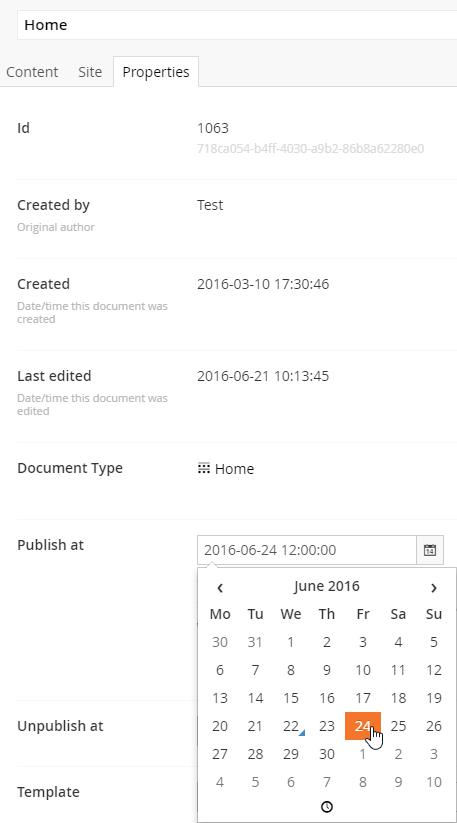

#Scheduled Publishing

Each document in Umbraco can be scheduled for publishing and unpublishing on a pre-defined date and time. In order to do this, go to the "Properties" tab and find the "Publish at" and "Unpublish at" fields. There you can select the exact date and time to publish and unpublish the current content item.

##Timezones 

Your server may be in a different timezone then where you are located. As of Umbraco version 7.5, you are able to select a date and time in your local timezone and Umbraco will make sure that the item gets published at the selected time. So if you select 12PM then the item will be published at 12PM in the timezone you are in. This may be 8PM on the server, which is indicated when you select the date and time.

If you are in the same timezone as the server, this message will not appear under the date picker.

**Note:** In Umbraco versions lower than 7.5, the time you select has to be the time on the server, these older versions of Umbraco do not detect your local timezone. 

##Permissions

You can only select a date and time if you have permissions to publish the selected content item, so if your user is in the "Writer" role you might not be able to select a time here

##Configuration

In some cases you will need to adjust your configuration to ensure that scheduled publishing/unpublishing works. The schedule works by the server sending an HTTP(S) request to itself. 

If you are in a load balanced environment special care must be given to ensure you've configured this correctly, [see the docs here](../../Setup/Server-Setup/Load-Balancing/flexible.md#scheduling-and-master-election)

If you are not load balancing, the way that Umbraco determines the base URL to send the scheduled HTTP(S) request to is as follows:

* umbracoSettings:settings/web.routing/@umbracoApplicationUrl if it exists _(see [these docs](../../../Reference/Config/umbracoSettings/index.md#web-routing) for details)_
* else umbracoSettings:settings/scheduledTasks/@baseUrl if it exits _(deprecated)_
* else umbracoSettings:distributedCall/servers if we have the server in there _(deprecated, see load balance docs)_
* else it's based on the first request that the website receives and uses the base url of this request _(default)_

If the `umbracoApplicationUrl` is used, the value also specfies the scheme (either http or https), howevever if any of the other optiosn are used, then if the appSetting `umbracoUseSSL` is set to `true`, then the request for scheduled publishing will always be sent to the HTTPS endpoint

##Troubleshooting

If your scheduled publishing/unpublishing is not working as you would expect it is most likely due to an issue that your server cannot communicate with the scheduled publishing endpoint. This can be caused by a number of reasons such as: 

* url rewrites in place that prevent the endpoint from being reached
* DNS misconfiguration not allowing the server to communicate to the base URL used in the first request that the website receives - which could be directly affected by a firewall/NAT/load balancer that your server sites behind
* SSL and/or umbracoUseSSL misconfiguration not allowing the server to communicate to the scheduled publishing endpoint on the correct http/https scheme

To better diagnose the issue you can temporarily change your log4net config settings to be DEBUG instead of INFO. This will give you all sorts of information including being able to see whether or not the scheduled publishing endpoint is being reached or not. 

In some cases it might be easiest to specifiy the [umbracoSettings:settings/web.routing/@umbracoApplicationUrl](../../../Reference/Config/umbracoSettings/index.md#web-routing) setting to ensure that your server is communicating to itself on the correct base url.
