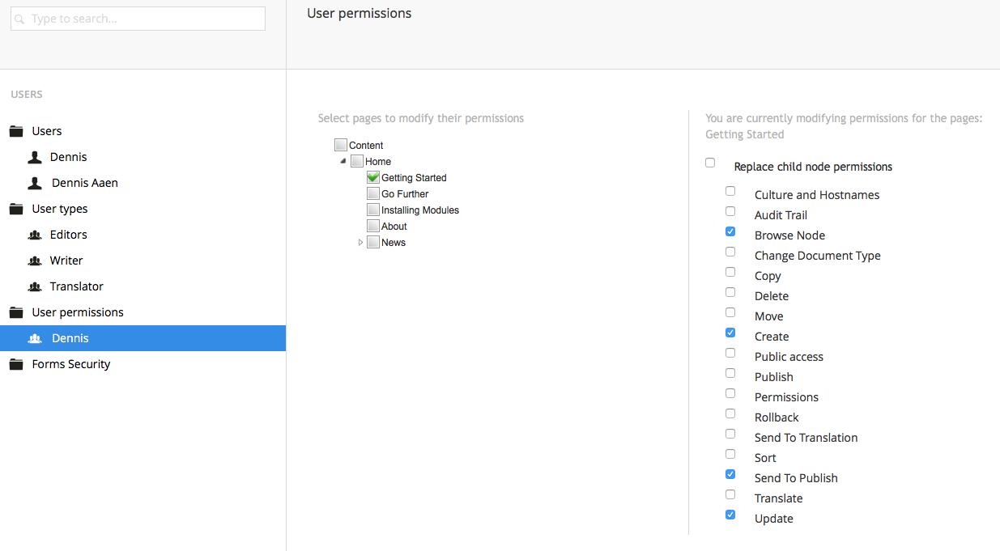

# Users
*Users (not to be confused with [Members](../Members)) are employees who have access to the Umbraco backoffice. These could include Content Editors, Translators, Web Designers, and Developers alike. This guide will explain how to define, create, and manage users in the backoffice.*

There is a default User Type that can be used to create users. You can of course customize it to fit your needs or create your own from scratch.

## Creating a user
Go to __Users__ section, click the menu icon next to __Users__ in the member tree and select __User__. Besides filling out the name, you will need to fill out  __Login Name__ and __Email__ on the __Create__ tab to create the user.

There is also a number of other default properties on the __Users__ tab that can be defined:

- Reset Password (provides reset password option)
- Password (sets account password)
- User Type (determines scope of access)
- Language (sets language of user account)
- Disable Umbraco Access (allows one to disable service access)
- Disable User (suspends user account access)

Once the user is created and saved you can access it by expanding the member tree and clicking __All Users__ to get a list view (with real time search) or selecting the user type to filter by in the Users tree.

## Default User Types
By default, the user types available to new users are __Administrator__, __Writer__, __Editor__, and __Translator__. The main user types and their permissions are defined as such:

__Administrator__: Can do anything when editing nodes in the content section (has all permissions).

__Writer__: Allowed to browse nodes, create nodes, and request for publication of items. Not allowed to publish directly without someone else's approval like an Editor (has permissions to "Browse Node", "Create", "Send to Publish" and "Update").

__Editor__: Allowed to create and publish content items or nodes on website without approval from others or restrictions (has permissions to "Audit Trail", "Browse Node", "Copy", "Delete", "Move", "Create", "Public Access", "Publish", "Rollback", "Send to Translation", "Sort" and "Update").

__Translator__: Allowed to browse and update nodes as well as grant dashboard access. Translations of site pages must be reviewed by others before publication (has permissions to "Browse Node" and "Update").

## Creating a User Type
You can also create your own custom User Types and add properties and tabs just as with Document Types and Member Types.

Go to the __Users__ section, click the menu icon next to __User Types__ and select __Create__. Name the new User Type and click the __Create__ button.

You are now taken to the User Type editor that is used to define and edit the User Type through custom settings and properties.

### User Type Parameters

Shows basic information about the User Type and settings for custom properties.

__Name:__ The name of the User Type shown in the User Type tree when new users are created.

__Alias:__ Used to Reference the User Type in code.

__Default Permissions:__ Selects the default permissions granted to users of the User Type.

## User Permissions

Depending on their respective User Type, each User has a set of permissions associated with their accounts. These permissions either enable or disable a User's ability to perform its associated function. The available user permissions are as follows:

__Culture and Hostnames__: Can choose language to use for content and host multiple domains on the same service.

__Audit Trail__: Tracks and logs actions performed by a User at specific dates and times.

__Browse Node__: Able to browse a node of content or information on the website interface.

__Change Document Type__: Allows a User to change the Document Type of any type of website content.

__Copy__: Allows a User to copy contents from one node to another node.

__Delete__: Allows a User to delete a particular node along with all its contents.

__Move__: Able to move the position of a node within a website's content tree.

__Create__: Able to create a new node and write new content within it.

__Public Access__: Protects associated site pages with password authentication.

__Publish__: Able to publish a new content onto an authorized public site page.

__Permissions__: Has the ability to set the permissions of other Users.

__Rollback__: Can rollback a site page and revert changes by going back to a previous state of the page.

__Send to Translation__: Can send potential content and nodes to Translators for review and further development.

__Sort__: Can change the sort order of nodes in the content or media tree of website.

__Send to Publish__: Can send potential content and nodes to Editors for review and further development.

__Translate__: Enables the logging of information of who edited which nodes.

__Update__: Allows a User to update the contents of a node that already has content.

### Setting User Permissions
When a new user is created, you can set different permissions for that user on different domains and subdomains. You can also set permissions on different user types, even for the default types.

# Technical
As a developer you are only able to leverage your website from the backoffice when you build on the users section of Umbraco, since the user section is restricted to the Umbraco backoffice.

### More information
- [Customizing Data Types](../Data-Types/)

### [Umbraco.TV](https://umbraco.tv)
- [Chapter: Users](https://umbraco.tv/videos/umbraco-v7/content-editor/administrative-content/users/what-is-a-user/)
