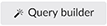
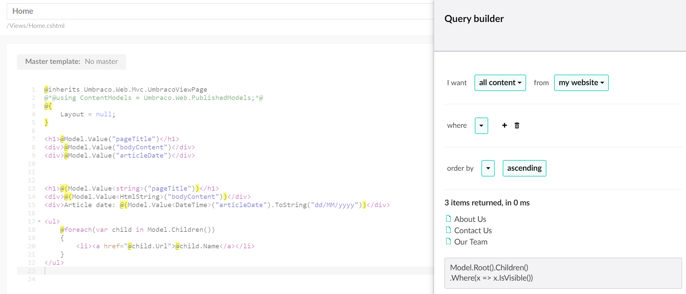

# Rendering content

_The primary task of any template in Umbraco is to render the values of the current page or the result of query against the content cache._

## Display a value in your template view

Each property in your [document type](../../Data/Defining-content/index.md#what-is-a-document-type) has an alias, this is used to specify where in the template view to display the value.

    <h1>@Model.Value("pageTitle")</h1>
    
@Model.Value("bodyContent")

    
@Model.Value("articleDate")

### Specifying types of data

You can specify the type of data being returned to help you format the value for display, consider the publish date in our example.

    <h1>@(Model.Value<string>("pageTitle"))</h1>
    
@(Model.Value<HtmlString>("bodyContent"))

    
Article date: @(Model.Value<DateTime>("articleDate").ToString("dd/MM/yyyy"))

### Using ModelsBuilder

	<h1>@Model.PageTitle</h1>
	
@Model.BodyContent

	
@Model.ArticleDate.ToString("dd/MM/yyyy")

### Working with the grid

See [Writing out Umbraco Grid Properties](../../Backoffice/Property-Editors/Built-in-Property-Editors/Grid-Layout/Render-Grid-In-Template.md#render-grid-in-template)....

## Query content
In many cases you want to do more then just display values from the current page, like creating a list of pages in a navigation. You can access content relative to the current page using methods such as `Children()`, `Descendants()` & `Ancestors()`. Explore the [full list of methods](../../../Reference/Templating/Mvc/querying.md#traversing).

You can do this by querying content relative to your current page in template views:

    <ul>
        @foreach(var child in Model.Children())
        {
            <li><a href="@child.Url">@child.Name</a></li>
        }
    </ul>

You can use the Query Builder in the template editor to build more advanced queries

### More information
- [Razor examples](../../../Reference/Templating/Mvc/examples.md)
- [Querying](../../..//Reference/Templating/Mvc/querying.md)

<!--
### Umbraco TV
- [Episode: Setting up our first template](http://umbraco.tv/videos/umbraco-v7/implementor/fundamentals/templating/alt-template/)
- [Episode: Insert Umbraco page field dialog](http://umbraco.tv/videos/umbraco-v7/implementor/fundamentals/templating/insert-umbraco-page-field-dialog/)
-->
