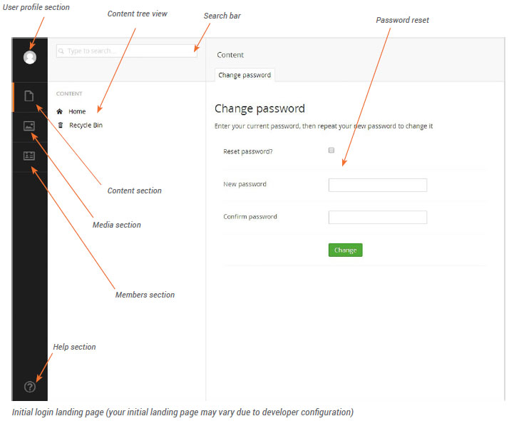

###2. Umbraco Interface##

####2.1 Initial View

Once you have logged  in you will enter  the Content section of Umbraco. There are several  sections within Umbraco that  allow you to manage different  aspects of your site. The Content section allows you to manage the web pages of your site. Sections may vary from user  to user  based upon  their role. As an editor or writer for instanace you may only have access to the Content and Media sections. You can  navigate between sections using  the black section bar on the left-hand  side of the screen. As you rollover one of the sections the name of the section will be revealed.  Click a section to navigate to it.

To the right of the section bar is the tree view which shows the structure of your website. To navigate the tree you can  click on the black arrows to the left of tree items which will reveal any sub-pages. Clicking on the
page  name will load that  page’s content into the large content area  on the right of the tree view.

 

####2.2  Behaviour at Smaller  Screen Sizes

By default, on a desktop with a large screen size, the tree view is always  visible giving you quick access
to select and navigate website content. On smaller  devices such  as laptops and tablets, the tree view will be closed and only opens after  you click on one of the navigation icons  in the section bar on the left of the screen.

After selecting an item within the tree view on a smaller  device, it will automatically close  to save  screen space. If you wish to close  the tree view without  selecting a page, you can  move your mouse out of the tree view, or alternatively on a touch  device you can  swipe  left over the tree view. Below are examples of how the interface will look on a tablet.
    

