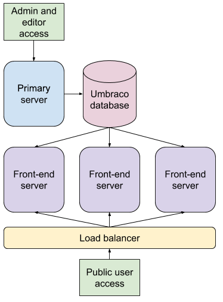
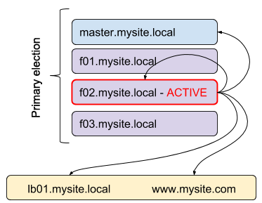

# Flexible load balancing

_Information on how to deploy Umbraco in a flexible Load Balanced scenario and other
details to consider when setting up Umbraco for load balancing._

**_Traditional load balancing must be used for Umbraco versions less than 7.3.0._**

**Be sure you read the [Overview](index.md) before you begin!**

## Design
These instructions make the following assumptions:

* All web servers can communicate with the database where Umbraco data is stored
* You are running Umbraco 7.3.0 or above
* _**You will designate a single server to be the back-office server for which your editors will log into for editing content.**_ Umbraco will not work correctly if the back-office is behind the load balancer.

There are three design alternatives you can use to effectively load balance servers:

1. You use cloud based auto-scaling appliances like [Microsoft's Azure Web Apps](https://azure.microsoft.com/en-us/services/app-service/web/)
2. Each server hosts copies of the load balanced website files and a file replication service is running to ensure that all files on all servers are up to date
3. The load balanced website files are located on a centralized file share (SAN/NAS/Custered File Server/Network Share)

For options #2 and #3 you will obviously need a load balancer to do your load balancing!

## How flexible load balancing works

In order to understand how to host your site it is best to understand how Umbraco's flexible load balancing works.

The following diagram shows the data flow/communication between each item in the environment:

 

The process is as follows:

* Administrators and editors create, update, delete data/content on the master server
* These events are converted into data structures called "instructions" and are stored in the database in a queue
* Each front-end server checks to see if there are any outstanding instructions it hasn't processed yet
* When a front-end server detects that there are pending instructions, it downloads them and processes them and in turn updates it's cache, cache files and indexes on it's own file system
* There can be up to a 5 second delay between content updates and a front-end server's refreshing, this is expected and normal behavior.

## Scheduling and master election

Although there is a Master server designated for administration, by default this is not explicitly set as the "Scheduling server". 
In Umbraco there can only be a single scheduling server which performs the following 3 things:

* Keep alive service - to ensure scheduled publishing occurs
* Scheduled tasks - to initiate any configured scheduled tasks
* Scheduled publishing - to initiate any scheduled publishing for documents

Flexible Load Balancing will automatically elect a "Scheduling server" to perform the above services. This means
that all of the servers will need to be able to resolve the URL of either: itself, the Master server, the internal load balancer or the public address.

For example, In the following diagram the slave node **f02.mysite.local** is the elected "Scheduling server". In order for scheduling to work it needs to be able to send
requests to itself, the Master server, the internal load balancer or the public address. The address used by the "Scheduling server" is called the "umbracoApplicationUrl". 



By default, Umbraco will set the "umbracoApplicationUrl" to the address made by the first accepted request when the AppDomain starts.
It is assumed that this address will be a DNS address that the server can resolve.

For example, if a public request reached the load balancer on "www.mysite.com", the load balancer may send the request on to the servers with the original address: "www.mysite.com" 
so by default the "umbracoApplicationUrl" will be "www.mysite.com". However, load balancers may route the request internally under a different DNS name such as "f02.mysite.local" which 
by default would mean the "umbracoApplicationUrl" is "f02.mysite.local". In any case the elected "Scheduling server" must be able to resolve this address. 

In many scenarios this is fine, but in case this is not adequate there's a few of options you can use:

* __Recommended__: [set your front-end(s) (non-admin server) to be explicit slave servers](flexible-advanced.md#explicit-master-scheduling-server) which means they will never be used as the master scheduler
* set the `umbracoApplicationUrl` property in the [Web.Routing section of /Config/umbracoSettings.config](../../../../Reference/Config/umbracoSettings/index.md)
* or in an [`ApplicationStarting` event of an application startup handler](../../../../Reference/Events/Application-Startup.md) you can specify a custom delegate to return the base url for a node by setting [`ApplicationUrlHelper.ApplicationUrlProvider`](https://github.com/umbraco/Umbraco-CMS/blob/75c2b07ad3a093b5b65b6ebd45697687c062f62a/src/Umbraco.Core/Sync/ApplicationUrlHelper.cs#L21)

## Umbraco Configuration files

There isn't any _Umbraco_ configuration file changes necessary. **You must not enable the distributed calls flag in the umbracoSettings.config** file for Flexible Load Balancing to work, that is purely for Traditional load balancing. 

There are some Examine/Logging config file updates needed (see below and the [Overview](index.md))

## Option #1 : Cloud based auto-scale appliances

We have focused primarily on Azure Web Apps when developing flexible load balancing for cloud based appliances. The documentation here is for Azure Web Apps but a similar setup would be achievable on other services supporting ASP.Net.

Ensure you read the [overview](index.md) before you begin - you will need to ensure that your asp.net & logging configurations are correct.

### Azure Requirements

* You will need to setup 2 x Azure Web Apps - one for the master (administrative) environment and another for your front-end environment
* You will need 1 x SQL server that is shared with these 2 web apps

###Lucene/Examine configuration

* Ensure you are using the [latest Examine version from Nuget](https://www.nuget.org/packages/Examine)
* In ExamineSettings.config, you can add these properties to all of your indexers and searchers: 
```
useTempStorage="Sync"
tempStorageDirectory="UmbracoExamine.LocalStorage.AzureLocalStorageDirectory, UmbracoExamine"
```
* The 'Sync' setting will store your indexes in the local workers file system instead of Azure Web Apps' 
remote file system. Lucene has issues when working from a remote file share so the files need to be read/accessed locally. Anytime the index is updated, this setting will ensure that both the locally created indexes and the normal indexes are written to. This will ensure that when the app is restarted or the local temp files are cleared out that the index files can be restored from the centrally stored index files. If you see issues with this syncing process (in your logs), you can also change this value to be 'LocalOnly' which will only persist the index files to the local file system
but this does mean they will be rebuilt when the website is migrated between Azure workers.

#####If you plan on using auto-scaling#####

**Important!** Your Examine path settings need to be updated! Azure Web Apps uses a shared file system which means that if you increase your front-end environment scale setting to more than one worker your Lucene index files will be shared by more than one process. This will not work! In ExamineIndex.config, you need to tokenize the path for each of your indexes to include the machine name, this will ensure that your indexes are stored in different locations for each machine. An example of a tokenized path is: `~/App_Data/TEMP/ExamineIndexes/{machinename}/Internal/`. This however has some drawbacks for two reasons:

* Azure web apps migrates your site between workers without warning which means the {machinename} will change and your index will be rebuilt when this occurs
* When you scale out (increase the number of workers), the new worker will also rebuild it's own index

We are working towards being able to mitigate these issues by adding the ability to store a master index in blob storage so that when new workers come online they can sync the existing index locally (this is not yet in place)

### Umbraco XML cache file

For your front-end Azure Web App instance, you'll need to ensure that the Umbraco XML config file is stored on the local server (since Azure uses a shared file system). To do this ensure this setting is true in your web.config:

```
<add key="umbracoContentXMLUseLocalTemp" value="true" /> 
```

### Steps

1. Create an Azure SQL database
2. Install Umbraco on your master environment and ensure to use your Azure SQL Database
3. Install Umbraco on your front-end environment and ensure to use your Azure SQL Database
4. Test: Perform some content updates on the master/administration environment, ensure they work successfully on that environment, then verify that those changes appear on the front-end environment

### Scaling

**Do not scale your master/adminsitration environment** this is not supported and can cause issues.

Azure Web Apps can be manually or automatically scaled up or down and is supported by Umbraco's flexible load balancing.

### Deployment considerations

Since you have 2 x web apps, when you deploy you will need to deploy to both places - There is probably various automation techniques you can use to make this simple (this is outside the scope of this document)

**Important note:** This also means that you should not be editing templates or views on a live server as master and front-end environments do not share the same file server. Changes should be made in a staging environment and then pushed to live environments.

## Option #2 : File Storage with File Replication

If you are not using a cloud based setup then *this is the recommended setup*.

Ensure you read the [overview](index.md) before you begin - you will need to ensure that your asp.net & logging configurations are correct.

[See here for specific details about using Option #2: File Storage with Replication](files-replicated.md)

### Scaling

Scaling will still be a slightly manual process because it would involve you adding servers/sites but with flexible load balancing you don't have to configure anything in Umbraco,
you just need to point the site to the Umbraco database and update your load balancer to include the site.

## Option #3 : File Storage on SAN/NAS/Clustered File Server/Network Share

Configuring your servers to work using a centrally located file system that is shared for all of your IIS instances can be tricky and can take a while to setup correctly.

[See here for specific details about using Option #3: File Storage on SAN/NAS/Clustered File Server/Network Share](files-shared.md)

### Scaling

Scaling will still be a slightly manual process because it would involve you adding servers/sites but with flexible load balancing you don't have to configure anything in Umbraco,
you just need to point the site to the Umbraco database and update your load balancer to include the site.

##Advanced techniques

Once you are familiar with how flexible load balancing works, you might be interested in some [advanced techniques](flexible-advanced.md).
