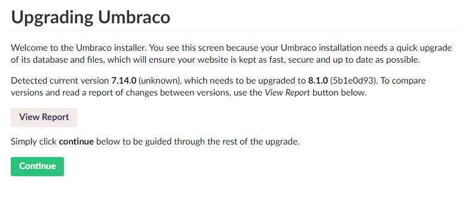

# Migrating content to Umbraco 8

Umbraco 8 contains a lot of breaking changes and a lot of code has been cleaned up compared to Umbraco 7. Due to this, it will not be possible to do a direct upgrade from Umbraco 7 to Umbraco 8. Instead, you will need to **migrate your content** from your Umbraco 7 site into your Umbraco 8 site and then recreate the rest in the new version.

A content migration tool has been implemented in Umbraco 8.1.0, to help you with the transition.

In this guide you can read more about the tool, its limitations and how to use it in practice.

## Limitations

### Versions supported

The content migration tool is a database migration, which is made for the database schema of Umbraco 7.14+. This means that in order to do the migration the first step is to ensure your Umbraco 7 site is running at least Umbraco 7.14.

### Database types supported

As Umbraco 8 doesn't support MySQL databases, the migration will not work when moving from an Umbraco 7 site using MySQL to Umbraco 8 on SQL Server, for example.
The database types that are supported are SQL Server and SQL CE.

### Known issues

Feedback from user testing has shown that some databases are harder to migrate than others.
We are collecting [a list of these known issues on our GitHub Issue Tracker](https://github.com/umbraco/Umbraco-CMS/issues?utf8=%E2%9C%93&q=label%3Acategory%2Fcontent-migration+). We will work on these for the next upcoming releases.

### Third party property editors

The migration will transform the data stored in third party editors as well. However, it will be stored as it was in Umbraco 7. If the structure has changed for Umbraco 8 or the property editor doesn't exist, you will still be able to find the data in the database, but you would not see it in the backoffice.

There are some options to convert the property editor configuration, read how [here](7-8-migration-dataTypes.md).

## What will happen

When the migrations are running, Umbraco will go through your entire Umbraco 7 database and update it to the format required for Umbraco 8. The schema will be remodelled and transformed into the correct format and your existing compatible data will also be transformed to fit with how Umbraco 8 is storing data.

Please be aware that these migrations will be running directly on your database. They are transforming schema and data - not transferring. Therefore always ensure that you have a backup before attempting to do this. In case something goes wrong, you will be able to rollback and try again.

It is highly recommended to clean up your site before running this as it will be quicker.

- Empty content recycle bin
- Empty media recycle bin
- Clean up database version history (can be done with a script or a package like [Unversion](https://our.umbraco.com/packages/website-utilities/unversion/))

## How it works

In the following guide we will try to migrate the content of an Umbraco 7.13.1 site to Umbraco 8.1.0.

### Step 1: Upgrading to 7.14+

Before the content migration can start the site has to be 7.14+. A good idea would be to **always take a database backup** before doing an upgrade, and then check the [version specific upgrade instructions](version-specific.md).

The site in this example is an Umbraco 7.13.1 site, and we will use Nuget to update it.

It is a basic site, with a bit of content:

Following the [general upgrade instructions](general.md) we will now upgrade via Nuget until we get to this point:

:::warning
If you are upgrading an old website, check if you are using obsolete properties in your Data Types and change them to their updated counterparts. The migration **will fail if you are still using obsolete properties!**

The updated properties are:
* Content Picker
* Media Picker
* Member Picker
* Multinode Treepicker
* Nested Content
* Folder Browser
* Related Links

You can see if your site is using the obsolete properties by the `(Obsolete)` prefix in their name.
:::

Once it is upgraded and you have verified everything is working, move on to step 2.

### Step 2: Migrating content to Umbraco 8

First thing to do is spin up a fresh new Umbraco 8.1+ site. Make sure it all works and that no content is there (_hint:_ choose not to install starter kit).

:::warning
If you have customized your `UsersMembershipProvider` on your Umbraco 7 site you will need to copy that over to the 8.1 web.config as well. Additionally you will need to update the `type` attribute to be `type="Umbraco.Web.Security.Providers.UsersMembershipProvider, Umbraco.Web"`.

This also includes the attribute `useLegacyEncoding` value. Make sure that this setting is copied into your new Umbraco 8 site, as it is needed in order for you to be able to log in.

:::

Now you should take a backup of your database from the **Umbraco 7.14 site**. You can then add the information for the backup database and add that to the connection string for the **Umbraco 8.1 site**. Do note that if you are running SQL CE, you will have to copy the database over to the new site as well.

Once the connection string is set, the final step is to change the Umbraco version number in the web.config on the **Umbraco 8.1 site**, to say 7.14.0. This will indicate to the site that there is an upgrade pending as the Umbraco dlls are 8.1 but the config says 7.14.0, so it needs to run the migration.

As you can see in the screenshot, the version will be set to 8.1.0, and you will need to change it to the version you are currently migrating from.

When you start the site it will ask you to login and then show you this screen:

That is all! Now the automatic migration will take over, and after a little bit you can log in and see your content:

:::note
Please be aware this is a **content migration**. If you go to the frontend after doing this nothing will work!

At this point you will have the content but nothing else. You will have to recreate all templates and other custom implementation before the site works again.

[Read more about rendering content in Umbraco 8](../../Design/Rendering-Content/index.md)
:::

### Step 3: Post-migration checks

As you are updating your template files and custom implementation to fit your new Umbraco 8 site, it will be a natural step to also check your configuration files and settings.

Umbraco 8 contains a few changes regarding the Sections in the Umbraco Backoffice. Because of this, you should also check your User Groups and make sure they have access to the appropriate sections.

Learn more about the Section changes in the [Sections article](../../Backoffice/Sections)

## Migrating Umbraco Cloud sites

If you wish to migrate an Umbraco 7 Cloud site to an Umbraco 8 Cloud site you should follow the [Migrate Cloud project from 7 to 8](../../../Umbraco-Cloud/Upgrades/Migrating-from-7-to-8) instead.
