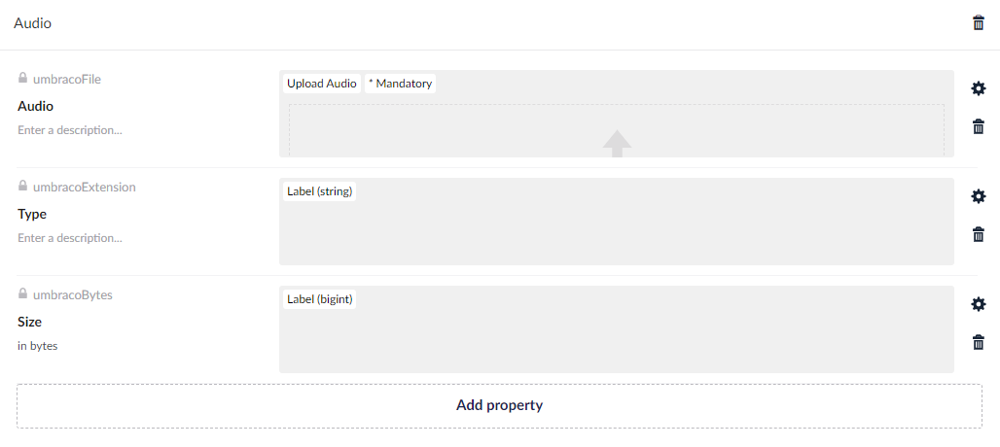

# Default Data/Media Types
On this page you will find the media types and data types that have been added in Umbaco 8.14. These types are not created automatically after an upgrade. If you want to use the new types, you can create them yourself.

## Data Types 

### UploadArticle
The `UploadArticle` data type has the following configuration:

- Property editor: `FileUpload`
- Accepted file extensions: `pdf`, `docx`, `doc`

### UploadAudio
The `UploadAudio` data type has the following configuration:

- Property editor: `FileUpload`
- Accepted file extensions: `mp3`, `weba`, `oga`, `opus`

### UploadVectorGraphics
The `UploadVectorGraphics` data type has the following configuration:

- Property editor: `FileUpload`
- Accepted file extensions: `svg`

### UploadVideo
The `UploadVideo` data type has the following configuration:

- Property editor: `FileUpload`
- Accepted file extensions: `mp4`, `webm`, `ogv`

## Media Types

### UmbracoMediaArticle
The `UmbracoMediaArticle` media type has the following properties:

- `umbracoFile` - Upload File
- `umbracoExtension` - Label (string)
- `umbracoBytes` - Label (bigint)

### UmbracoMediaAudio
The `UmbracoMediaAudio` media type has the following properties:

- `umbracoFile` Upload Audio
- `umbracoExtension` Label (string)
- `umbracoBytes` Label (bigint)

### UmbracoMediaVectorGraphics
The `UmbracoMediaVectorGraphics` media type has the following properties:

- `umbracoFile` - Upload Vector Graphics
- `umbracoExtension` Label (string)
- `umbracoBytes` Label (bigint)

### UmbracoMediaVideo
The `UmbracoMediaVideo` media type has the following properties:

- `umbracoFile` - Upload Video
- `umbracoExtension` - Label (string)
- `umbracoBytes` - Label (bigint)

