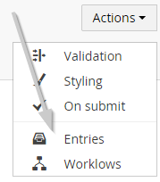

#Viewing and exporting entries

The entries viewer for each form can be found when expanding the form in the tree

or hit the entries option on the form actions

##Overview

When accessing the entries viewer you should get a screen similar to

##Filtering

By default you'll see the records of the last 24 hours, if you want to change this simply update the filter settings

##Exporting data

You can export all of the records for your form. Hit the export button in the toolbar to open the export dialog.

Then in the dialog simply select the format of the export

The options are

- Excell File
- Html Table

##Record actions

When selecting records it's possible to execute actions. Simply select the records by checking them (a checkbox is available for each record).

After checking at least 1 record you should see the available actions.
By default there are 2 possible actions:

- Approve
- Delete

###Approve

Will place the records in the approved state
###Delete

Deletes the records from the database (not possible to undo)

