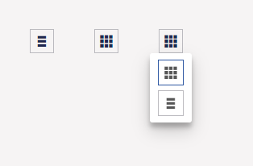

# umbLayoutSelector

When you have a list of items or similar, you can use the `umb-layout-selector` directive to let users toggle between different layouts. For instance, in Umbraco's media archive, users can select between a grid-based layout (thumbnails) and a list-based layout (table).

:::center

:::


The directive has three attributes:

- `layouts` is used to indicate the available layouts that the user should be able to select.
- `active-layout` is a reference to the layout currently being used.
- `on-layout-select` is a callback function triggered when the user chooses another layout.

For a view utilizing this directive, the HTML could look something like this:

```html
<div ng-controller="myController">
    <umb-layout-selector layouts="layouts"
                         active-layout="activeLayout"
                         on-layout-select="selectLayout(layout)">
    </umb-layout-selector>
</div>
```

For this to work, you'd also need a controller - eg. for initializing the different values to be used for the directive:

```js
angular.module("umbraco").controller("myController", function ($scope) {

    // Declare the available layouts
    $scope.layouts = [
        {
            name: "Grid",
            icon: "icon-thumbnails-small",
            path: "gridpath",
            selected : true
        },
        {
            name: "List",
            icon: "icon-list",
            path: "listpath",
            selected: true
        }
    ];

    // Declare the function called by the directive when user chooses another layout
    $scope.selectLayout = function(layout) {
        $scope.activeLayout = layout;
        $scope.layouts.forEach(element => element.active = false);
        layout.active = true;
    };

    // Select the first layout
    $scope.selectLayout($scope.layouts[0]);

});
```

For each layout, the `name` property indicates the visual name of the layout (eg. used when hovering over the layout in the selector), and `icon` is the CSS selector for the icon of the layout. The `path` attribute indicates a sort of alias, and is used internally for comparing the layouts. And while a bit misleading, each layout should also have a `selected` property indicating whether a particular layout is enabled, and thereby visible in the selector.
