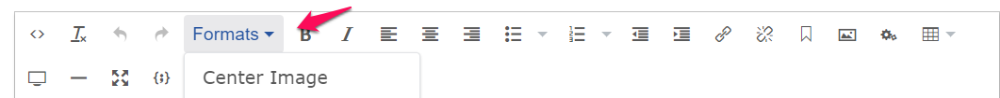
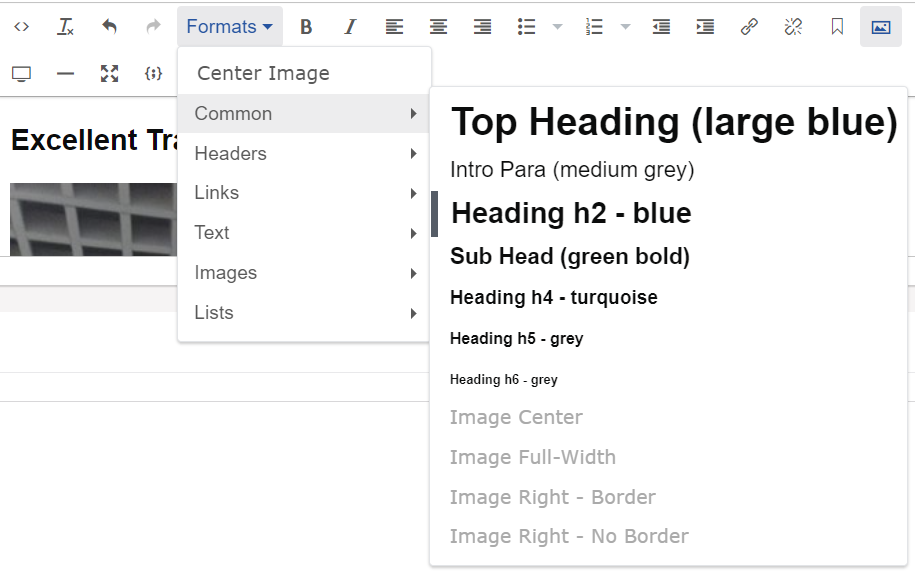

# tinyMceConfig - Rich Text Editor Configuration

The Rich Text Editor in the Umbraco V8 Backoffice utilises the rich text editor plugin: [TinyMce V4.x](https://www.tiny.cloud/docs-4x/). This configuration file **'/config/tinyMce.config'** is used to set globally every TinyMce instance when it is intialized by Umbraco. Not all TinyMce features are enabled by default in Umbraco, you can use this configuration file to enable other TinyMce plugins or ammend the core behaviour of the Rich Text Editor in Umbraco.

## Commands / Toolbar

Inside the `<commands>` section of the configuration file you will find multiple `<command>` nodes. Each one of these configuration elements define an 'icon/button' option that can appear on the formatting toolbar of the Rich Text Editor instance. When configuring a rich text editor Data Type instance you can pick and choose the 'commands/toolbar icons' that should be included.

```xml
        <command alias="cut" name="Cut" mode="Selection"/>
        <command alias="copy" name="Copy" mode="Selection"/>
        <command alias="paste" name="Paste" mode="All" />
```

`alias` defines a unique alias within Umbraco for the command. This alias should not contain any spaces.

`name` defines the name that will be seen in the list of Toolbar configuration options in the backoffice for the rich text editor 

`mode` - This can be set to be either 'Insert', 'Selection' or 'All'. In 'distraction free' mode, there are two 'quick menus' that appear - one when you are about to 'insert' text, and one when you 'select' existing text. This setting determines which 'quick menu' the icon should appear on or whether it should appear on both.

:::note
The order of the commands in this configuration file influences the order of the buttons in the toolbar.
:::

## Plugins

TinyMCE follows a 'plugin' architecture, making it easy to add additional functionality to the rich text editor, either from the [library of existing TinyMCE plugins](https://www.tiny.cloud/docs-4x/plugins/) or by [implementing your own custom plugin](https://www.tiny.cloud/docs-4x/advanced/creating-a-plugin/). 
Below you will find the standard tinyMCE plugins configured in a clean install of Umbraco v8.x.

```xml
    <plugins>
        <plugin>paste</plugin>
        <plugin>anchor</plugin>
        <plugin>charmap</plugin>
        <plugin>table</plugin>
        <plugin>lists</plugin>
        <plugin>advlist</plugin>
        <plugin>hr</plugin>
        <plugin>autolink</plugin>
        <plugin>directionality</plugin>
        <plugin>tabfocus</plugin>
        <plugin>searchreplace</plugin>
        <plugin>fullscreen</plugin>
    </plugins>
```
Umbraco has it's own custom TinyMce plugins to handle inserting Media + Macros and these are implemented in the [tinyMceService](/apidocs/v8/ui/#/api/umbraco.services.tinyMceService).

### Example - Adding the TinyMce Code Sample plugin
TinyMce has a 'code highlighting' plugin that works with [prism.js](https://prismjs.com/) called [Code Sample](https://www.tiny.cloud/docs-4x/plugins/codesample/).
For most Umbraco site's this perhaps wouldn't be that useful for editors, but a blog about coding? Let's add it in.

First we need to update the **/config/tinyMceConfig.config** file and add the alias for the plugin: 'codesample' to the list of Commands:
```xml
 <command alias="codesample" name="Code Sample" mode="Insert" />
```
Next we add a reference to the plugin itself:
```xml
        <plugin>codesample</plugin>
```
:::note
The plugin implementation for 'code sample' is already shipped with TinyMce inside Umbraco. It is loaded 'by convention' from the location **/umbraco/lib/tinymce/plugins/codesample/plugin.min.js**. The convention here is the 'codesample' folder matches the plugin alias, and the plugin.min.js contains the actual implementation. (NB: this is where the toolbar icon is set for the plugin).
:::

Now after restarting the Umbraco site, The Code Sample option will be available to select for use in Rich Text Editor instances:


And in our Rich Text Editor, we now have a 'Code Sample' syntax highlighting option:


Pressing the button allows the selecting of a code language and the sample code to be entered:


and this is then displayed in the editor:


:::note
You will need prism.js loaded in the public facing part of your website to display the code highlighting on the published page.
:::

## validElements

The `validElements` section defines which HTML elements and attributes are allowed to be used in the rich text editor, non valid elements and attributes will be removed from the markup when the page being edited is saved. (for example pasting text from an external source, that might contain 'inline styles').

This option contains a comma separated list of element conversion chunks. Each chunk contains information about how one element and its attributes should be treated. 

Here is an example of the standard valid elements that come with a clean install of Umbraco v8.x.

```xml
<validElements>
        <![CDATA[+a[id|style|rel|data-id|data-udi|rev|charset|hreflang|dir|lang|tabindex|accesskey|type|name|href|target|title|class|onfocus|onblur|onclick|
ondblclick|onmousedown|onmouseup|onmouseover|onmousemove|onmouseout|onkeypress|onkeydown|onkeyup],-strong/-b[class|style],-em/-i[class|style],
-strike[class|style],-u[class|style],#p[id|style|dir|class|align],-ol[class|reversed|start|style|type],-ul[class|style],-li[class|style],br[class],
img[id|dir|lang|longdesc|usemap|style|class|src|onmouseover|onmouseout|border|alt=|title|hspace|vspace|width|height|align|umbracoorgwidth|umbracoorgheight|onresize|onresizestart|onresizeend|rel|data-id],
-sub[style|class],-sup[style|class],-blockquote[dir|style|class],-table[border=0|cellspacing|cellpadding|width|height|class|align|summary|style|dir|id|lang|bgcolor|background|bordercolor],
-tr[id|lang|dir|class|rowspan|width|height|align|valign|style|bgcolor|background|bordercolor],tbody[id|class],
thead[id|class],tfoot[id|class],#td[id|lang|dir|class|colspan|rowspan|width|height|align|valign|style|bgcolor|background|bordercolor|scope],
-th[id|lang|dir|class|colspan|rowspan|width|height|align|valign|style|scope],caption[id|lang|dir|class|style],-div[id|dir|class|align|style],
-span[class|align|style],-pre[class|align|style],address[class|align|style],-h1[id|dir|class|align|style],-h2[id|dir|class|align|style],
-h3[id|dir|class|align|style],-h4[id|dir|class|align|style],-h5[id|dir|class|align|style],-h6[id|style|dir|class|align|style],hr[class|style],small[class|style],
dd[id|class|title|style|dir|lang],dl[id|class|title|style|dir|lang],dt[id|class|title|style|dir|lang],object[class|id|width|height|codebase|*],
param[name|value|_value|class],embed[type|width|height|src|class|*],map[name|class],area[shape|coords|href|alt|target|class],bdo[class],button[class],iframe[*]]]>
    </validElements>
```

### Control characters

The following table of control characters is taken from [the official TinyMce documentation](https://www.tiny.cloud/docs-4x/configure/content-filtering/#valid_elements "the official TinyMce documentation") on the topic:

<table>
<thead>
<tr><th>Name</th><th>Summary</th></tr>
</thead>
<tbody>
<tr>
<td>@</td>
<td>

Rules with this name will be applied to all elements defined after this rule. So @[attr1|attr2] will enable attr1 and attr2 for all elements, but element1,@[attr1|attr2],element2,element3 will enable attr1 and attr2 only for element2 and element3.

</td>
</tr>
<tr>
<td>,</td>
<td>Separates element chunk definitions.</td>
</tr>
<tr>
<td>/</td>
<td>Separates element synonymous. The first element is the one that will be output.</td>
</tr>
<tr>
<td>|</td>
<td>Separates attribute definitions.</td>
</tr>
<tr>
<td>[</td>
<td>Starts a new attribute list for an element definition.</td>
</tr>
<tr>
<td>]</td>
<td>Ends an attribute list for an element definition.</td>
</tr>
<tr>
<td>!</td>
<td>Makes attributes required. If none of the required attributes are set, the element will be removed. For example, "!href".</td>
</tr>
<tr>
<td>=</td>
<td>Makes the attribute default to the specified value. For example, "target=_blank"</td>
</tr>
<tr>
<td>:</td>
<td>Forces the attribute to the specified value. For example, "border:0"</td>
</tr>
<tr>
<td>&lt;</td>
<td>Verifies the value of an attribute (only the listed values are allowed). For example, "target&lt;_blank?_self"</td>
</tr>
<tr>
<td>?</td>
<td>Separates attribute verification values. See above.</td>
</tr>
<tr>
<td>+</td>
<td>Makes the element open if no child nodes exists. For example, "+a".</td>
</tr>
<tr>
<td>-</td>
<td>Enables removal of empty elements such as &lt;strong /&gt;. For example, "-strong".</td>
</tr>
<tr>
<td>#</td>
<td>Enables padding of empty elements. This will pad with &amp;nbsp; if they are empty. For example, "#p".</td>
</tr>
</tbody>
</table>

Wildcards such as *,+,? may be used in element or attribute name matching.

## invalidElements

This option should contain a comma separated list of element names to exclude from the saved content. Elements in this list will be removed when your content is saved.

```xml
<invalidElements>font</invalidElements>
```
This option doesn't accept attributes.

## Extended Valid Elements

Extended valid elements(`extended_valid_elements`) is a configuration option of TinyMCE that is normally used to apply additional specific rules on top of the existing `validElements` ruleset. However Umbraco currently uses this configuration setting to ensure that core 'Umbraco specific' Rich Text Editor functionality is always allowed, eg inserting Macros. It is therefore recommended not to use the `extended_valid_elements` option in any custom TinyMCE configuration to avoid breaking core Umbraco functionality.

For reference this is the use of extended_valid_elements in the Umbraco core:

```js
    //These are absolutely required in order for the macros to render inline
    //we put these as extended elements because they get merged on top of the normal allowed elements by tiny mce
    var extendedValidElements = "@[id|class|style],-div[id|dir|class|align|style],ins[datetime|cite],-ul[class|style],-li[class|style],-h1[id|dir|class|align|style],-h2[id|dir|class|align|style],-h3[id|dir|class|align|style],-h4[id|dir|class|align|style],-h5[id|dir|class|align|style],-h6[id|style|dir|class|align],span[id|class|style]";
```

## Custom Config

The `customConfig` node contains any custom configuration you would like applied to TinyMce when each instance is initialized. For examples of configuration options see the [official TinyMce Configuration options documentation](https://www.tiny.cloud/docs-4x/configure/ "official TinyMce Configuration Options documentation").

```xml
<customConfig>
    <!--    <config key="myKey">mySetting</config>-->
    <config key="entity_encoding">raw</config>   
</customConfig>
```
### Common Custom Configuration Examples

By default, Umbraco doesn't provide any custom configurations for TinyMce other than setting the `entity_encoding` value to be raw. However there are some common configurations worth considering making for improving the editor experience for most sites. (Or at least here are some examples for inspiration of how to extend TinyMce in Umbraco via configuration).

#### Spellchecking

There is a paid for extension for TinyMCE called [Spell Checker Pro](https://www.tiny.cloud/docs-4x/enterprise/check-spelling/) that provides 'as you type' spelling assistance, however it's also possible to use the native web browser spell checker within TinyMCE with the following custom configuration:

```xml
<customConfig>
    <config key="entity_encoding">raw</config>
    <config key="browser_spellcheck">true</config>    
</customConfig>
```

#### Responsive Tables
When you insert a table into the rich text area, by default the columns and rows will be defined by 'pixels' and not stretch full-width across the page container. Additionally you might want to provide styling options for 'striped' rows, or set a default border size, or at least make sure the table has a css class so you can target it with tablesaw or similar plugin. The following configuration will make inserted tables more responsive:

```xml
<customConfig>
    <config key="entity_encoding">raw</config>
    <!-- Use percentages instead of pixels for table cell widths-->
    <config key="table_responsive_width">true</config>
    <!-- default table attributes eg ensure a css class is on every inserted table-->
    <config key="table_default_attributes">{ "border" : "0", "class": "table"}</config>
    <!-- provide some default 'styles' for the table (if you are not using the css class to control this)-->
    <config key="table_default_styles">{ 'border-collapsed': 'collapse', 'width': '100%'}</config>
    <!-- provide some styling choices for the editor to select when inserting the table.
    <config key="table_class_list">
      [
      {"title": "Responsive", "value": "table"},{"title": "None", "value": ""},{"title": "Hover", "value": "table table-hover"},{"title": "Striped", "value": "table table-striped"},{"title": "Condensed", "value": "table table-condensed"},{"title": "Bordered", "value": "table table-bordered"}
      ]
    </config>
    <!-- (there are also options in the same format as the table_class_list for table_row_class_list (row css classes) and table_cell_class_list (cell css classes)) but these become a bit klunky for editors to apply -->
</customConfig>
```
#### Style Formats

Umbraco provides a mechanism for using a CSS stylesheet + comments, updated via a nice backoffice UI to set custom style formats for a Rich Text Editor configuration:


This enables editors to apply style formats to text using the 'Formats' dropdown



However, TinyMce has a couple of further options for customising this menu that can't currently be set via the backoffice approach.

##### Providing context

Not all formats should be applicable to ALL HTML elements - in the example above we created a 'Center Image' rule, but with the backoffice approach, this rule will apply to all HTML elements within the page.

Adding the following custom configuration:
```xml
 <config key="style_formats">
       [
    {
      "title": "Image Left",
      "selector": "img",
      "classes": "float-left"
    },
    {
      "title": "Image Right",
      "selector": "img",
      "classes": "float-right"
     }  
  ]
    </config>
```
Will add two additional options in the format dropdown, the difference with this approach is they will ONLY be applicable IF an img element is selected in the editor.

... otherwise they will be greyed out.


... and with an image selected:


You can apply the 'Image Left' or 'Image Right' style formats. This approach can provide a better editor experience, making it easy to see which formats can be applied in which contexts.

Additionally adding the configuration option, means any 'greyed' out options will not appear at all in the dropdown, only appearing in the list when they can be successfully applied:
```xml
<config key="style_formats_autohide">true</config>
```
This is useful if there is a large number of style formats, but can prevent discoverability of options for editors.

##### Organising style formats into sub menus

For a large number of style formats, instead of hiding those that cannot be applied, you can provide 'submenus' to group similar style formats together:



To achieve this you group your style formats under a title + items array grouping
```xml
 "title":"sub menu name",
      "items":[

      {
<!-- list your items here -->
}]
```
For example a really complicated set of style formats might look like the below:

```xml
<config key="style_formats">
         [
      {
      "title":"Common",
      "items":[
      {
      "title":"Top Heading (large blue)",
      "block":"h1"
      },
      {
      "title":"Intro Para (medium grey)",
      "block":"p",
      "classes":"text-large"
      },
      {
      "title":"Heading h2 - blue",
      "block": "h2"
      },
      {
      "title":"Sub Head (green bold)",
      "block":"h3"
      },
      {
      "title":"Heading h4 - turquoise",
      "block":"h4"
      },
      {
      "title":"Heading h5 - grey",
      "block":"h5"
      },
      {
      "title":"Heading h6 - grey",
      "block":"h6"
      },
      {
      "title":"Image Center",
      "selector":"img",
      "classes":"img-center"
      },
      {
      "title":"Image Full-Width",
      "selector":"img",
      "classes":"full-width-img"
      },
      {
      "title":"Image Right - Border",
      "selector":"img",
      "classes":"right"
      }, {
      "title":"Image Right - No Border",
      "selector":"img",
      "classes":"right-no-border"
      }
      ]},
      {
      "title":"Headers",
      "items":[
      {
      "title":"Heading h1",
      "block":"h1"
      },
      {
      "title":"Heading h2",
      "block":"h2"
      },
      {
      "title":"Heading h2 Medium",
      "selector":"h2",
      "block":"h2",
      "classes":"medium"
      },
      {
      "title":"Heading h2 Large",
      "selector":"h2",
      "block":"h2",
      "classes":"h2-large"
      },
      {
      "title":"Heading h2 Bott-El",
      "selector":"h2",
      "block":"h2",
      "classes":"bott-el"
      },
      {
      "title":"Heading h3",
      "block":"h3"
      },
      {
      "title":"Heading h3 Grey",
      "selector":"h3",
      "block":"h3",
      "classes":"grey"
      },
      {
      "title":"Heading h3 Spacing",
      "selector":"h3",
      "block":"h3",
      "classes":"Spacing"
      },
      {
      "title":"Heading h4",
      "block":"h4"
      },
      {
      "title":"Heading h4 Grey",
      "selector":"h4",
      "block":"h4",
      "classes":"grey"
      },
      {
      "title":"Heading h5",
      "block":"h5"
      },
      {
      "title":"Heading h6",
      "block":"h6"
      }
      ]
      },
      {
      "title":"Links",
      "items":[
      {
      "title":"Link grey",
      "selector":"a",
      "classes":"grey"
      },
      {
      "title":"Link inner-link",
      "selector":"a",
      "classes":"inner-link"
      },
      {
      "title":"Link No Line",
      "selector":"a",
      "classes":"no-line"
      },
      {
      "title":"Link Large",
      "selector":"a",
      "classes":"large"
      },
      {
      "title":"Link List",
      "selector":"a,ul",
      "classes":"link-list"
      }
      ]
      },
      {
      "title":"Text",
      "items":[
      {
      "title":"Span Bold",
      "inline":"span",
      "classes":"bold"
      },
      {
      "title":"Step",
      "inline":"span",
      "classes":"step"
      },
      {
      "title":"Span Green",
      "inline":"span",
      "classes":"green"
      },
      {
      "title":"Span Reset",
      "inline":"span",
      "classes":"reset"
      },
      {
      "title":"Info",
      "block":"p",
      "classes":"info"
      },
      {
      "title":"Paragraph x-small",
      "block":"p",
      "classes":"x-small"
      },
      {
      "title":"Paragraph text-large",
      "block":"p",
      "classes":"text-large"
      },
      {
      "title":"Text Small",
      "inline":"span",
      "classes":"small"
      },
      {
      "title":"Text Medium",
      "inline":"span",
      "classes":"text-medium"
      },
      {
      "title":"Text Strong",
      "inline":"span",
      "classes":"small"
      },
      {
      "title":"Text Underline",
      "inline":"span",
      "classes":"underline"
      },
      {
      "title":"Text Green",
      "inline":"span",
      "classes":"green"
      },
      {
      "title":"Text Blue",
      "inline":"span",
      "classes":"blue"
      },
      {
      "title":"Text Small Info",
      "inline":"span",
      "classes":"small-info"
      },
      {
      "title":"Text Small Last",
      "classes":"small-last"
      },
      {
      "title":"Paragraph Title",
      "block":"p",
      "classes":"p-title"
      },
      {
      "title":"Text Indent",
      "block":"p",
      "classes":"indent"
      },
      {
      "title":"Text Login",
      "block":"p",
      "classes":"login"
      }
      ]
      },
      {
      "title":"Images",
      "items":[
      {
      "title":"Image Center",
      "selector":"img",
      "classes":"img-center"
      },
      {
      "title":"Image Right",
      "selector":"img",
      "classes":"right"
      },
      {
      "title":"Image Right No Border",
      "selector":"img",
      "classes":"right-no-border"
      },
      {
      "title":"Image full-width",
      "selector":"img",
      "classes":"full-width-img"
      }
      ]
      }, {
      "title":"Lists",
      "items":[
      {
      "title":"List Title",
      "classes":"list-title"
      },
      {
      "title":"List xl-padding",
      "selector":"ul",
      "classes":"xl-padding"
      },
      {
      "title":"UList Contacts",
      "selector":"ul",
      "classes":"contacts"
      },
      {
      "title":"UL Quick Link Right",
      "selector":"ul",
      "classes":"quick-link-right"
      },
      {
      "title":"UL Multi Element",
      "selector":"ul",
      "classes":"multi-el"
      },
      {
      "title":"Small List",
      "selector":"ul",
      "classes":"small"
      },		 {
      "title":"Smallest List",
      "selector":"ul",
      "classes":"smallest"
      },
      {
      "title":"UList Steps",
      "selector":"ul",
      "classes":"steps"
      }
      ]
      }
      ]
    </config>
```
#### Format Parameters
For each format you can specify some additional parameters to determine how they will be applied:

<table>
<thead>
<tr>
<th>Name</th>
<th>Summary</th>
</tr>
</thead>
<tbody>
<tr><td>inline</td><td>Tag name of the inline element to use as a wrapper, for example, "span" is used to wrap the current selection.</td></tr>
<tr><td>block</td><td>Tag name of the block element to use as a wrapper, for example, "h1". Existing block elements within the selection are replaced with this block element.</td></tr>
<tr><td>selector</td><td>CSS3 selector pattern that is used to find elements within the selection. It can be used to apply classes to specific elements only, for example only to odd rows in a table.</td></tr>
<tr><td>classes</td><td>Space-separated list of classes that are applied to the selected or newly created inline/block element.</td></tr>
<tr><td>styles</td><td>Key/value object with CSS styles to apply to the selected or newly created inline/block element (e.g. color, backgroundColor, textDecoration, etc).</td></tr>
<tr><td>attributes</td><td>Key/value object with attributes to apply to the selected or newly created inline/block element.</td></tr>
<tr><td>exact</td><td>Makes sure that the format is not merged with other wrappers having the same format. We use it to avoid conflicts between text-decorations for underline and strikethrough formats.</td></tr>
<tr><td>wrapper</td><td>States that the format is a container format for block elements. For example a div wrapper or blockquote.</td></tr>
</tbody>

</table>
