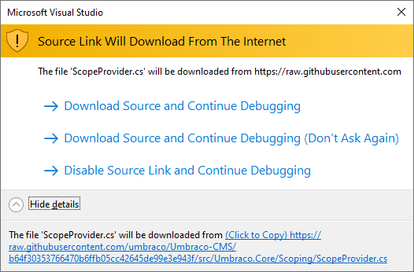

# Debugging with SourceLink
Microsoft & Visual Studio have introduced a new debugging technology called 'SourceLink' that enables source code debugging of certain .NET assemblies from NuGet. In version Umbraco 8.1+ this feature has been enabled to allow developers to step into the native Umbraco CMS source code.

## Enabling SourceLink in Visual Studio 2017 & 2019
* Verify that VS Debugging option `SourceLink` checked & `Just My Code` option is unchecked


## What is SourceLink ?
You can find details from Microsoft about SourceLink here:

* [Microsoft Docs](https://docs.microsoft.com/en-us/dotnet/standard/library-guidance/sourcelink)
* [Scott Hanselman blog post on Sourcelink](https://www.hanselman.com/blog/ExploringNETCoresSourceLinkSteppingIntoTheSourceCodeOfNuGetPackagesYouDontOwn.aspx)
* [SourceLink on GitHub](https://github.com/dotnet/sourcelink)

## Working with SourceLink
* Create new 4.7.2 .NET Framework blank/empty website
* Install latest UmbracoCMS 8.1+ Nuget Packages from Nuget.org
* Create an IUserComposer or similar code in your new site/SLN that you want to F11/Step Into
* Prompt should appear & the original source code file is fetched directly from GitHub
* How far can you `F11` aka `Step Into` & go down the rabbit hole of the Umbraco CMS source code?



### Example Code Snippet to try with SourceLink

```csharp
using Umbraco.Core;
using Umbraco.Core.Composing;
using Umbraco.Core.Services;

namespace WebApplication23
{
    public class MyComposer : IUserComposer
    {
        public void Compose(Composition composition)
        {
            composition.Components().Append<MyComponent>();
        }
    }

    public class MyComponent : IComponent
    {
        private IContentService _contentService;

        public MyComponent(IContentService contentService)
        {
            _contentService = contentService;
        }

        public void Initialize()
        {
            // Add break point & F11 into me
            var root = _contentService.GetRootContent();

            foreach(var item in root)
            {
                // Add break point & F11 into me
                var udi = item.GetUdi();
                var foo = 5;
            }
        }

        public void Terminate()
        {
        }
    }
}
```
