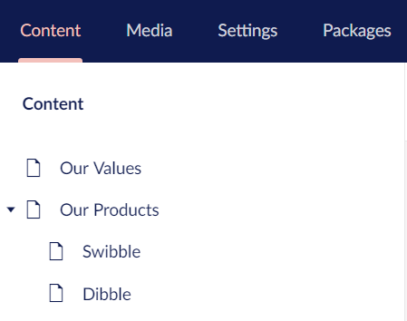
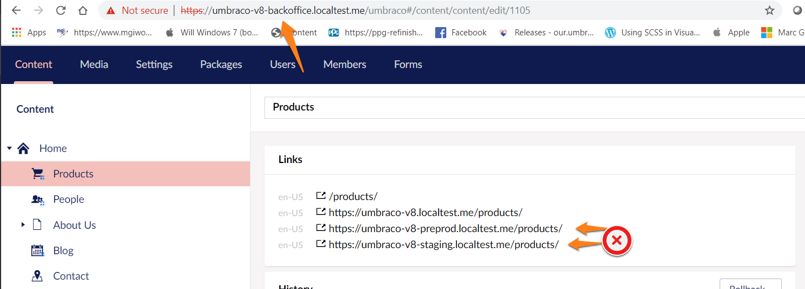
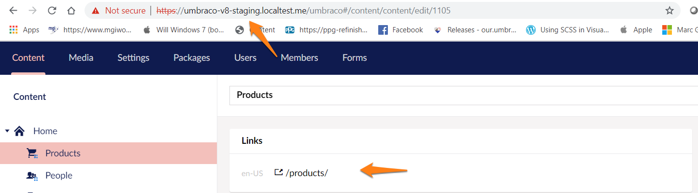
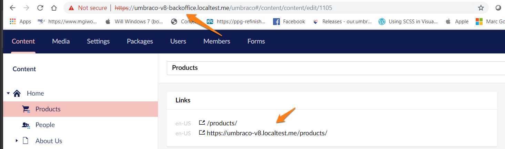

# Outbound request pipeline

The **outbound pipeline** consists out of the following steps:

1. [Create segments](#segments)
2. [Create paths](#paths)
3. [Create urls](#urls)

To explain things we will use the following content tree:


## 1. <a name="segments"></a> Create segments

When the URL is constructed, Umbraco will convert every node in the tree into a segment.  Each published [Content](../../../Reference/Management/Models/Content) item has a corresponding url segment.

In our example "Our Products" will become "our-products" and "Swibble" will become "swibble".

The segments are created by the "Url Segment provider"

### Url Segment provider

The 'Current Composition' of an Umbraco implementation contains a collection of `UrlSegmentProviders` this collection is populated during Umbraco boot up. Umbraco ships with a 'DefaultUrlSegmentProvider' - but custom implementations can be added to the collection.

When the GetUrlSegment extension method is called for a content item + culture combination, each registered IUrlSegmentProvider in the collection is executed in 'collection order' until a particular UrlSegmentProvider returns a segment value for the content. (and no further UrlSegementProviders in the collection will be executed.)

To create a new Url Segment Provider, implement the following interface:

```csharp
public interface IUrlSegmentProvider
{
  string GetUrlSegment(IContentBase content, string culture = null);
}
```

Note each 'culture' variation can have a different Url Segment!

The returned string will be the Url Segment for this node.  Any string value can be returned here but it cannot contain url segment separators `/` characters as this would create additional "segments". So something like `5678/swibble` is not allowed.

#### Example

For the segment of a 'product page' add its unique SKU / product ref to the existing url segment...
```csharp
using Umbraco.Core.Models;
using Umbraco.Core.Strings;

namespace Umbraco8.Routing
{
    public class ProductPageUrlSegmentProvider : IUrlSegmentProvider
    {

            readonly IUrlSegmentProvider _provider = new DefaultUrlSegmentProvider();

            public string GetUrlSegment(IContentBase content, string culture = null)
            {
                //only apply this rule for product pages
                if (content.ContentType.Alias != "productPage") return null;
                var segment = _provider.GetUrlSegment(content);
                // get unique product sku/id  to add to url segment
                var productSku = content.GetValue("productSku");
                return string.Format("{0}-{1}", segment, productSku);
            }
    }
}
```

The returned string becomes the native Url segment.  No need for any Url rewriting, ...

For our "swibble" product in our example content tree the  `ProductPageUrlSegmentProvider`, would return a segment "swibble-123xyz" (where 123xyz is the unique product sku/reference for the swibble product).

Register the custom UrlSegmentProvider with Umbraco:

```csharp
using Umbraco.Core;
using Umbraco.Core.Composing;
using Umbraco8.Routing;

namespace Umbraco8.Composers
{
    public class RegisterCustomSegmentProviderComposer : IUserComposer
    {
        public void Compose(Composition composition)
        {
            composition.UrlSegmentProviders().Insert<ProductPageUrlSegmentProvider>();
        }
    }
}
```

### The Default Url Segment Provider

The Default Url Segment provider builds its segments like this:

First it looks (in this order) for:

- A property with alias *umbracoUrlName* on the node. (this is a convention led way of giving editors control of the segment name - with variants - this can vary by culture).
- The 'name' of the content item eg content.Name

The Umbraco string extension `ToUrlSegment()` is used to produce a clean 'Url safe' segment.

```csharp
 public string GetUrlSegment(IContentBase content, string culture = null)
        {
            return GetUrlSegmentSource(content, culture).ToUrlSegment(culture);
        }

        private static string GetUrlSegmentSource(IContentBase content, string culture)
        {
            string source = null;
            if (content.HasProperty(Constants.Conventions.Content.UrlName))
                source = (content.GetValue<string>(Constants.Conventions.Content.UrlName, culture) ?? string.Empty).Trim();
            if (string.IsNullOrWhiteSpace(source))
                source = content.GetCultureName(culture);
            return source;
        }
```

## 2. <a name="paths"></a>Create paths

To create a path, the pipeline will use the segments of each node to produce a path.

If we look at our example, the "swibble" node will receive the path: "/our-products/swibble".  If we take the `ProductPageUrlSegmentProvider` from above, the path would become: "/our-products/swibble-123xyz".

### Multiple sites in a single Umbraco implementation

But, what if there are multiple websites in a single Umbraco Implementation? in this multi-site scenario then an (internal) path to a node such as "/our-products/swibble-123xyz" could belong to any of the sites, or match multiple nodes in multiple sites. In this scenario additional sites will have their internal path prefixed by the node id of their root node.
Any content node with a hostname defines a “new root” for paths.


<table>
<tr><th>Node</th><th>Segment</th><th>Internal Path</th>
</tr>
<tr>
<td>Our Values</td><td>our-values</td><td>/our-values</td>
</tr>
<tr>
<td>Our Products</td><td>our-products</td><td>/our-products</td>
</tr>
<tr>
<td>Swibble</td><td>swibble-123xyz</td><td>/our-products/swibble-123xyz</td>
</tr>
<tr>
<td>Dibble</td><td>dibble-456abc</td><td>/our-products/dibble-456abc</td>
</tr>
<tr>
<td>Another Site</td><td>another-site</td><td><b>9676</b>/</td>
</tr>
<tr>
<td>Their Values</td><td>their-values</td><td><b>9676</b>/their-values</td>
</tr>
</table>

Paths can be cached, what comes next cannot (http vs https, current request…).

#### Some further considerations when **working with hostnames**

-  **Domain without path** e.g. "www.site.com"
will become "1234/path/to/page"
- **Domain with path** e.g. "www.site.com/dk"
will produce "1234/dk/path/to/page" as path
- **No domain specified**: "/path/to/page"
- **Unless HideTopLevelNodeFromPath config is true**, then the path becomes "/to/page"

## 3. <a name="urls"></a> Creating Urls
The Url of a node consists of a complete [URI](https://en.wikipedia.org/wiki/Uniform_Resource_Identifier): the Schema, Domain name, (port) and the path.

In our example the "swibble" node could have the following URL: "http://example.com/our-products/swibble.aspx"

Generating this url is handled by the Url Provider.  The Url Provider is called whenever a request is made in code for a Url (e.g.):

```csharp
@Model.Url
@Umbraco.Url(1234)
@UmbracoContext.UrlProvider.GetUrl(1234);
```

The 'Current Composition' of an Umbraco implementation contains a collection of `UrlProviders` this collection is populated during Umbraco boot up. Umbraco ships with a 'DefaultUrlProvider' - but custom implementations can be added to the collection.
When .Url is called each UrlProvider registered in the collection is executed in 'collection order' until a particular UrlProvider returns a value. (and no further UrlProviders in the collection will be executed.)
### DefaultUrlProvider
Umbraco ships with a DefaultUrlProvider, which provides the implementation for the out of the box mapping of the structure of the content tree to the url.

```csharp
// That one is initialized by default
public class DefaultUrlProvider : IUrlProvider
{
    public virtual UrlInfo GetUrl(UmbracoContext umbracoContext, IPublishedContent content, UrlMode mode, string culture, Uri current)
    {…}

    public virtual IEnumerable<UrlInfo> GetOtherUrls(UmbracoContext umbracoContext, int id, Uri current)
    {…}
}
```
### How the Default Url provider works

- If the current domain matches a root domain of the target content
  - Return a relative Url
  - Else must return an absolute Url
- If the target content has only one root domain
  - Use that domain to build the absolute Url
- If the target content has more that one root domain
  - Figure out which one to use
  - To build the absolute Url
- Complete the absolute Url with scheme (http vs https)
  - If the domain contains a scheme use it
  - Else use the current request’s scheme

If "useDirectoryUrls" is false, then add .aspx in the Url.
If "addTrailingSlash" is true, then add a slash.
Then add the virtual directory.

If the URL provider encounters collisions when generating content URLs, it will always select the first available node and assign the URL to this one.
The remaining nodes will be marked as colliding and will not have a URL generated. Fetching the URL of a node with a collision URL will result in an error string including the node ID (#err-1094) since this node does not currently have an active URL.
This can happen if an umbracoUrlName property is being used to override the generated URL of a node, or in some cases when having multiple root nodes without hostnames assigned.

:::warning
This means publishing an unpublished node with a conflicting URL, might change the active node being rendered on that specific URL in cases where the published node should now take priority according to sort order in the tree!
:::

### Custom Url Provider

Create a custom Url Provider by implementing `IUrlProvider` interface

```csharp
public interface IUrlProvider
{
    UrlInfo GetUrl(UmbracoContext umbracoContext, IPublishedContent content, UrlMode mode, string culture, Uri current);

    IEnumerable<UrlInfo> GetOtherUrls(UmbracoContext umbracoContext, int id, Uri current);
}
```

The url returned in the 'UrlInfo' object by GetUrl can be completely custom.

If implementing a custom Url Provider, consider following things:

- Cache things,
- Be sure to know how to handle schema's (http vs https) and hostnames
- Inbound might require rewriting

:::tip
If there is only a small change to the logic around Url generation, then a smart way to create a custom Url Provider is to inherit from the DefaultUrlProvider and override the GetUrl() virtual method.
:::

#### Example

 add /fish on the end of every url...

```csharp
using Umbraco.Core.Logging;
using System;
using System.Collections.Generic;
using System.Linq;
using System.Web;
using Umbraco.Core.Configuration;
using Umbraco.Core.Configuration.UmbracoSettings;
using Umbraco.Core.Models.PublishedContent;
using Umbraco.Web;
using Umbraco.Web.Routing;

namespace UmbracoV8.Routing.UrlProviders
{

    public class ProductPageUrlProvider : DefaultUrlProvider
    {
        public ProductPageUrlProvider(IRequestHandlerSection requestSettings, ILogger logger, IGlobalSettings globalSettings, ISiteDomainHelper siteDomainHelper) : base(requestSettings,logger,globalSettings,siteDomainHelper) { }
        public override IEnumerable<UrlInfo> GetOtherUrls(UmbracoContext umbracoContext, int id, Uri current)
        {
            //add custom logic to return 'additional urls' - this method populates a list of additional urls for the node to display in the Umbraco backoffice
            return base.GetOtherUrls(umbracoContext, id, current);
        }

        public override UrlInfo GetUrl(UmbracoContext umbracoContext, IPublishedContent content, UrlMode mode, string culture, Uri current)
        {
            //only apply this to product pages
        if (content != null && content.ContentType.Alias == "productPage")
            {
            // get the original base url that the DefaultUrlProvider would have returned, it's important to call this via the base, rather than .Url, or UrlProvider.GetUrl to avoid cyclically calling this same provider in an infinite loop!!)
                UrlInfo defaultUrlInfo = base.GetUrl(umbracoContext, content, mode, culture,current);
                if (!defaultUrlInfo.IsUrl)
                {
                    //this is a message (eg published but not visible because the parent is unpublished or similar)
                    return defaultUrlInfo;
                }
                else
                {
                    //manipulate the url somehow in a custom fashion:
                    var originalUrl = defaultUrlInfo.Text;
                    var customUrl = originalUrl + "fish/";
                    return new UrlInfo(customUrl, true,defaultUrlInfo.Culture);

                }
            }
        //otherwise return the base GetUrl result:
                return base.GetUrl(umbracoContext, content, mode, culture, current);
        }
    }
}
```

Register the custom UrlProvider with Umbraco:

```csharp
using Umbraco.Core;
using Umbraco.Core.Composing;
using Umbraco8.Routing;

namespace Umbraco8.Composers
{
    public class RegisterCustomUrlProviderComposer : IUserComposer
    {
        public void Compose(Composition composition)
        {
            composition.UrlProviders().Insert<ProductPageUrlProvider>();
        }
    }
}
```
### GetOtherUrls

The GetOtherUrls method is only actioned in the Umbraco Backoffice to provide a list to editors of other Urls which also map to the node.

For example, let's consider a convention-led umbracoUrlAlias property that enables editors to specify a comma delimited list of alternative urls for the node. It has a corresponding AliasUrlProvider registered in the UrlProviderCollecton to display this list to the Editor in the backoffice Info Content app for a node.

### Url Provider Mode
Specifies the type of urls that the url provider should produce, eg. absolute vs. relative Urls. Auto is the default

These are the different modes:

```csharp
public enum UrlMode
{
  /// <summary>
  /// Indicates that the url provider should do what it has been configured to do.
  /// </summary>
  Default = 0,

  /// <summary>
  /// Indicates that the url provider should produce relative urls exclusively.
  /// </summary>
  Relative,

  /// <summary>
  /// Indicates that the url provider should produce absolute urls exclusively.
  /// </summary>
  Absolute,

  /// <summary>
  /// Indicates that the url provider should determine automatically whether to return relative or absolute urls.
  /// </summary>
  Auto
}
```
Default setting can be changed in /config/umbracoSettings.config web.routing section:

```xml
  <web.routing urlProviderMode="Relative">
  </web.routing>
```


### Site Domain Helper
The `ISiteDomainHelper` implementation is used in the IUrlProvider and filters a list of <c>DomainAndUri</c> to pick one that best matches the current request.

Create a custom SiteDomainHelper by implementing ISiteDomainHelper

```csharp
public interface ISiteDomainHelper
{
    DomainAndUri MapDomain(IReadOnlyCollection<DomainAndUri> domainAndUris, Uri current, string culture, string defaultCulture);
    IEnumerable<DomainAndUri> MapDomains(IReadOnlyCollection<DomainAndUri> domainAndUris, Uri current, bool excludeDefault, string culture, string defaultCulture);
}
```

The MapDomain methods will receive the Current Uri of the request, and custom logic can be implemented to decide upon the preferred domain to use for a site in the context of that request. The SiteDomainHelper's role is to get the current Uri and all eligible domains, and only return one domain which is then used by the UrlProvider to create the Url.

Only a single SiteDomainHelper can be registered with Umbraco.

Register the custom SiteDomainHelper with Umbraco using the `SetSiteDomainHelper` extension method

```csharp
using Umbraco.Core;
using Umbraco.Core.Composing;
using Umbraco8.Routing;

namespace Umbraco8.Composers
{
    public class RegisterCustomUrlProviderComposer : IUserComposer
    {
        public void Compose(Composition composition)
        {
            composition.SetSiteDomainHelper<CustomSiteDomainHelper>();
        }
    }
}
```

### Default SiteDomainHelper

Umbraco ships with a default `SiteDomainHelper`. This has some useful functionality for grouping sets of domains together.
With Umbraco Cloud, or another Umbraco development environment scenario, there maybe be multiple domains setup for a site 'live, 'staging', 'testing' or a seperate domain to access the backoffice. Each domain will be setup as a 'Culture and Hostname' inside Umbraco. By default editors will see the full list of possible Urls for each of their content items on each domain, which can be confusing. If the additional urls aren't present in Culture and Hostnames, then when testing the front-end of the site on a 'staging' url, will result in navigation links taking you to the registered domain!


What the editor sees without any SiteDomainHelp, visiting the backoffice url:



Which is 'noise' and can lead to confusion: accidentally clicking the staging url, which is likely to be served from a different environment / different database etc may display the wrong content...

To avoid this problem, use the default SiteDomainHelper's AddSite method to group Urls together:

```csharp

using Umbraco.Core;
using Umbraco.Core.Composing;
using Umbraco.Web.Routing;

namespace Umbraco8.Composers
{
    public class SiteDomainHelperComposer : IUserComposer
    {
        public void Compose(Composition composition)
        {
            SiteDomainHelper.AddSite("backoffice", "umbraco-v8-backoffice.localtest.me", "umbraco-v8.localtest.me");
            SiteDomainHelper.AddSite("preproduction", "umbraco-v8-preprod.localtest.me");
            SiteDomainHelper.AddSite("staging", "umbraco-v8-staging.localtest.me");
        }
    }
}
```

Now if an editor visits the backoffice via the staging url they will only see domains for the staging url:



Now if an editor visits the backoffice via the backoffice url they will only see domains for the backoffice url and the production url:



NB: it's not a 1-1 mapping, but a grouping. Multiple Urls can be added to a group. Think multilingual production and staging variations, and in the example above, if an editor logged in to the backoffice via the production url, eg umbraco-v8.localtest.me/umbraco - they would see the umbraco-v8-backoffice.localtest.me domain listed.

#### Grouping the groupings - BindSites

The SiteDomainHelper contains a 'BindSites' method that enables different site groupings to be bound together:

```csharp
    public void Compose(Composition composition)
        {
            SiteDomainHelper.AddSite("backoffice", "umbraco-v8-backoffice.localtest.me", "umbraco-v8.localtest.me");
            SiteDomainHelper.AddSite("preproduction", "umbraco-v8-preprod.localtest.me");
            SiteDomainHelper.AddSite("staging", "umbraco-v8-staging.localtest.me");
            SiteDomainHelper.BindSites("backoffice", "staging");
        }
```

Visiting the backoffice now via umbraco-v8-backoffice.localtest.me/umbraco would list all the 'backoffice' grouped domains AND all the 'staging' grouped domains.
