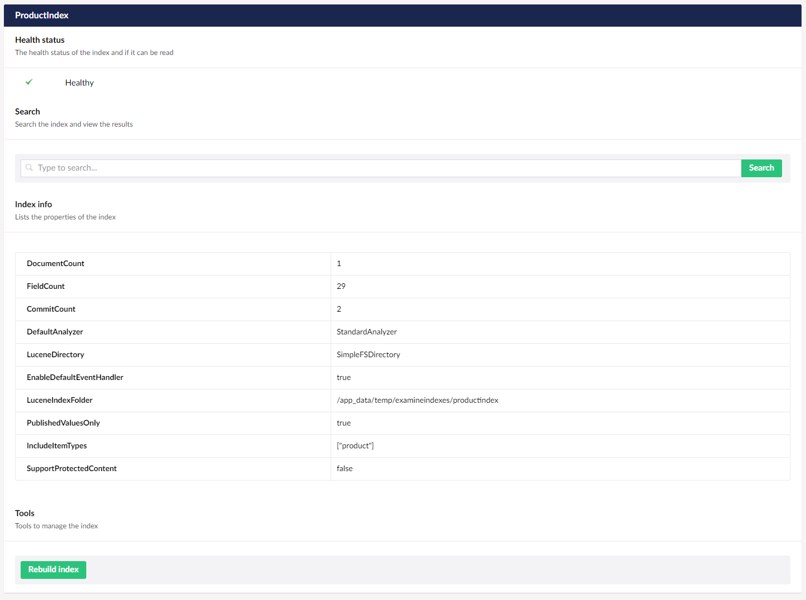

# Custom indexing

Examine has changed quite a bit in Umbraco 8 (and by "a bit" we really mean a lot). In Umbraco 7 everything was configured in the two Examine config files - in Umbraco 8 everything happens through C#.

## Customizing the built in indexes

You can modify the built in indexes in several ways:

* Events - giving you control over exactly what data goes into them and how the fields are configured
* Changing the field value types to change how values are stored in the index
* Changing the `IValueSetValidator` to change what goes into the index
* Take control of the entire index creation pipeline to completely change the implementation

### Changing field value types

By default Examine will store values into the Lucene index as "Full Text", meaning it will be indexed and analyzed for a textual search. However, if a value that you are storing in a field is numerical, a date/time or another specific value type then you might want to change how this is stored in the index. This way you will be able to take advantage of some features such as numerical range or date features, etc...

There is some documentation about this in the [Examine documentation](https://shazwazza.github.io/Examine/configuration).

The easiest way to modify how a field is configured is using a custom component, for example:

```c#
using Examine;
using Umbraco.Core;
using Umbraco.Core.Composing;

// register the component
public class CustomizeIndexComposer : ComponentComposer<CustomizeIndexComponent> { }

public class CustomizeIndexComponent : IComponent
{
    private readonly IExamineManager _examineManager;

    public CustomizeIndexComponent(IExamineManager examineManager)
    {
        _examineManager = examineManager;
    }

    public void Initialize()
    {
        // get the external index
        if (!_examineManager.TryGetIndex(UmbracoIndexes.ExternalIndexName, out IIndex index))
            return;

        // add a custom field type
        index.FieldDefinitionCollection.TryAdd(new FieldDefinition("price", FieldDefinitionTypes.Double));

        // modify an existing field type (not recommended)
        index.FieldDefinitionCollection.AddOrUpdate(new FieldDefinition("parentID", FieldDefinitionTypes.FullText));
    }

    public void Terminate()
    {
    }
}
```

## Changing IValueSetValidator

An `IValueSetValidator` is responsible for validating a `ValueSet` to see if it should be included in the index and/or filtering the data in the `ValueSet`. For example, by default the validation process for the ExternalIndex checks if a `ValueSet` has a category type of either "media" or "content" (not member). If a `ValueSet` was passed to the ExternalIndex and it did not pass this requirement it would be ignored.

Starting in Umbraco 8.4.0, the `IValueSetValidator` implementation for the built in indexes, can be changed like this:

```c#
using Examine;
using Umbraco.Core;
using Umbraco.Core.Composing;
using Umbraco.Core.Services;
using Umbraco.Examine;

public class CustomizeIndexComposer : IUserComposer
{
    public void Compose(Composition composition)
    {
        // replace the default IUmbracoIndexConfig definition
        composition.RegisterUnique<IUmbracoIndexConfig, CustomIndexConfig>();
    }
}

// inherit from the default
public class CustomIndexConfig : UmbracoIndexConfig, IUmbracoIndexConfig
{
    public CustomIndexConfig(IPublicAccessService publicAccessService) : base(publicAccessService)
    {
    }

    // explicit implementation - overrides base class.
    // GetMemberValueSetValidator is used for the MemberIndex.
    IValueSetValidator IUmbracoIndexConfig.GetMemberValueSetValidator()
    {
        // NOTE - by default Umbraco only includes a small subset of fields for the member index for
        // security reasons, however you may want to include a larger set of data in the member index.
        // This example will include all data for a member excluding the built in property values.

        // all built in member properties to exclude (i.e. Password question, etc...)
        var excludeFields = Constants.Conventions.Member.GetStandardPropertyTypeStubs().Keys;

        // include everything except the above
        return new MemberValueSetValidator(null, null, null, excludeFields);
    }
}
```

If you are using a version of Umbraco before 8.4.0 then to do this you will need to modify the index creation (see below).

### Overriding index creation

You can completely take control of the whole Umbraco index creation logic by replacing the default implementation of `IUmbracoIndexesCreator`.

A few examples of why you might want to override the index creation:

* To customize the default analyzer used in the built in indexes
* Change the `IValueSetValidator`
* Modify field definitions
* Change the location of where the indexes are stored, or
* Completely replace the indexes with your own entirely custom implementation

As an example, to change the `IValueSetValidator` for the MemberIndex in the above example:

```c#
using Examine;
using Umbraco.Core;
using Umbraco.Core.Composing;
using Umbraco.Core.Logging;
using Umbraco.Core.Services;
using Umbraco.Examine;
using Umbraco.Web.Search;

public class CustomizeIndexComposer : IUserComposer
{
    public void Compose(Composition composition)
    {
        // replace the default IUmbracoIndexesCreator definition
        composition.RegisterUnique<IUmbracoIndexesCreator, CustomUmbracoIndexesCreator>();
    }
}

// override the default creator
public class CustomUmbracoIndexesCreator : UmbracoIndexesCreator
{
    public CustomUmbracoIndexesCreator(IProfilingLogger profilingLogger, ILocalizationService languageService, IPublicAccessService publicAccessService, IMemberService memberService, IUmbracoIndexConfig umbracoIndexConfig)
        : base(profilingLogger, languageService, publicAccessService, memberService, umbracoIndexConfig)
    {
    }

    // note - in Umbraco 8.4 this method is obsoleted and it's advised to replace the
    // IUmbracoIndexConfig as in the above example.
    public override IValueSetValidator GetMemberValueSetValidator()
    {
        // all built in member properties to exclude (i.e. Password question, etc...)
        var excludeFields = Constants.Conventions.Member.GetStandardPropertyTypeStubs().Keys;

        // include everything except the above
        return new MemberValueSetValidator(null, null, null, excludeFields);
    }
}
```

Another example could be to replace the default Lucene analyzer for the ExternalIndex:

```c#
using System.Collections.Generic;
using Examine;
using Lucene.Net.Analysis;
using Umbraco.Core;
using Umbraco.Core.Logging;
using Umbraco.Core.Services;
using Umbraco.Examine;
using Umbraco.Web.Search;

// override the default creator
public class CustomUmbracoIndexesCreator : UmbracoIndexesCreator
{
    // ctor
    public CustomUmbracoIndexesCreator(IProfilingLogger profilingLogger, ILocalizationService languageService, IPublicAccessService publicAccessService, IMemberService memberService, IUmbracoIndexConfig umbracoIndexConfig)
        : base(profilingLogger, languageService, publicAccessService, memberService, umbracoIndexConfig)
    {
    }

    // override the Create method
    public override IEnumerable<IIndex> Create()
    {
        // create the default index definitions
        var defaultIndexes = base.Create().ToDictionary(x => x.Name, x => x);
        var internalIndex = defaultIndexes[Constants.UmbracoIndexes.InternalIndexName];
        var memberIndex = defaultIndexes[Constants.UmbracoIndexes.MembersIndexName];

        // create a custom external index
        var externalIndex = CreateExternalIndex();

        // return the Umbraco indexes - all 3 must be here with the correct names!
        return new IIndex[]
        {
            internalIndex,
            externalIndex,
            memberIndex
        };
    }

    private IIndex CreateExternalIndex()
    {
        var index = new UmbracoContentIndex(
            Constants.UmbracoIndexes.ExternalIndexName, // default
            CreateFileSystemLuceneDirectory(Constants.UmbracoIndexes.ExternalIndexPath), // default
            new UmbracoFieldDefinitionCollection(), // default

            // change the default analyzer from StandardAnalyzer
            new WhitespaceAnalyzer(),

            ProfilingLogger, // default
            LanguageService, // default
            UmbracoIndexConfig.GetPublishedContentValueSetValidator()); // default

        return index;
    }
}
```

## Index based on document types

The following example will show how to create an index that will only include nodes based on the document type _product_.

:::note
We always recommend that you use the existing built in ExternalIndex. You should then query based on the NodeTypeAlias instead of creating a new separate index based on that particular node type. However, should the need arise, the example below will show you how to do it.

Take a look at our [Examine Quick Start](../quick-start/index.md) to see some examples of how to search the ExternalIndex.
:::

In order to create this index we need three things:

1. An IndexCreator to create a definition for the configuration of the index(s)
2. A Component to register the created index(s) with Examine
3. A Composer to append this Component to the list of Components Umbraco initializes during start up and to register our IndexCreator service with the underlying dependency injection framework, so it can be injected into our Component constructor.

(Read more about [using Composition and Components to modify Umbraco's default behaviour](../../../../Implementation/Composing/) and [Registering dependencies with Umbraco's underlying IoC framework](../../../Using-Ioc/)).

### ProductIndexCreator

```c#
using System.Collections.Generic;
using Examine;
using Umbraco.Core.Logging;
using Umbraco.Core.Services;
using Umbraco.Examine;
using Umbraco.Web.Search;

public class ProductIndexCreator : LuceneIndexCreator, IUmbracoIndexesCreator
{
    private readonly IProfilingLogger _profilingLogger;
    private readonly ILocalizationService _localizationService;
    private readonly IPublicAccessService _publicAccessService;

    // Since Umbraco 8 has dependency injection out of the box, we can use it to inject
    // the different services that we need.
    public ProductIndexCreator(IProfilingLogger profilingLogger,
        ILocalizationService localizationService,
        IPublicAccessService publicAccessService
    )
    {
        _profilingLogger = profilingLogger;
        _localizationService = localizationService;
        _publicAccessService = publicAccessService;
    }

        // Noticed that we return a collection of indexes? Technically you
        // can create multiple indexes in an indexCreator :) You can have a look at
        // UmbracoIndexesCreator.cs in the CMS core and see how the CMS does that.
        public override IEnumerable<IIndex> Create()
        {
            var index = new UmbracoContentIndex("ProductIndex",
                CreateFileSystemLuceneDirectory("ProductIndex"),
                new UmbracoFieldDefinitionCollection(),
                new StandardAnalyzer(Version.LUCENE_30),
                _profilingLogger,
                _localizationService,
                // We can use the ContentValueSetValidator to set up rules for the content we
                // want to have indexed. In our case we want published, non-protected nodes of the type "product".
                new ContentValueSetValidator(true, false, _publicAccessService, includeItemTypes: new string[] { "product" }));

            return new[] { index };
        }
}
```

### ProductComponent

```c#
using Examine;
using Umbraco.Core.Composing;

public class ProductComponent : IComponent
{
    private readonly IExamineManager _examineManager;
    private readonly ProductIndexCreator _productIndexCreator;

    public ProductComponent(IExamineManager examineManager, ProductIndexCreator productIndexCreator)
    {
        _examineManager = examineManager;
        _productIndexCreator = productIndexCreator;
    }

    public void Initialize()
    {
        // Because the Create method returns a collection of indexes,
        // we have to loop through them.
        foreach (var index in _productIndexCreator.Create())
        {
            _examineManager.AddIndex(index);
        }
    }

    public void Terminate() { }
}
```

### ProductComposer

```c#
using Umbraco.Core;
using Umbraco.Core.Composing;

public class ProductComposer : IUserComposer
{
    public void Compose(Composition composition)
    {
        composition.Components().Append<ProductComponent>();
        composition.RegisterUnique<ProductIndexCreator>();
    }
}
```

### Result




