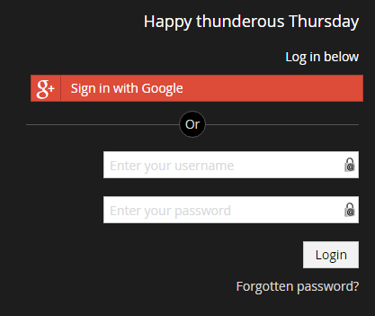

# Security

_This section includes information on Umbraco security, it's various security options and configuring how authentication & authorization works in Umbraco_

## Umbraco Security overview

We have a dedicated security page on our main site which provides most of the details you may need to know about security within the Umbraco CMS including how to report a vulnerability: [https://umbraco.com/products/umbraco-cms/security/](https://umbraco.com/products/umbraco-cms/security/)

## SSL/HTTPS

We highly encourage the use of HTTPS on Umbraco websites especially in production environments. By using HTTPS you greatly improve the security of your website. There are several benefits of HTTPS:

* Trust - when your site is delivered over HTTPS your users will see that your site is secured, they are able to view the certificate assigned to your site and know that your site is legitimate
* Removing an attack vector called ["Man in the middle"](https://www.owasp.org/index.php/Man-in-the-middle_attack) (or network Sniffing)
* Gaurds against [Phishing](https://www.microsoft.com/en-us/safety/online-privacy/phishing-symptoms.aspx), an attacker will have a hard time obtaining an authentic SSL certificate
* Google likes HTTPS, it may help your site's rankings

Another benefits of HTTPS is that you are able to use the [http2](https://en.wikipedia.org/wiki/HTTP/2) protocol if your web server and browser support it.

__UseSSL configuration option__

Umbraco allows you to force SSL/HTTPS for all back office communications very easily but using the following appSettings configuration:

	<add key="umbracoUseSSL" value="true" />

This options does several things when it is turned on:

* Ensures that the back office authentication cookie is set to [secure only](https://www.owasp.org/index.php/SecureFlag) (so it can only be transmitted over https)
* All non-https requests to any back office controller is redirected to https
* All self delivered Umbraco requests (i.e. scheduled publishing, keep alive, etc...) are performed over https
* All Umbraco notification emails with links generated have https links
* All authorization attempts for back office handlers and services will be denied if the request is not over https

Once you enable HTTPS for your site you should redirect all requests to your site to HTTPS, this can be done with an IIS rewrite rule. The IIS rewrite module needs to be installed for this to work, most hosting providers will have that enabled by default.

In your `web.config` find or add the `<system.webServer><rewrite><rules>` section and put the following rule in there. This rule will redirect all requests for the site http://mysite.com URL to the secure https://mysite.com URL and respond with a permanent redirect status.

	<rule name="HTTP to HTTPS redirect" stopProcessing="true">
		<match url="(.*)" />
		<conditions>
			<add input="{HTTPS}" pattern="off" ignoreCase="true" />
			<add input="{HTTP_HOST}" pattern="localhost" negate="true" />
		</conditions>
		<action type="Redirect" url="https://{HTTP_HOST}/{R:1}" redirectType="Permanent" />
	</rule>        

Note that the rule includes an ignore for `locahost`. If you run your local environment on a different URL than `localhost` you can add additional ignore rules. Additionally, if you have a staging environment that doesn't run on HTTPS, you can add that to the ignore rules too.

## Back office users

**Applies to version 7.3.1 and newer**

Authentication for back office users in Umbraco uses [ASP.Net Identity](http://www.asp.net/identity) which is a very flexible and extensible framework for authentication. 
 
Out of the box Umbraco ships with a custom ASP.Net Identity implementation which uses Umbraco's database data. Normally this is fine for most Umbraco developers
but in some cases the authentication process needs to be customized. ASP.Net Identity can be easily extended by using custom OAuth providers which is helpful if you want
your users to authenticate with a custom OAuth provider like Azure Active Directory, or even Google accounts. ASP.Net identity is also flexible enough for you to override/replace 
any part of the process of authentication.

### Custom OAuth providers

The Umbraco back office supports custom OAuth providers for performing authentication of your users. For example: Any OpenIDConnect provider such as Azure Active Directory or Identity Server, Google, Facebook, Microsoft Account, etc...

To install and configure a custom OAuth provider you should use the Identity Extensions package: [https://github.com/umbraco/UmbracoIdentityExtensions](https://github.com/umbraco/UmbracoIdentityExtensions)

The installation of these packages will install snippets of code with readme files on how to get up and running. Depending on the provider you've configured and it's caption/color, the end result will look similar to:

### Replacing the basic username/password check

Having the ability to simply replace the logic to validate a username and password against a custom data store is important to some developers. Normally in ASP.Net Identity this
would require you to override the `UmbracoBackOfficeUserManager.CheckPasswordAsync` implementation and then replace the `UmbracoBackOfficeUserManager` with your own class during startup. 
Since this is a common task we've made this process a lot easier with an interface called `IBackOfficeUserPasswordChecker`.

Here are the steps to specify your own logic for validating a username and password for the back office:

1. Install the UmbracoIdentityExtensions package https://github.com/umbraco/UmbracoIdentityExtensions 

1. Create an implementation of `Umbraco.Core.Security.IBackOfficeUserPasswordChecker`

	* There is one method in this interface: `Task<BackOfficeUserPasswordCheckerResult> CheckPasswordAsync(BackOfficeIdentityUser user, string password);`
	* The result of this method can be 3 things:
		* ValidCredentials = The credentials entered are valid and the authorization should proceed
		* InvalidCredentials = The credentials entered are not valid and the authorization process should return an error
		* FallbackToDefaultChecker = This is an optional result which can be used to fallback to Umbraco's default authorization process if the credentials could not be verified by your own custom implementation

	For example, to always allow login when the user enters the password `test` you could do:
	
		using System.Threading.Tasks;
		using Umbraco.Core.Models.Identity;
		using Umbraco.Core.Security;
		
		namespace MyNamespace
		{
		    public class MyPasswordChecker : IBackOfficeUserPasswordChecker
		    {
		        public Task<BackOfficeUserPasswordCheckerResult> CheckPasswordAsync(BackOfficeIdentityUser user, string password)
		        {
		            var result = (password == "test") 
		                ? Task.FromResult(BackOfficeUserPasswordCheckerResult.ValidCredentials)
		                : Task.FromResult(BackOfficeUserPasswordCheckerResult.InvalidCredentials);
		
		            return result;
		        }
		    }
		}

1. Modify the `~/App_Start/UmbracoCustomOwinStartup.cs` class

	* Replace the `app.ConfigureUserManagerForUmbracoBackOffice` call with a custom overload to specify your custom `IBackOfficeUserPasswordChecker`  

            var applicationContext = ApplicationContext.Current;
            app.ConfigureUserManagerForUmbracoBackOffice<BackOfficeUserManager, BackOfficeIdentityUser>(
                applicationContext,
                (options, context) =>
                {
                    var membershipProvider = Umbraco.Core.Security.MembershipProviderExtensions.GetUsersMembershipProvider().AsUmbracoMembershipProvider();
                    var userManager = BackOfficeUserManager.Create(options, 
                        applicationContext.Services.UserService,
                        applicationContext.Services.ExternalLoginService,
                        membershipProvider);
                    //Set your own custom IBackOfficeUserPasswordChecker   
                    userManager.BackOfficeUserPasswordChecker = new MyPasswordChecker();
                    return userManager;
                });	
                
1. Make sure to switch the `owin:appStartup` appSetting in your `web.config` file to use `UmbracoCustomOwinStartup`: `<add key="owin:appStartup" value="UmbracoCustomOwinStartup"/>`

**Note:** if the username entered in the login screen does not exist in Umbraco then `MyPasswordChecker()` does not run, instead Umbraco will immediately fall back to it's internal checks (default Umbraco behavior).

### Authenticating with Active Directory credentials

Umbraco 7.5.0+ comes with a built-in `IBackOfficeUserPasswordChecker` for Active Directory: `Umbraco.Core.Security.ActiveDirectoryBackOfficeUserPasswordChecker`. 

So like the above docs, instead of setting up your own `IBackOfficeUserPasswordChecker`, you can just use `Umbraco.Core.Security.ActiveDirectoryBackOfficeUserPasswordChecker` and then specify your AD domain in your web.config:

    <appSettings>
      	<add key="ActiveDirectoryDomain" value="mydomain.local" />
    </appSettings>
