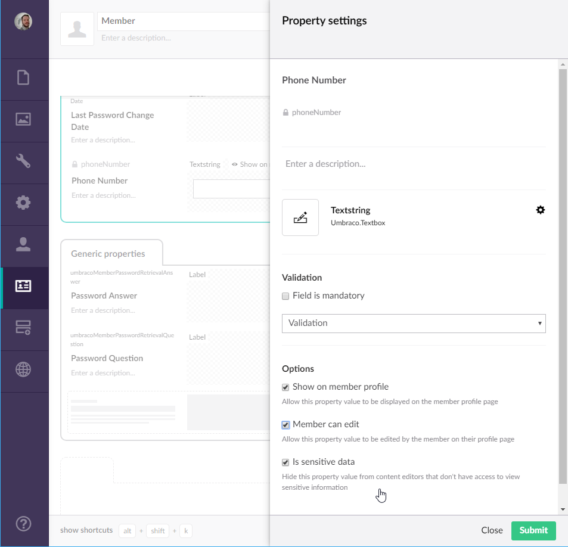

# Sensitive data

Marking fields as sensitive will hide the data in those fields for backoffice users that have no business viewing personal data of members.

In order to start marking fields as sensitive, you can add the users who need access to this data to the "Sensitive data" user group. In the User management sections go to Groups and choose the Sensitive data group.

From there on, add the users who need access to this data to this group.

When a user in the backoffice does not have access to this data they get told so:

Users who don't have access to sensitive data also do not have access to the "Export member" functionality on each member.

