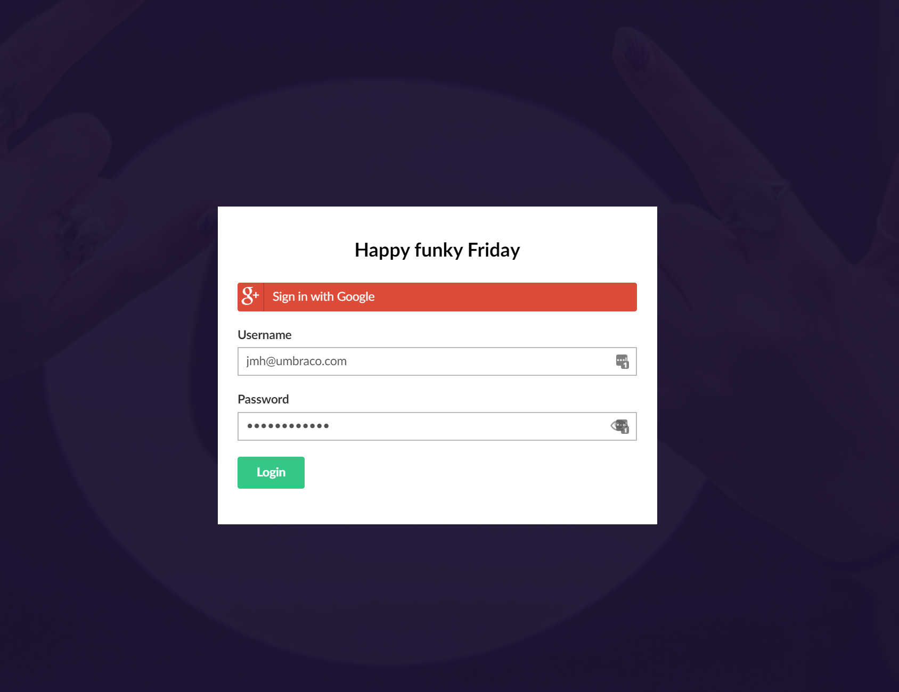
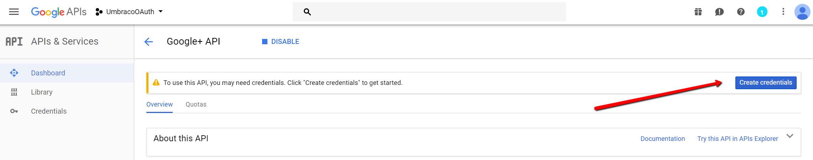

# Tutorial - Add Google Authentication

## Overview

This guide takes you through the steps to setup a Google login for the Umbraco backoffice.

### What is a Google login

It means when you log in to the backoffice you normally have to put in your username and password, instead it will add a button that you can click and then log in with your Google account. Here is how it looks on Umbraco v7.9.1



### Why

Why not? I'm sure a lot of content editors and implementors of your Umbraco sites would love to have one less password to remember. Click a button and if you are already logged into Google it will log you in!

### Who is this tutorial for

Developers who won't mind configuring a Google API, running the solution in Visual Studio, adding NuGet packages and editing the config files - does that sound way too advanced for you? Don't worry, I did this after working a bit with Umbraco for about a month, and I will make the steps in the guide very clear so even beginners will have a chance!

### Prerequisites

Here is what you will need for this tutorial:

- [Visual Studio](https://visualstudio.microsoft.com/) installed
- A [Google](https://myaccount.google.com/) account
- A working [Umbraco solution](../../Getting-Started/)

## Setting up a Google OAuth API

The first thing to do is set up a Google API. To do this you need to go to [https://console.developers.google.com/](https://console.developers.google.com/), then log in with your Google account.

The first thing to do is to add a new API, you may have some already if you are using Firebase or any other Google product, but click the + at the top:


After you have given your new API a name and gone through the basic setup you need to add an API from the API library on the lefthand menu. Find the Google+ API and enable it:


Once you have enabled your new API, you will need credentials. Click on the button and fill in the info as below:




Add in your credentials and the domains that it should cover. As you can see I am using an Umbraco Cloud page and have chosen the path domain/google-signin as the redirect URL.


Now, fill in your email and leave the page open - you will need the Client ID and Client Secret in a little while!

## Installing Visual Studio packages

Now that you have the Google API all set up you have to go to your existing solution in Visual Studio. If you don't know how to clone down a Cloud site to use in Visual Studio then there is an excellent guide [here!](../../Umbraco-Cloud/Set-Up/Working-with-Visual-Studio/)

In Visual Studio, go to the Tools menu, then NuGet Package Manager - Package Manager Console. This adds a package manager console at the bottom where you can install packages with commands. In this console write the following:

`Install-Package UmbracoCms.IdentityExtensions`

This starts the download of a package that makes it possible to set up OAuth logins through various platforms - it might take a few minutes to install it and all the dependencies.

Once the package is done installing a nice readme file will pop up and give you some useful information - feel free to completely ignore it and continue following this excellent tutorial!

Depending on which version of Umbraco you are using, you might run into some dependency issues after installing the IdentityExtension package. These can usually be resolved by reinstalling the package causing the issues, using the following command:

`Update-Package Package.Name -Reinstall`

This will update the package and dependencies, and clear out the issues.

Now we need to build the website again then try to run it. Hopefully you reach the Umbraco page like I did:


Next, we will install the package we need for Google authentication, for that paste the following in the NuGet Package console:

`Install-Package UmbracoCms.IdentityExtensions.Google`

Like before, wait for the package to install then build and run the website.

Now you have installed both packages, and your site still works (hopefully)! Now we have to configure the files to allow Google Authentication as login.

## Configuring the solution to allow Google logins

The first thing to do is locate the files we installed from the packages. They are located in the App_Code/App_start folder. There are two files we need to edit, first one is the file called UmbracoGoogleAuthExtensions.cs. The only thing you need to touch here is the callback path, this is what we set on the API as the redirect URL. If you followed my example it should be set to /google-signin:


The second file we need to configure is the UmbracoStandardOwinStartup.cs file. Here we need to add the following code:

```csharp
var clientId = ConfigurationManager.AppSettings["GoogleOAuthClientID"];
var secret = ConfigurationManager.AppSettings["GoogleOAuthSecret"];
app.ConfigureBackOfficeGoogleAuth(clientId, secret);
```

Add this in the file as seen here:


The ConfigurationManager is missing a dependency so add the following at the top: `using System.Configuration;`

Finally open the web.config file in the root folder, here we will need to set the client id and secret from the google api.

But first locate the code that says
`<add key="owin:appStartup" value="UmbracoDefaultOwinStartup" />`
and change the value to:

```xml
<add key="owin:appStartup" value="UmbracoStandardOwinStartup" />
```

Then add the following in the appSettings as well:

```xml
<add key="GoogleOAuthClientID" value="this is where you paste in the client id"/>
<add key="GoogleOAuthSecret" value="this is where you paste in the client secret"/>
```

Make sure to fill in the relevant information as the value fields - you can copy paste this from your Google API.

Build and run the website one final time. Now when you have logged into your backoffice you can click your user in the top right corner and choose link with Google:


If you do that, then in all future backoffice logins you will have a button like at the top of this guide that you can click and you are logged in!
