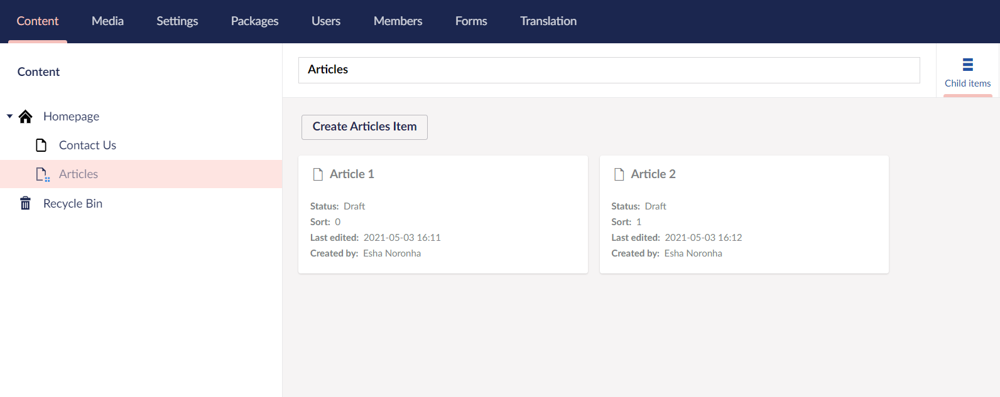
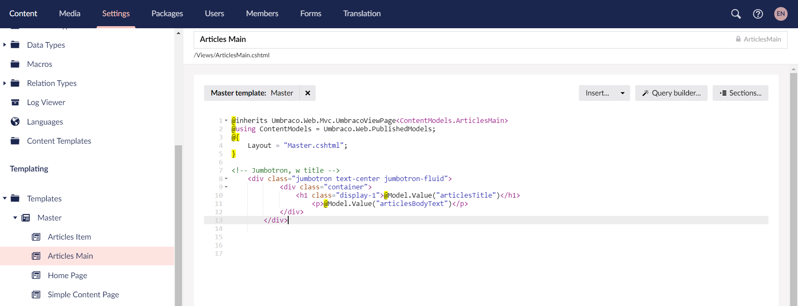
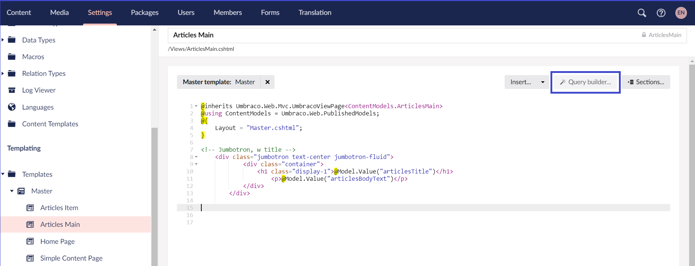
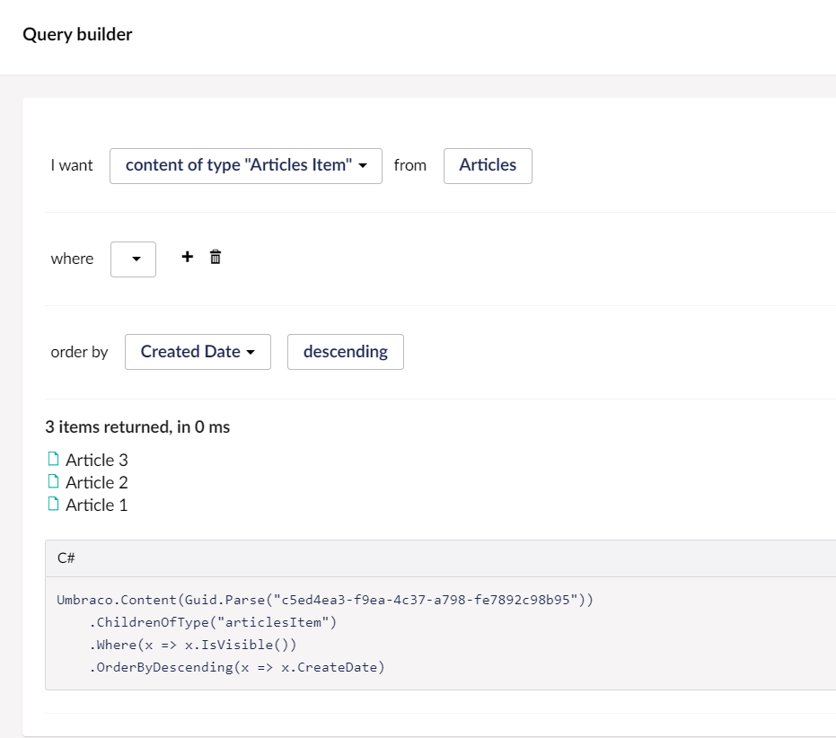
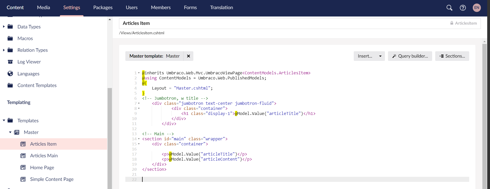
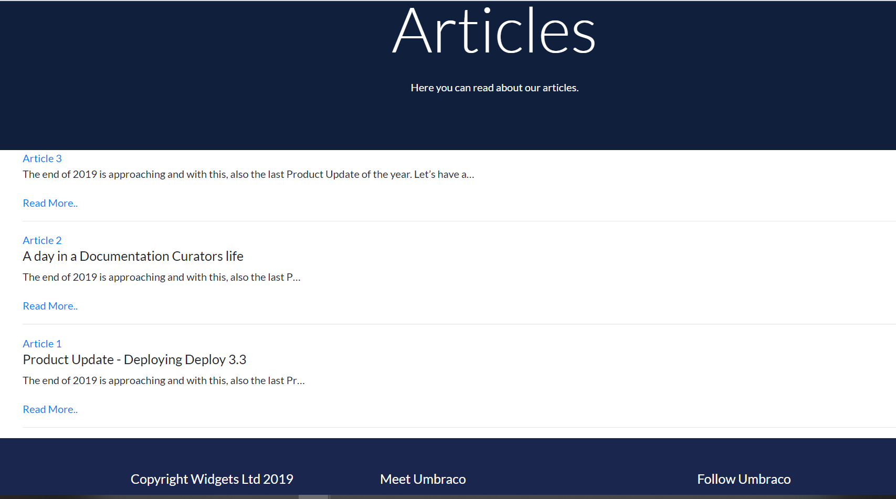

# Articles and Article Items - A Parent Page with Infinite Children

Having an Articles Parent page, and a number of associated child articles, provides a good example of Umbraco's features. We'll assume our fictional company, Widgets Ltd, writes about ten articles a month and want the articles page to act like a blog. You could use this functionality for news, event pages, or any other collection of Document Types.

## Creating Articles and Article Items

Create two new Document Types with template: **Articles Main** and **Articles Item**.

To create **Articles Main** Document Type, follow these steps:

1. Go to **Settings**.
2. Select **...** next to the **Document Types** in the **Settings** tree.
3. Click **Document Type with Template**.

    
4. Enter a **Name** for the **Document Type**. Let's call it _Articles Main_.
5. Let's add two fields with the following specifications:

    | Group | Field Name         | Alias            | Data Type        |
    |-------|--------------------|------------------|------------------|
    | Intro | Articles Title     | articlesTitle    | TextBox          |
    | Intro | Articles Body Text | articlesBodyText | Rich Text Editor |

    
6. Click **Save**

To create **Articles Item** Document Type, follow these steps:

1. Go to **Settings**.
2. Select **...** next to the **Document Types** in the **Settings** tree.
3. Click **Document Type with Template**.

    
4. Enter a **Name** for the **Document Type**. Let's call it _Articles Item_.
5. Let's add two fields with the following specifications:

    | Group   | Field Name      | Alias          | Data Type        |
    |---------|-----------------|----------------|------------------|
    | Content | Article Title   | articleTitle   | TextBox          |
    | Content | Article Content | articleContent | Rich Text Editor |

    
6. Click **Save**

### Updating the Document Type Permissions

To update **Articles Main** Document Type permissions:

1. Navigate to the **Home Page** Document Type and go to the **Permissions** tab.
2. Select **Add child** in the **Allowed child node types**. The **Choose child node** window opens.
3. Select **Articles Main** and click **Save**.
4. Navigate to the **Articles Main** Document Type and go to the **List View** tab.
5. Toggle **Enable List view** and click **Save**.

    
6. Go to the **Permissions** tab.
7. Select **Add child** in the **Allowed child node types**. The **Choose child node** window opens.
8. Select **Articles Item** and click **Save**.

To update **Articles Item** Document Type permissions:

1. Navigate to the **Articles Item** Document Type and go to the **Permissions** tab.
2. Select **Add child** in the **Allowed child node types**. The **Choose child node** window opens.
3. Select **Articles Item** and click **Save**.

## Creating the Content Node

To add a content node:

1. Go to **Content**.
2. Select **...** next to the **HomePage** and select **Articles Main**.
3. Enter the name for the article. We are going to call it _Articles_.
4. Enter the **Article Title**, **Article Content**, and click **Save**.
   When you click on Save, you will notice an empty list view is created.

   We still need to add the child nodes which will be displayed in the list view making it easier to view them. You can create new nodes from this section.

   :::tip
    If you do not see the list view, try refreshing the page.
   :::
5. Let's add two child nodes called **Article 1**, **Article 2**, and click **Save and Publish**.

    

## Updating the Template

To update the **Articles Main** template, follow these steps:

1. Go to **Settings**.
2. Expand the **Templates** folder in the **Templating** section. You should see a template titled **_Articles Main_**.
3. Select **Master** in the **Master template** and click **Save**.
4. Open the **Custom Umbraco Template** folder.
5. Copy the contents of **Blog.html** and paste the content into **Articles Main** below the closing curly brace "}".

    :::warning
    Take care when pasting the template not to overwrite the first line `@inherits Umbraco.Web.Mvc.UmbracoViewPage<ContentModels.ArticlesMain>`. If you get an error when loading the page ensure the last part in <> brackets matches your Document Type alias.
    :::
6. Remove everything from the `<html>` (around line 8) to the end of the `</div>` tag (around line 43) which is the `header` and `navigation` of the site since it is already mentioned in the master template.
7. Remove everything from the `<!-- Footer -->` tag (around line 92) to the end of the `</html>` tag (around line 139)
8. Replace the static text within the `<h1>` tags (around line 12) with the Model.Value reference to **_articlesTitle_**.
9. Replace the static text within the `<div>` tags (from line 22 to 28) with the Model.Value reference to **_articlesBodyText_**.

    
10. Define a query for all articles, just below the `<h3>` tag (around line 30) of the `<!-- Latest blog posts -->` section.

    
11. You can set conditions to get specific articles or decide the order of the articles. For the purpose of this guide, we'll use the following parameters:

    
12. If you've set the correct parameters, you will get a preview of the items being selected with the query. Click **Submit**, and you will see a code snippet has been added to your template.
    It will look similar to this:

    ```csharp
    @{
        var selection = Umbraco.Content(Guid.Parse("c5ed4ea3-f9ea-4c37-a798-fe7892c98b95"))
        .ChildrenOfType("articlesItem")
        .Where(x => x.IsVisible())
        .OrderByDescending(x => x.CreateDate);
    }
    <ul>
        @foreach (var item in selection)
        {
            <li>
                <a href="@item.Url">@item.Name</a>
            </li>
        }
    </ul>
    ```

13. The above code will output a list of all the **_Article Items_** as links using the name. We will modify the template a little, to add more information about the articles. Replace the `HTML` in the *foreach* loop with this snippet:

    ```csharp
    <article class="special">
            <div class="articledate" > @item.CreateDate </div>
            <div class="articletitle"><a href="@item.Url">@item.Name</a></div>
            <div class="articlepreview">@Html.Truncate(item.Value("articleContent").ToString(), 20, true)<a href="@item.Url">Read More..</a></div>
    </article>
    ```

14. Click **Save**.

To update the **Articles Item** template, follow these steps:

1. Go to **Settings**.
2. Expand the **Templates** folder in the **Templating** section. You should see a template titled **_Articles Item_**.
3. Select **Master** in the **Master template** and click **Save**.
4. Open the **Custom Umbraco Template** folder.
5. Copy the contents of **Blogpost.html** and paste the content into **Articles Item** below the closing curly brace "}".

    :::warning
    Take care when pasting the template not to overwrite the first line `@inherits Umbraco.Web.Mvc.UmbracoViewPage<ContentModels.ArticlesMain>`. If you get an error when loading the page ensure the last part in <> brackets matches your Document Type alias.
    :::
6. Remove everything from the `<html>` (around line 8) to the end of the `</div>` tag (around line 43) which is the `header` and `navigation` of the site since it is already mentioned in the master template.
7. Remove everything from the `<!-- Footer -->` tag (around line 104) to the end of the `</html>` tag (around line 151)
8. Replace the static text within the `<h1>` tags (around line 12) with the Model.Value reference to **_articleTitle_**.
9. Replace the static text within the `<div>` tags (from line 23 to 38) with the Model.Value reference to **_articleContent_**.

    
10. Click **Save**.

Check your browser, you should now see something similar to the screen below.



---

Prev: [Setting The Navigation Menu](../Setting-The-Navigation-Menu)  &emsp; &emsp; &emsp; &emsp; &emsp; &emsp; &emsp; &emsp; &emsp; Next: [Adding Language Variants](../Adding-Language-Variants)
