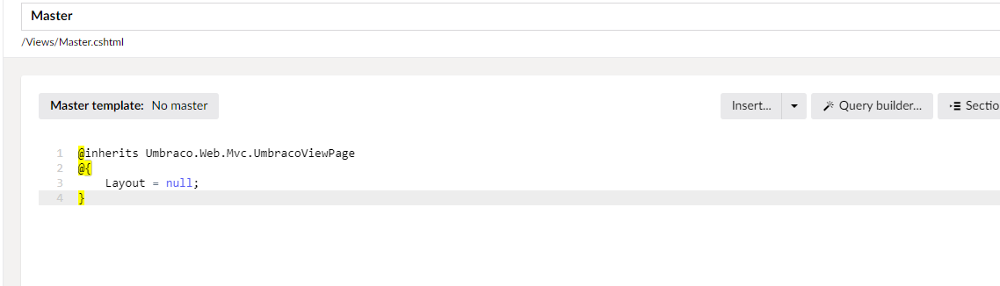
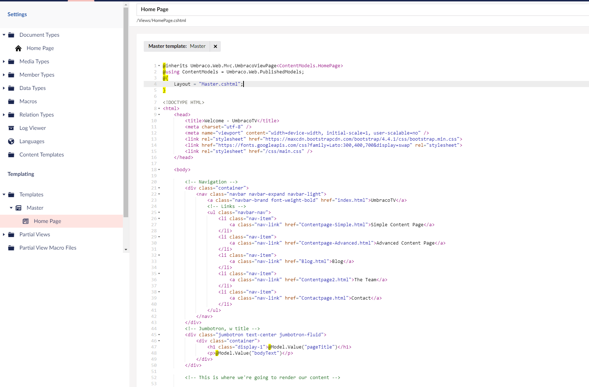
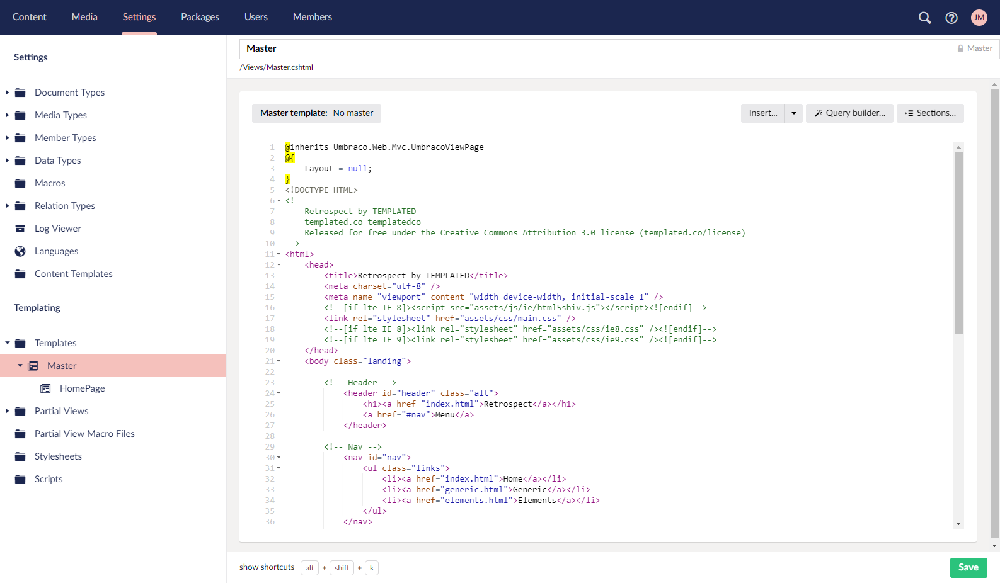
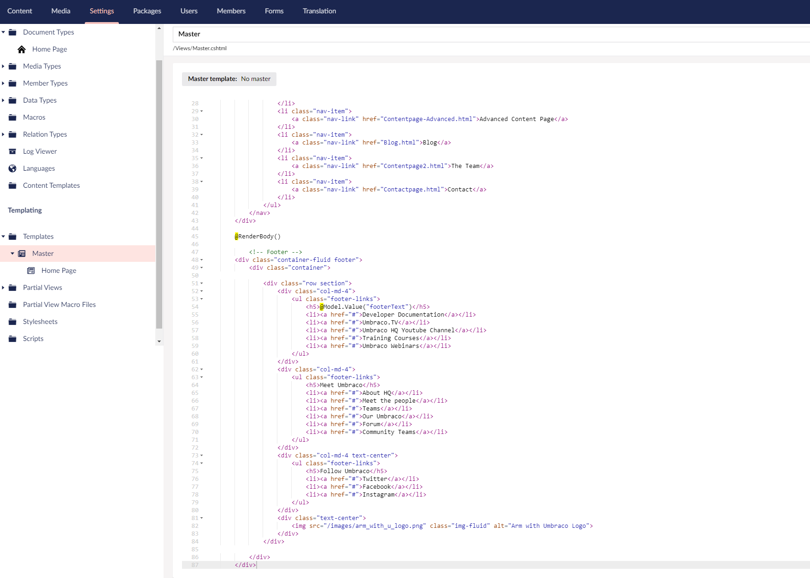

# Creating More Pages

## Using a Maintainable Template Structure

We've seen how to create a **_Document Type_**. If we wanted to create a three-page site containing; Home, News and Contact Us pages. We could create a **_Document Type_** with a corresponding template for each and copy the same HTML code into each template. Afterwards we could make the custom changes to each separate template for these pages.

Though this would work, but once a site starts to grow this would lead to problems. For instance changing anything in the header or footer would need to be done on each template. It also means we'd need the user to enter the same content for the footer on each page.

Umbraco provides us with an elegant solution for a consistent base template - those familiar with MVC will recognise it.

To start we're going to unpick a little bit of what we did in creating the homepage to sit the homepage template under a master.

# Create a Master Template

Go to the **_Settings > Templates_** and open up the tree.  At the moment we only have our **_Homepage_** template.  Hover over the **_Templates_** menu and click the menu **_..._** button. Create a new template called Master, click **_+ Create_** and then give it the name "_Master_" . Remember to click **_Save_**.



Now we're going to move the **_Homepage_** template under the **_Master_** template. To do this select the **_Settings > Homepage template_** and at the top click where it says _No master_, and select the template called **Master**. This will update the Razor code section to change `Layout = null;` to `Layout = "Master.cshtml";`



Now we need to move the parts of our HTML template that are common across all pages into the **_Master_**. It might be slightly different for different websites and you'll need to consider if all pages contain a `<div id="main">` section so can you put this in the master or of it belong to only certain pages?

For this site, we will cut everything from the closing curly brace to line 39, so you get the end of the `</nav>` - we're going to move the `header` and `nav` of the site to the master template. Cut this and click **_Save_**.


Now click on your **_Master_** template and paste this HTML markup after the closing curly brace and remember to click **_Save_**.



At the end of this markup we need to tell Umbraco to insert the child template's content - this is done by adding the code **_@RenderBody()_** at the end (around line 39). Click **_Save_**.


Now we'll do the same with the footer content. Cut everything from the `<!-- Footer -->` comment (approximately line 111) from the **_Settings > Templates > Homepage template_**, click **_Save_** and then paste this into the **_Master_** template under the **_@RenderBody_** field we've added. Remember to click **_Save_**.



Now we've done a lot of work - and what we should see if we refresh our localhost page is nothing has changed!  If you have a compilation error you've perhaps mistyped **_@RenderBody()_**. If you're missing any content (header or footer) check that what you have in the Master template matches the following:

```csharp
@inherits Umbraco.Web.Mvc.UmbracoViewPage
@{
    Layout = null;
}
<!DOCTYPE HTML>
<!--
    Retrospect by TEMPLATED
    templated.co templatedco
    Released for free under the Creative Commons Attribution 3.0 license (templated.co/license)
-->
<html>
    <head>
        <title>Retrospect by TEMPLATED</title>
        <meta charset="utf-8" />
        <meta name="viewport" content="width=device-width, initial-scale=1" />
        <!--[if lte IE 8]><script src="assets/js/ie/html5shiv.js"></script><![endif]-->
        <link rel="stylesheet" href="assets/css/main.css" />
        <!--[if lte IE 8]><link rel="stylesheet" href="assets/css/ie8.css" /><![endif]-->
        <!--[if lte IE 9]><link rel="stylesheet" href="assets/css/ie9.css" /><![endif]-->
    </head>
    <body class="landing">

        <!-- Header -->
            <header id="header" class="alt">
                <h1><a href="index.html">Retrospect</a></h1>
                <a href="#nav">Menu</a>
            </header>

        <!-- Nav -->
            <nav id="nav">
                <ul class="links">
                    <li><a href="index.html">Home</a></li>
                    <li><a href="generic.html">Generic</a></li>
                    <li><a href="elements.html">Elements</a></li>
                </ul>
            </nav>

            @RenderBody()

        <!-- Footer -->
            <footer id="footer">
                <div class="inner">
                    <ul class="icons">
                        <li><a href="#" class="icon fa-facebook">
                            <span class="label">Facebook</span>
                        </a></li>
                        <li><a href="#" class="icon fa-twitter">
                            <span class="label">Twitter</span>
                        </a></li>
                        <li><a href="#" class="icon fa-instagram">
                            <span class="label">Instagram</span>
                        </a></li>
                        <li><a href="#" class="icon fa-linkedin">
                            <span class="label">LinkedIn</span>
                        </a></li>
                    </ul>
                    <ul class="copyright">
                        <li>&copy; @Model.Value("footerText")</li>
                        <li>Images: <a href="http://unsplash.com">Unsplash</a>.</li>
                        <li>Design: <a href="http://templated.co">TEMPLATED</a>.</li>
                    </ul>
                </div>
            </footer>

        <!-- Scripts -->
            <script src="assets/js/jquery.min.js"></script>
            <script src="assets/js/skel.min.js"></script>
            <script src="assets/js/util.js"></script>
            <!--[if lte IE 8]><script src="assets/js/ie/respond.min.js"></script><![endif]-->
            <script src="assets/js/main.js"></script>

    </body>
</html>
```

And that what you have in the Homepage template matches the following:

```csharp
@inherits Umbraco.Web.Mvc.UmbracoViewPage<ContentModels.HomePage>
@using ContentModels = Umbraco.Web.PublishedModels;
@{
    Layout = "Master.cshtml";
}
        <!-- Banner -->
            <section id="banner">
                <i class="icon fa-diamond"></i>
                <h2>@Model.Value("pageTitle")</h2>
                <p>@Model.Value("bodyText")</p>
                <ul class="actions">
                    <li><a href="#" class="button big special">Learn More</a></li>
                </ul>
            </section>

        <!-- One -->
            <section id="one" class="wrapper style1">
                <div class="inner">
                    <article class="feature left">
                        <span class="image"></span>
                        <div class="content">
                            <h2>Integer vitae libero acrisus egestas placerat  sollicitudin</h2>
                            <p>Sed egestas, ante et vulputate volutpat, eros pede semper est, vitae luctus metus libero eu augue. Morbi purus libero, faucibus adipiscing, commodo quis, gravida id, est.</p>
                            <ul class="actions">
                                <li>
                                    <a href="#" class="button alt">More</a>
                                </li>
                            </ul>
                        </div>
                    </article>
                    <article class="feature right">
                        <span class="image"></span>
                        <div class="content">
                            <h2>Integer vitae libero acrisus egestas placerat  sollicitudin</h2>
                            <p>Sed egestas, ante et vulputate volutpat, eros pede semper est, vitae luctus metus libero eu augue. Morbi purus libero, faucibus adipiscing, commodo quis, gravida id, est.</p>
                            <ul class="actions">
                                <li>
                                    <a href="#" class="button alt">More</a>
                                </li>
                            </ul>
                        </div>
                    </article>
                </div>
            </section>

        <!-- Two -->
            <section id="two" class="wrapper special">
                <div class="inner">
                    <header class="major narrow">
                        <h2>Aliquam Blandit Mauris</h2>
                        <p>Ipsum dolor tempus commodo turpis adipiscing Tempor placerat sed amet accumsan</p>
                    </header>
                    <div class="image-grid">
                        <a href="#" class="image"></a>
                        <a href="#" class="image"></a>
                        <a href="#" class="image"></a>
                        <a href="#" class="image"></a>
                        <a href="#" class="image"></a>
                        <a href="#" class="image"></a>
                        <a href="#" class="image"></a>
                        <a href="#" class="image"></a>
                    </div>
                    <ul class="actions">
                        <li><a href="#" class="button big alt">Tempus Aliquam</a></li>
                    </ul>
                </div>
            </section>

        <!-- Three -->
            <section id="three" class="wrapper style3 special">
                <div class="inner">
                    <header class="major narrow	">
                        <h2>Magna sed consequat tempus</h2>
                        <p>Ipsum dolor tempus commodo turpis adipiscing Tempor placerat sed amet accumsan</p>
                    </header>
                    <ul class="actions">
                        <li><a href="#" class="button big alt">Magna feugiat</a></li>
                    </ul>
                </div>
            </section>

        <!-- Four -->
            <section id="four" class="wrapper style2 special">
                <div class="inner">
                    <header class="major narrow">
                        <h2>Get in touch</h2>
                        <p>Ipsum dolor tempus commodo adipiscing</p>
                    </header>
                    <form action="#" method="POST">
                        <div class="container 75%">
                            <div class="row uniform 50%">
                                <div class="6u 12u$(xsmall)">
                                    <input name="name" placeholder="Name" type="text" />
                                </div>
                                <div class="6u$ 12u$(xsmall)">
                                    <input name="email" placeholder="Email" type="email" />
                                </div>
                                <div class="12u$">
                                    <textarea name="message" placeholder="Message" rows="4"></textarea>
                                </div>
                            </div>
                        </div>
                        <ul class="actions">
                            <li><input type="submit" class="special" value="Submit" /></li>
                            <li><input type="reset" class="alt" value="Reset" /></li>
                        </ul>
                    </form>
                </div>
            </section>

```


---
## Next - [Creating Master Template Part 2](../Creating-Master-Template-Part-2)
Part 2 - using the Master template to create new page types.
